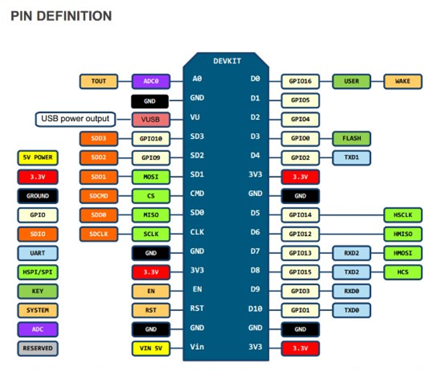
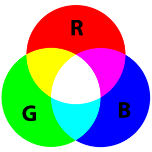
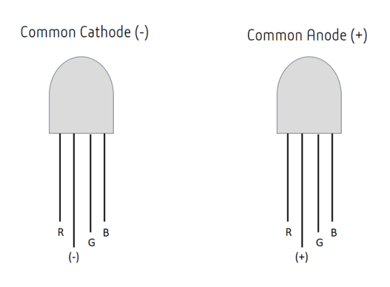
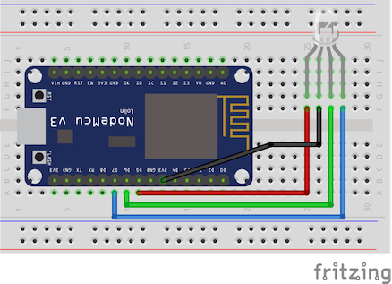

# LED

## Topik Bahasan
Implementasi program Running LED

## Kemampuan Akhir yang Direncanakan
- Mahasiswa mampu menjelaskan cara kerja digitalWrite
- Mahasiswa mampu mengimplementasi Coding Running LED
- Mahasiswa mampu melakukan pengembangan simulasi LED
- Mahasiswa mampu membedakan LED Anode dan Cathode

## Teori Singkat
### Mikrokontroler
Mikrokontroler adalah suatu chip berupa IC (Integrated Circuit) yang dapat menerima sinyal input, mengolahnya dan memberikan 
sinyal output sesuai dengan program yang diisikan ke dalamnya. Sinyal input mikrokontroler berasal dari sensor yang merupakan 
informasi dari lingkungan sedangkan sinyal output ditujukan kepada aktuator yang dapat memberikan efek ke lingkungan. 
Jadi secara sederhana mikrokontroler dapat diibaratkan sebagai otak dari suatu perangkat/produk yang mempu berinteraksi 
dengan lingkungan sekitarnya. 

Mikrokontroler pada dasarnya adalah komputer dalam satu chip, yang di dalamnya terdapat mikroprosesor, memori, jalur 
Input/Output (I/O) dan perangkat pelengkap lainnya. Kecepatan pengolahan data pada mikrokontroler lebih rendah jika dibandingkan 
dengan PC. Pada PC kecepatan mikroprosesor yang digunakan saat ini telah mencapai orde GHz, sedangkan kecepatan operasi mikrokontroler 
pada umumnya berkisar antara 1 – 16 MHz. Begitu juga kapasitas RAM dan ROM pada PC yang bisa mencapai orde Gbyte, dibandingkan 
dengan mikrokontroler yang hanya berkisar pada orde byte/Kbyte.


Block Diagram MCU

Sistem yang menggunakan mikrokontroler sering disebut sebagai embedded system atau dedicated system. Embeded system 
adalah sistem pengendali yang tertanam pada suatu produk, sedangkan dedicated system adalah sistem pengendali yang dimaksudkan 
hanya untuk suatu fungsi tertentu. Sebagai contoh, printer adalah suatu embedded system karena di dalamnya terdapat mikrokontroler 
sebagai pengendali dan juga dedicated system karena fungsi pengendali tersebut berfungsi hanya untuk menerima data dan mencetaknya. 
Hal ini berbeda dengan suatu PC yang dapat digunakan untuk berbagai macam keperluan, sehingga mikroprosesor pada PC sering disebut 
sebagai general purpose microprocessor (mikroprosesor serba guna). Pada PC berbagai macam software yang disimpan pada media 
penyimpanan dapat dijalankan, tidak seperti mikrokontroler hanya terdapat satu software aplikasi. Penggunaan mikrokontroler 
antara lain terdapat pada bidang-bidang berikut ini:
1. Otomotif : Engine Control Unit, Air Bag, fuel control, Antilock Braking System, sistem pengaman alarm, transmisi automatik, 
hiburan, pengkondisi udara, speedometer dan odometer, navigasi, suspensi aktif.
2. perlengkapan rumah tangga dan perkantoran : sistem pengaman alarm, remote control, mesin cuci, microwave, pengkondisi udara, 
timbangan digital, mesin foto kopi, printer, mouse.
3. pengendali peralatan di industri.
4. robotika. 

selain itu ada banyak jenis board microcontroller yang dapat digunakan dalam pengembangan project Internet of Things, 
salah satu jenis board yang umum dipakai adalah Arduino dan NodeMCU.


Arduino UNO


NodeMCU

### NodeMCU Development Board
NodeMCU adalah mikrokontroller yang dibuat berdasarkan chip WiFi ESP8266, jadi NodeMCU adalah seperti arduino biasa yang 
dapat di flash instruksi tertentu sesuai dengan keinginan kita namun memiliki fitur WiFi, sehingga dapat berinteraksi dengan 
perangkat client jaringan atau bahkan dengan internet. 

NodeMCU juga merupakan development board yang juga menyediakan firmware berbasis eLua untuk chip WiFi ESP8266 dari vendor
 Espressif. Firmwarenya berbasis Espressif NON-OS SDK dan menggunakan file system berbasis spiffs. Repositori kodenya sendiri 
 berisi 98.1% C-code. Firmware NodeMCU adalah projek pendukung dari development kit NodeMCU yang sangat populer, yang juga 
 menyertakan development board open-source siap pakai yang menggunakan chip ESP8266-12E.

Pemrograman NodeMCU dapat dilakukan dengan mudah sebagaimana menggunakan Arduino. Perbedaan utamanya adalah pada bagian 
penomeran pin dari boardnya, seperti terlihat pada gambar berikut:



Ada beberapa jenis development board NodeMCU yang umum di jual di pasaran, yaitu jenis Amica dan Lolin. Yang membedakan 
diantara keduanya hanya pada ukuran dan urutan nomor dari GPIO pin  nya.


NodeMCU versi Lolin


NodeMCU versi AMICA 

### LED
LED atau akronim dari `light-emitting diode` adalah sebuah sumber cahaya semikonduktor yang memancarkan cahaya ketika
arus mengalir melaluinya.  Secara umum yang sering digunakan terdiri dari 2 jenis LED dengan satu warna(memiliki 2 kaki) 
dan LED dengan tiga warna(memiliki 4 kaki) atau sering disebut juga dengan LED RGB, yang akan dibahas di sini adalah LED RGB. 
Berikut ini adalah gambar dari LED RGB


Pada gambar di atas LED RGB terdapat 4 kaki, dimana kaki terpanjang adalah bagian ground atau tegangan tergantung dari jenis
LED. Kemudian untuk 3 kaki yang lain adalah warna merah, hijau, dan biru.

Walaupun LED RGB hanya terdapat 3 warna, tetapi kita bisa menggabungkan untuk mendapatkan warna yang lain. Sebagai contoh
akan menghidupkan/menghasilkan warna kuning berarti LED warna hijau dan merah perlu diberikan tegangan, ilustrasinya dapat
ditunjukkan pada gambar di bawah ini



LED RGB terdiri dari 2 jenis yaitu _common annode_ dan _common cathode_, common annode adalah salah satu kaki memiliki
kutub positif sedangkan common cathode salah satu kaki memiliki kutub negatif. Kaki yang memiliki kutub positif atau
negatif biasanya memilik bentuk fisik yang paling panjang. Gambaran umum dari kedua jenis LED tersebut dapat ditunjukkan
pada gambar di bawah ini



Untuk mengetahui LED _annode_ ataupun LED _cathode_ dapat menggunakan multimeter, caranya sama seperti ketika mencari arus
dengan menghubungkan sisi positif/negatif pada kaki paling panjang pada LED RGB dan sisi positif/negatif pada multimeter
dihubungkan pada kaki yang lainnya(kaki untuk warna merah, hijau, ataupun biru). Ketika menyala berarti kita bisa
mengkategorikan LED tersebut.

Mengetahui jenis LED RGB yang digunakan(_annode_ ataupun _cathode_) sangat penting, karena berpengaruh terhadap pemasangan
di microcontroller ataupun Raspberry yang digunakan.

### Cara Mencoba LED Menggunakan Multimeter
Untuk mengetahui apakah LED berfungsi dengan baik bisa menggunakan multimeter, untuk lebih jelasnya dapat dilihat pada gambar di bawah ini


## Praktikum

### Project 1: Running LED RGB
Pada project ketiga ini akan dilakukan percobaan untuk menyalakan lebih dari satu LED secara teratur dan berurutan 
(running lED), siapkan beberapa komponen yang dibutuhkan dan rangkailah komponen tersebut pada project board.

Hardware Preparation:
+ NodeMCU x 1
+ LED RGB x 1
+ 220 ohm resistor x 3, optional
+ Kabel Dupont (male to male)
+ Micro USB cable x 1
+ PC/laptop x 1
+ Software Visual Studio Code

1. Rangkailah komponen-komponen yang diperlukan seperti pada gambar berikut

    
    
    Tanpa resistor
    
    
    
    Dengan resistor

    > Resistor digunakan untuk menyeimbangkan arus yang akan dialirkan ke LED, sehingga ketika menggunakan resistor LED 
    >tidak rusak atau putus karena kelebihan arus
    
    Dari gambar di atas dapat dilihat pengkabelan seperti pada tabel di bawah ini
    
| ESP8266 Amica | LED RGB                   	     |
|---------------|------------------------------------|
| D5            | Red                                |
| D6            | Green                              |
| D7            | Blue                               |
| Vin/3V3       | Tegangan		 	                 |
    
2. Selanjutnya tuliskan kode program berikut pada Visual Studio Code

    ```cpp
   #include <Arduino.h>
   
   #define RED_LED D5 //led warna merah
   #define GREEN_LED D6 //led warna hijau
   #define BLUE_LED D7 //led warnah biru
   
   void setup() {
     Serial.begin(115200);
     pinMode(RED_LED,OUTPUT);//atur pin-pin digital sebagai output
     pinMode(GREEN_LED,OUTPUT);
     pinMode(BLUE_LED,OUTPUT);
     Serial.println("Contoh Program LED RGB");
   }
   
   void rgbLED(){
     digitalWrite(RED_LED, HIGH); 
     digitalWrite(GREEN_LED, LOW); 
     digitalWrite(BLUE_LED, LOW); 
     Serial.println("LED Merah nyala"); 
     delay(1000); 
   
     digitalWrite(RED_LED, LOW); 
     digitalWrite(GREEN_LED, HIGH); 
     digitalWrite(BLUE_LED, LOW); 
     Serial.println("LED Hijau nyala"); 
     delay(1000); 
   
     digitalWrite(RED_LED, LOW); 
     digitalWrite(GREEN_LED, LOW); 
     digitalWrite(BLUE_LED, HIGH); 
     Serial.println("LED Biru nyala"); 
     delay(1000);
   }
   
   void loop() {
     rgbLED();
   }
    ```
   
      >Untuk nilai ```HIGH dan LOW``` silakan disesuaikan dengan jenis LED yang digunakan, karena nanti akan menyebabkan masing-masing warna LED kurang terang atau jernih. Normalnya warnanya akan jernih, tidak bercampur dengan warna yang lain.

3. Upload Sketch program diatas ke board NodeMCU
4. Segera setelah proses compile dan upload selesai, LED pada rangkaian project board akan menyala secara berurutan 
dengan jeda waktu 1 detik

### Project 2: SOS LED
Pada project ketiga ini akan dilakukan percobaan untuk menyalakan lebih dari satu LED secara teratur sesuai sandi morse SOS, 
untuk komponen yang dibutuhkan dan rangkaian masih menggunakan komponen pada projek yang sebelumnya.

1. Buat project menggunakan Visual Studio Code dengan nama `vs-program2`
2. Selanjutnya tuliskan kode program berikut pada Visual Studio Code

    ```cpp
   #include <Arduino.h>
   
   #define RED_LED D5   //led warna merah
   #define GREEN_LED D6 //led warna hijau
   #define BLUE_LED D7  //led warnah biru
   
   void setup()
   {
     Serial.begin(115200);
     pinMode(RED_LED, OUTPUT); //atur pin-pin digital sebagai output
   
     Serial.println("Contoh Program LED SOS");
   }
   
   void loop()
   {
     // 3 dits (3 titik atau huruf S)
     for (int x = 0; x < 3; x++)
     {
       digitalWrite(RED_LED, HIGH); // LED nyala
       delay(150);                  // delay selama 150ms
       digitalWrite(RED_LED, LOW); // LED mati
       delay(100);                  // delay selama 100ms
     }
     delay(100);
   
     // 3 dahs (3 garis atau huruf O)
     for (int x = 0; x < 3; x++)
     {
       digitalWrite(RED_LED, HIGH); // LED nyala
       delay(400);                  // delay selama 400ms
       digitalWrite(RED_LED, LOW); // LED mati
       delay(100);                  // delay selama 100ms
     }
   
     // 100ms delay to cause slight gap between letters
     delay(100);
     // 3 dits again (3 titik atau huruf S)
     for (int x = 0; x < 3; x++)
     {
       digitalWrite(RED_LED, HIGH); // LED nyala
       delay(150);                  // delay selama 150ms
       digitalWrite(RED_LED, LOW); // LED mati
       delay(100);                  // delay selama 100ms
     }
   
     // wait 5 seconds before repeating the SOS signal
     delay(5000);
   }
    ```
   
3. Upload Sketch program diatas ke board NodeMCU
4. Segera setelah proses compile dan upload selesai, LED pada rangkaian project board akan menyala secara berurutan dengan 
jeda waktu 1 detik

[comment]: <> (## Video Pendukung)

[comment]: <> (<iframe width="791" height="494" src="https://www.youtube.com/embed/tUYOdKRTmW4" frameborder="0" allow="accelerometer; autoplay; clipboard-write; encrypted-media; gyroscope; picture-in-picture" allowfullscreen=""></iframe>)

## Tugas
+ Kembangkan praktikum ke-2(SOS) sehingga ada 3 LED yang digunakan yaitu merah, hijau dan biru. LED hijau menggunakan LED RGB, sedangkan untuk LED biru dan LED merah menggunakan LED yang terdapat padad ESP8266. Buatlah skematik(gambar pengkabelannya) dan kode programnya!
+ Kumpulkan laporan dan tugas di LMS

### Hasil Tugas yang Diharapkan

