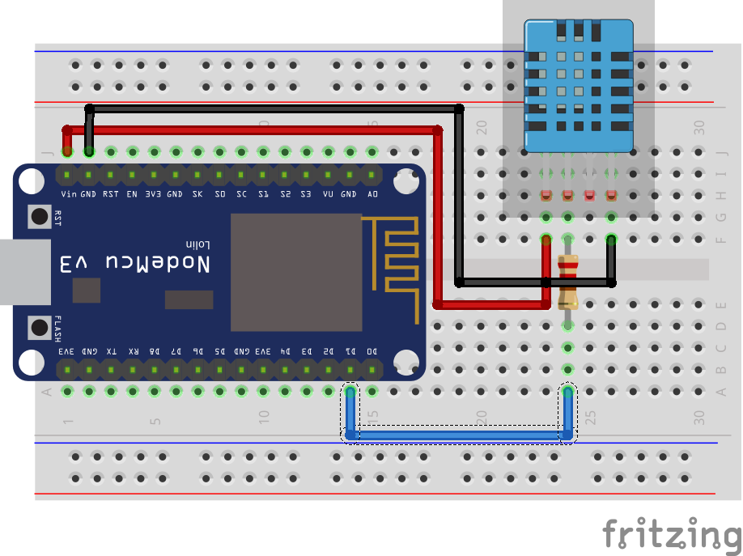
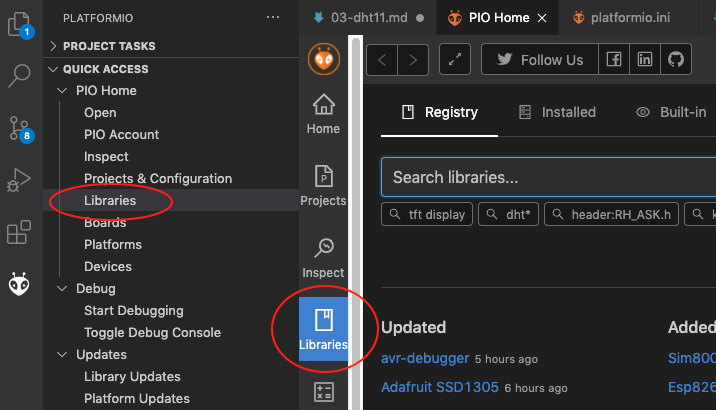
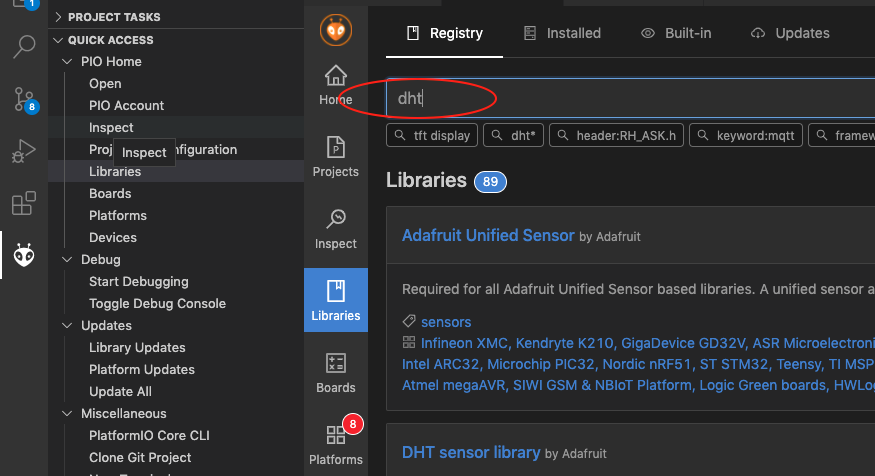
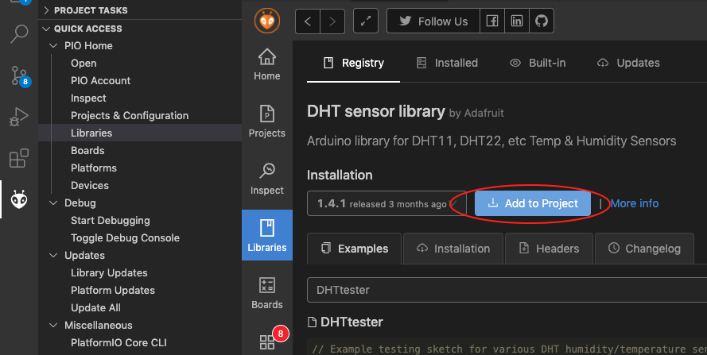
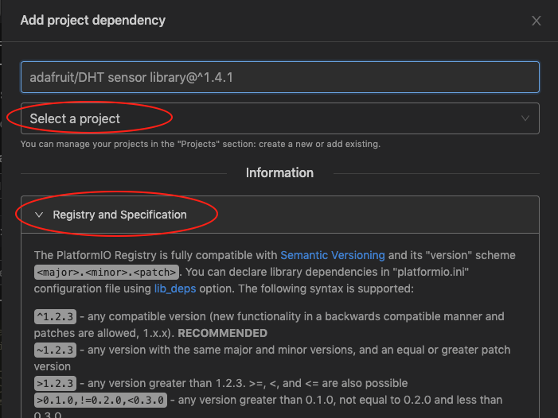

# DHT11

## Topik Bahasan

Implementasi program sensor Suhu & Kelembaban DHT11

## Kemampuan Akhir yang Direncanakan

- Menjelaskan cara kerja sensor DHT11
- Menjelaskan cara kerja analogRead
- Menampilkan suhu dan kelembaban dalam satuan derajat dan fahrenheit pada console debugger secara real time

## Teori Singkat

### Sensor Suhu dan Kelembaban

Salah satu sensor diantara sensor-sensor yang lain adalah sensor suhu dan kelembaban. Sensor ini digunakan untuk mengambil data suhu pada lingkungan tertentu beserta tingkat kelembabannya. Salah satu sensor tersebut yang banyak digunakan adalah DHT11 karena secara biaya sangat minim serta mudah digunakan.

Jenis sensor lain yang memiliki fungsi yang sama adalah DHT22, yang membedakan dari tipe ini adalah keakuratan dalam mengambil data suhu dan kelembaban dan juga lama atau jeda dalam pengambilan sampling. DHT22 mengambil sampling setiap 2 detik, sedangkan DHT11 setiap 1 detik. Tentunya DHT22 lebih baik dibandingkan dengan versi terdahulunya, DHT11.

**Spesifikasi sensor DHT11**

| Nama                 | Nilai                       |
| -------------------- | --------------------------- |
| Tegangan             | 3,5 V - 5,5 V               |
| Arus                 | 0,3 mA                      |
| Jangkauan Suhu       | 0 - 50 derajat Celsius      |
| Jangkauan Kelembaban | 20%-90%                     |
| Akurasi Pengukuran   | +- 2 derajat Celsius (Suhu) |
|                      | 5% (Kelembaban)             |

**Spesifikasi sensor DHT22**

| Nama                 | Nilai                         |
| -------------------- | ----------------------------- |
| Tegangan             | 3,5 V - 5,5 V                 |
| Arus                 | 0,3 mA                        |
| Jangkauan Suhu       | -40 - 80 derajat Celsius      |
| Jangkauan Kelembaban | 0% - 100%                     |
| Akurasi Pengukuran   | +- 0.5 derajat Celsius (Suhu) |
|                      | 2 - 5% (Kelembaban)           |

Sumber: https://learn.adafruit.com/dht

Struktur pin pada sensor DHT11 seperti berikut, sebenarnya sama dengan DHT22. Perbedaannya adalah jika DHT22 biasanya penutup menggunakan warna putih.


Dari gambar di atas terlihat bahwa terdapat 3 kaki yang masing-masing memiliki fungsi dan peran masing-masing adalah sebagai berikut;

1. `VCC` digunakan untuk memberikan tegangan pada sensor, pada NODEMCU dihubungkan pada pin Vin atau 3v3.
2. `Data` digunakan untuk menghubungkan hasil pembacaan data dari nilai suhu atau kelembaban pada sensor, dihubungkan pin tertentu yang tersedia.
3. `Ground` dihubungkan pada pin GND pada NODEMCU.

## Praktikum - Membaca data suhu dan kelembaban udara

Pada praktikum pertama, anda akan melakukan percobaan untuk menangkap data suhu dan kelembaban udara dengan sensor DHT11.

Susunan rangkaian sederhana pada praktikum ini seperti gambar berikut.



> Dari gambar di atas terlihat terdapat resistor, jika tidak memiliki resistor diabaikan saja dan dihubungkan langsung ke pin tanpa melalui resistor.

**Skematik dari rangkaian di atas**

| NODEMCU | DHT11  |
| ------- | ------ |
| D1      | Data   |
| Vin     | VCC    |
| GND     | Ground |

Berikut ini adalah contoh source code untuk membaca suhu dan kelembaban udara menggunakan Visual Studio Code.

1. Buat project dengan nama `vs-program`
2. Tentukan board yang digunakan, dengan mengetik `esp8266` kemudian pilih yang `Espressif ESP8266 EFSP-12E`
3. Untuk lokasi penyimpanan project disesuaikan dengan kebutuhan Anda.
4. Tunggu beberapa saat sampai dibuat struktur project oleh Visual Studio Code. Kemudian tambahkankan beberapa konfigurasi pada file `platform.ini`

   ```
   lib_deps =
       adafruit/DHT sensor library@^1.4.1
       adafruit/Adafruit Unified Sensor @ ^1.1.4

   monitor_speed = 115200
   ```

5. Dapat juga menggunakan pada tombol `libraries` yang disediakan oleh PlatformIO kemudian akan muncul isian library yang bisa kita cari, terlihat seperti pada gambar di bawah ini

   

6. Silakan ketik `dht` sehingga akan muncul banyak varian yang bisa digunakan, silakan pilih yang banyak didownload dan sesuai kebutuhan. Untuk lebih jelasnya perhatikan gambar di bawah ini

   

7. Setelah memilih library yang akan kita gunakan, kita dapat memilih cara untuk menambahkan library ke project dengan klik tombol `Add to Project` dan pilih projek yang akan ditambahkan library tersebut seperti ditunjukkan pada gambar berikut

   

8. Langkah yang lain, kita dapat menambahkan konfigurasi pada file `platform.ini` dengan property `lib_deps`. Banyak model yang bisa digunakan misalkan menambahkan link github pada file tersebut atau dengan menyebut nama library diikuti dengan versi library, misalkan seperti di bawah ini:

   - `adafruit/DHT sensor library @ ^1.4.1` artinya ketika menggunakan sintaks tersebut berarti library tersebut masih bisa untuk menerima perbaikan fungsi update dari versi yang sebelumnya
   - `adafruit/DHT sensor library @ ~1.4.1` adalah hanya menerima perbaikan bug fixing dari versi yang sebelumnya.
   - `adafruit/DHT sensor library @ 1.4.1` berarti library yang digunakan adalah versi 1.4.1

   Dokumentasi tersebut di atas dapat dilihat pada gambar di bawah ini ketika

   

9. Tambahkan baris kode untuk inisialisasi dan menambahkan fungsi sensor seperti di bawah ini

   ```c++
   #include <Arduino.h>
   #include <DHT.h>

   #define DHTTYPE DHT11

   DHT dht(D7, DHTTYPE);
   ```

10. Tambahkan kode baris pada fungsi setup() untuk melakukan konfigurasi agar baudrate di serial monitor menjadi 11500.

    ```c++
    Serial.begin(115200);
    Serial.println("Menggunakan DHT11");
    ```

11. Yang terakhir, tambahkan kode untuk menampilkan data hasil pembacaan sensor pada fungsi loop().

    ```c++
    delay(2000);
    float h = dht.readHumidity();
    float t = dht.readTemperature();
    float f = dht.readTemperature(true);

    if (isnan(h) || isnan(t) || isnan(f))
    {
      Serial.println("Failed to read from DHT sensor!");
      return;
    }

    float hif = dht.computeHeatIndex(f, h);
    float hic = dht.computeHeatIndex(t, h, false);

    Serial.print(F("Humidity: "));
    Serial.print(h);
    Serial.print(F("%  Temperature: "));
    Serial.print(t);
    Serial.print(F("°C "));
    Serial.print(f);
    Serial.print(F("°F  Heat index: "));
    Serial.print(hic);
    Serial.print(F("°C "));
    Serial.print(hif);
    Serial.println(F("°F"));
    ```

12. Silakan jalankan program di atas dengan upload ke board Anda dan amati hasilnya.

> Misalkan menggunakan library yang di atas masih belum berhasil, atau sensor suhu akurasinya kurang, ataubahkan tidak stabil silakan menggunakan library `winlinvip/SimpleDHT@^1.0.14`.

Contoh code menggunakan library `winlinvip/SimpleDHT@^1.0.14` dapat dilihat pada contoh di bawah ini

```cpp
    #include <Arduino.h>
    #include <SimpleDHT.h>

    #define pinDHT 7 // SD3 pin signal sensor DHT

    byte temperature = 0;
    byte humidity = 0;

    SimpleDHT11 dht11(D7); //instan sensor dht11

    void KelembabanSuhu()
    {
        int err = SimpleDHTErrSuccess;

        if ((err = dht11.read(&temperature, &humidity, NULL)) != SimpleDHTErrSuccess)
        {
            Serial.print("Pembacaan DHT11 gagal, err=");
            Serial.println(err);
            delay(1000);
            return;
        }

        Serial.print("Sample OK: ");
        Serial.print((int)temperature);

        Serial.print(" *C, ");
        Serial.print((int)humidity);
        Serial.println(" H");

        delay(1500);
    }

    void setup()
    {
        Serial.begin(115200);
        Serial.println("Simple DHT");
        delay(1000);
    }

    void loop()
    {
        KelembabanSuhu();
    }
```

Ketika dijalankan seharusnya seperti berikut ini

```bash
    Sample OK: 31 *C, 95 H
    Sample OK: 31 *C, 95 H
    Sample OK: 31 *C, 95 H
    Sample OK: 31 *C, 95 H
    Sample OK: 31 *C, 95 H
    Sample OK: 31 *C, 95 H
    Sample OK: 31 *C, 95 H
    Sample OK: 31 *C, 95 H
    Sample OK: 31 *C, 95 H
    Sample OK: 31 *C, 95 H
    Sample OK: 31 *C, 95 H
    Sample OK: 31 *C, 95 H
```

## Video Pendukung

<iframe width="897" height="561" src="https://www.youtube.com/embed/pQg1BdpLtrQ" frameborder="0" allow="accelerometer; autoplay; clipboard-write; encrypted-media; gyroscope; picture-in-picture" allowfullscreen></iframe>

## Tugas

1. Modifikasi baris kode pada bagian praktikum sehingga muncul data suhu dalam satuan Kelvin dan Reaumur!
2. Buatlah simulasi sebuah alat pembaca suhu dan kelembaban udara di tengah kota dengan memanfaatkan lampu LED sebagai indikator dengan disertai keterangan data suhu dan kelembaban yang ditampilkan pada serial monitor!

   Contoh: Suhu pada sebuah kota dikategorikan dingin, normal, dan panas. Masing-masing kategori memiliki indikator lampu LED yang menyala, salah satunya ketika kategori dingin diwakili oleh LED hijau, normal diwakili oleh LED warna Biru, dan panas diwakili oleh LED warna Merah.

   > Misalkan tidak memiliki LED RGB, silakan menggunakan LED build in NODEMCU.

3. Gambarkan skematik dari simulasi yang Anda buat.
4. Hasil dari simulasi tersebut silakan upload di youtube dan urlnya disisipkan pada laporan Anda.
