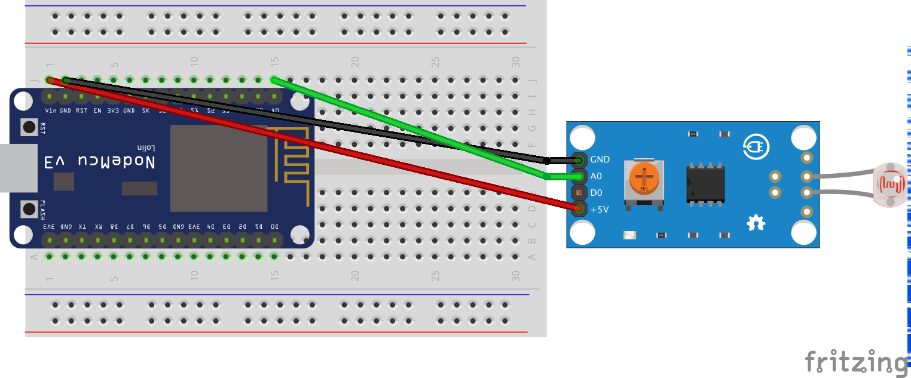

# LDR dan HC-SR04

## Topik Bahasan
Implementasi program sensor cahaya LDR dan sensor Ultrasonic

## Kemampuan Akhir yang Direncanakan
- Mahasiswa dapat menjelaskan cara kerja sensor cahaya LDR
- Mahasiswa dapat menghitung dan menampilkan intensitas cahaya yang dierima oleh sensor LDR secara analog
- Mahasiswa dapat menampilkan nilai temperatur dan kelembaban ke serial monitor
- Mahasiswa dapat mengklasifikasi keterangan pada serial monitor: “Gelap”, “Redup”, “Terang”
- Mahasiswa dapat menjelaskan proses perhitungan jarak berdasarkan gelombang dikirim dan diterima
- Mahasiswa dapat menampilkan jarak antara benda penghalang dengan ultrasonic ke layar serial monitor dalam satuan cm dan inch

## Teori Singkat

### Sensor Cahaya

Sensor cahaya digunakan untuk menangkap intensitas cahaya di sekitar. Sensor yang digunakan adalah sensor LDR (Light Dependent Resistor). 

Pin pada sensor cahaya terdapat 3 buah, VCC, ground, dan data. Data yang ditangkap pada sensor cahaya berupa data analog, sehingga kita harus menghubungkan pin data pada pin analog NodeMCU. Struktur pin pada sensor cahaya LDR seperti berikut.


Contoh penggunaan LDR digunakan sebagai sensor penerang jalan otomatis, lampu kamar tidur, alarm, rangkaian anti pencurian otomatis menggunakan laser, dan masih banyak yang lain.

**Skematik dari rangkaian di atas**

| NODEMCU | LDR|
|-|-|
| A0 | Data|
| Vin| VCC|
| GND | Ground |

> A0 merupakan pin khusus yang digunakan sebagai input analog

### Ultrasonic Sensor HC-SR04

Sensor ultrasonik merupakan sensor yang berfungsi untuk mendeteksi suatu benda dengan jarak tertentu sesuai dengan jenis sensornya. Pada praktikum kali ini dibahas mengenai cara menggunakan serta implemetasi sensor ultrasonik pada NodeMCU. Sensor ultrasonik yang digunakan adalah tipe HC-SR04 dengan jarak yang dapat untuk mendeteksi benda dengan akurasi 3 mm. Sensor ini memiliki pin Trigger, dimana pin ini berfungsi sebagai pengirim sinyal dan pin Echo yang berfungsi sebagai penerima sinyal yang didapat dari pantulan benda.

Sensor ultrasonik ialah sensor yang mempunyai kemampuan untuk mengubah besaran fisis yaitu bunyi kedalam besaran listrik, begitu juga sebaliknya. Sensor ini bekerja berdasarkan perhitungan dari pantulan suatu gelombang ultrasonik sehingga jarak suatu benda dapat diketahui. Nilai gelombang ultrasonik mencapai 20.000 Hz yang tidak bisa didengar oleh telinga manusia karena sangat tinggi dan hanya bisa didengar oleh hewan-hewan tertentu seperti anjing, kucing, atau kelelawar.

Pada sensor ultrasonik tersusun atas rangkaian transmitter sebagai pemancar gelombang ultrasonik  dan rangkaian receiver sebagai penerima gelombang ultrasonik. Transmitter sensor akan memancarkan sinyal ultrasonik dan saat sinyal ultrasonik mengenai sebuah penghalang, maka sinyal ultrasonik akan dipantulkan. Sinyal ultrasonik yang dipantulkan akan diterima oleh receiver sensor. Mikrokontroller digunakan untuk mengolah dan menghitung sinyal yang diterima oleh rangkaian receiver sensor sehingga jarak sensor terhadap benda di depannya atau bidang pantul dapat diketahui. Agar lebih jelas perhatikan ilustrasi dibawah ini.


Sinyal ultrasonik yang dipancarkan tersebut akan merambat sebagai sinyal atau gelombang bunyi dengan kecepatan bunyi yang berkisar 340 m/s. Dengan demikian, untuk menentukan jarak benda dengan pantulan dapat ditentukan dengan menggunakan rumus:

```S = 340.t/2```

dimana, 		
`S` adalah jarak antara sensor ultrasonik dengan bidang pantul

`t` adalah selisih waktu antara pemancaran gelombang ultrasonik sampai diterima kembali oleh bagian penerima/receiver sensor ultrasonic

Penggunaan Sensor Ultrasonik meliputi berbagai bidang, seperti :

Dunia Kesehatan:
- Mendeteksi organ-organ dan penyakit dalam tubuh manusia dengan USG

Dunia Industri:
- Mendeteksi suatu objek dalam proses produksi barang
- Mendeteksi keberadaan mineral dan bahan-bahan tambang.

Dunia Robotika:
- Sebagai pengganti indra pada robot untuk mengetahui jarak.

Dunia Maritim:
- Sebagai Radar


Sensor Ultrasonic HC-SR04

## Praktikum 1 - Membaca data intensitas cahaya

Pada praktikum pertama, anda akan melakukan percobaan untuk menangkap data intensitas cahaya.

Berikut ini adalah rangkaian yang dapat digunakan


Contoh source code untuk membaca data intensitas cahaya.

1. Buatlah projek pada PlatformIO, namanya sesuai dengan keinginan Anda.
2. Deklarasikan variabel untuk menampung nilai sensor dan untuk variabel sensor seperti di bawah ini

    ```c++
    #define sensorLDR A0
    int nilaiSensor;
    ```
3. Tambahkan beberapa kode untuk melakukan konfigurasi serial monitor pada `fungsi setup()`.
    ```c++
    Serial.begin(115200);
    Serial.println("Contoh Penggunaan Sensor LDR");
    delay(3000);
    ```
4. Dan yang terakhir, membuat kode untuk membaca nilai dari sensor dan menampilkannya seperti berikut ini pada `fungsi loop()`.
    ```c++
    nilaiSensor = analogRead(sensorLDR);
    Serial.print(“Nilai Sensor : “);
    Serial.println(nilaiSensor);
    delay(1000);
    ```

Setelah source code diupload, buka serial monitor pada PlatformIO untuk melihat hasil pembacaan data intensitas cahaya di sekitar sensor.


> Normalnya ketika program Anda dijalankan maka akan menampilkan nilai 0-1024, Semakin banyak cahaya yang mengenai LDR maka nilai resistansinya akan menurun, dan sebaliknya semakin sedikit cahaya yang mengenai LDR maka nilai hambatannya akan semakin membesar. Ketika hasil pembacaan sensor nilainya tidak seperti yang disebutkan, silakan kalibrasi sensor tersebut dengan cara memutar baut kecil yang terdapat di sensor menggunakan obeng kecil sambil mengamati keluaran yang ada di serial monitor.

## Praktikum 2 - Membaca data jarak benda

Pada project awal ini akan dilakukan percobaan untuk bagaimana menerapakan atau mengimplementasikan pembacaan sensor 
ultrasonic untuk kemudian ditampilkan pada serial monitor yang ada pada Platformio.

**Rangkaian**


Sensor Ultrasonik HC-SR04
- `Pin Trigger` dihubungkan ke pin `D3` NodeMCU
- `Pin Echo` dihubungkan ke pin `D4` NodeMCU
- `VCC` dihubungkan ke `Vin` NodeMCU
- `GND` dihubungkan ke `GND` NodeMCU

**Syntax Program**

Setelah rangkaian elektrik telah selesai anda rangkai, selanjutnya hal yang perlu anda lakukan adalah menulis syntax program 
sesuai dengan nomor pin dari rangkaian elektrik tersebut. Berikut ini langkah-langkah dalam menulis serta uploading pada nodeMCU:
```cpp
#define triggerPin D1
#define echoPin D2

void setup() {
   Serial.begin (115200);
   pinMode(triggerPin, OUTPUT);
   pinMode(echoPin, INPUT);
   pinMode(BUILTIN_LED, OUTPUT);
}

void loop() {
   long duration, jarak;
   digitalWrite(triggerPin, LOW);
   delayMicroseconds(2);
   digitalWrite(triggerPin, HIGH);
   delayMicroseconds(10);
   digitalWrite(triggerPin, LOW);
   duration = pulseIn(echoPin, HIGH);
   jarak = duration * 0.034 / 2;
   Serial.print(jarak);
   Serial.println(" cm");
   delay(2000);
}
```    

## Video Pendukung
<p>
<iframe width="640" height="320" src="https://www.youtube.com/embed/84RNgzA-ESo" frameborder="0" allow="accelerometer; autoplay; clipboard-write; encrypted-media; gyroscope; picture-in-picture" allowfullscreen></iframe>
</p>

## Tugas
1. Buatlah sebuah rangkaian untuk LED, sensor cahaya dan sensor suhu menggunakan fritzing, kemudian buatlah program dengan skenario sebagai berikut
    + Ketika cahaya redup dan suhu kategori dingin maka LED warna biru akan berkedip-kedip.
    + Ketika cahaya terang dan suhu tergolong tinggi, LED merah akan menyala.
    > Ketika tidak memiliki LED RGB, silakan memanfaatkan LED build in adalah LED bawaan esp8266, biasanya berwarna biru atau merah
2. + Buatlah rangkaian dan kode programnya dimana:
   - Terdapat tambahan 1 LED RGB,
   - LED Blue menyala jika jarak yang terbaca 1 cm
   - LED Green menyala jika jarak yang terbaca 2 cm
   - LED Red menyala jika jarak yang terbaca  3 cm
   - LED menyala semua dan berkedip kedip selama 1 detik jika jarak melebihi dari 3 cm
3. Upload hasilnya berupa file video menggunakan youtube atau google drive dan sisipkan linknya pada laporan Anda.
