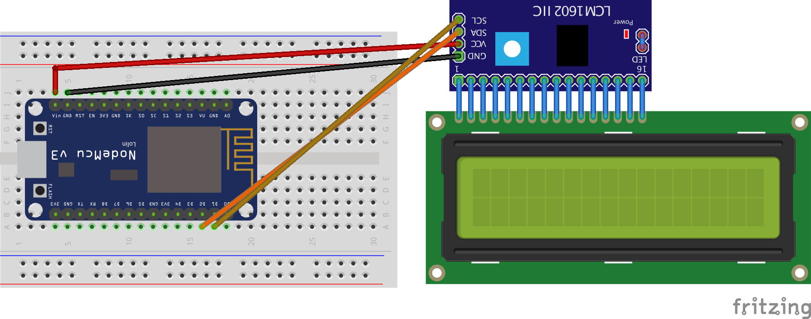
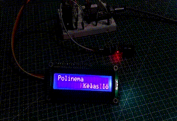
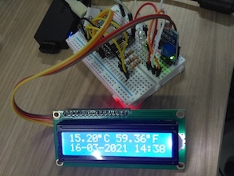

# LCD

## Topik Bahasan
Implementasi LCD I2C

## Kemampuan Akhir yang Direncanakan
- Mahasiswa mampu menggunakan LCD I2C untuk menampilkan data
- Mahasiswa mampu untuk mencari alamat I2C pada MCU
- Mahasiswa mampu menggunakan library yang digunakan untuk kebutuhan LCD I2C
- Mahasiswa mamapu mengkalibrasi LCD I2C

## Teori Singkat
Berbagai jenis LCD bergantung dengan banyaknya karakter yang dapat ditampilkan, misalkan 16x2 ataupun 20x4. 16x2 artinya LCD tersebut mampu menampilkan sebanyak 32 karakter, dengan jumlah barisnya 2 dan jumlah kolomnya adalah 16. LCD merupakan sebuah jenis dari aktuator dan biasanya digunakan sebagai output atau tampilan dari sebuah nilai/data yang telah diolah dari sensor.

Biasanya untuk memudahkan dalam wiring kita membutuhkan modul i2c, fungsi modul tersebut agar menyederhanakan jumlah kabel yang digunakan. Berikut ini adalah tampilan fritzing yang sapat dapat diterapkan.



> Versi fritzing dapat diunduh di [sini](images/esp8266-lcd-i2c.fzz)

Dari gambar di atas, diperjelas pada tabel di bawah ini

| ESP8266 Amica | LCD I2C                            |
|---------------|------------------------------------|
| Vin           | VCC                                |
| GND           | GND                              |
| D1            | SCL                                |
| D2            | SDA                                |

## Praktikum 1 - Mencari alamat I2C
Untuk dapat menggunakan LCD yang menggunakan I2C, sebelumnya harus mencari terlebih dahulu lokasi dari I2C tersebut. I2C defaultnya terdapat di `0x27`, akan tetapi hal tersebut bisa berbeda bergantung dari manufacture atau vendor. Buatlah kode di bawah ini untuk mendapatkan alamat I2C pada LCD. 

Adapun langkah-langkahnya adalah sebagai berikut;
1. Buat project menggunakan visual studio code dengan PlatformIO dengan nama `vs-i2c-address`
2. Tentukan board yang digunakan, dengan mengetik `esp8266` kemudian pilih yang `Espressif ESP8266 EFSP-12E`
3. Untuk lokasi penyimpanan project disesuaikan dengan kebutuhan Anda.
4. Tunggu beberapa saat sampai dibuat struktur project oleh Visual Studio Code. Kemudian tambahkankan beberapa konfigurasi pada file `platform.ini`. Tambahkan kode `monitor_speed = 115200` untuk mengkonfigurasi serial console terkait baudrate.
5. Tambahkan potongan kode pada fungsi `setup()` seperti berikut ini

    ```c++
    Serial.begin(115200);
    Serial.println("\nI2C Scanner");
    ```
6. Pada fungsi `loop()` tambahkan juga kode seperti berikut
    ```c++
      byte error, address;
      int nDevices;
      Serial.println("Scanning...");
      nDevices = 0;
      for(address = 1; address < 127; address++ ) {
        Wire.beginTransmission(address);
        error = Wire.endTransmission();
        if (error == 0) {
          Serial.print("I2C ditemukan pada 0x");
          if (address<16) {
            Serial.print("0");
          }
          Serial.println(address,HEX);
          nDevices++;
        }
        else if (error==4) {
          Serial.print("Unknow error at address 0x");
          if (address<16) {
            Serial.print("0");
          }
          Serial.println(address,HEX);
        }    
      }
      if (nDevices == 0) {
        Serial.println("No I2C devices found\n");
      }
      else {
        Serial.println("done\n");
      }
      delay(3000);          
    ```
Upload kode di atas, kemudian amati hasilnya pada serial monitor.

### Verifikasi Hasil Percobaan
Hasil dari percobaan di atas seharusnya dapat menghasilkan keluaran seperti ditunjukkan pada gambar di bawah ini


> Keluaran dari kode di atas akan kita gunakan untuk menginisialisasi LCD yang akan kita gunakan pada praktikum selanjutnya. Setiap nilai alamat I2C bisa berbeda dengan yang lain, tergantung dari pabrik pembuatnya.

## Praktikum 2 - Menampilkan data pada LCD
Pada praktikum ini kita akan mencoba menggunakan LCD untuk menampilkan sebuah text, hasil praktikum pertama akan kita gunakan pada praktikum ini. Silakan ikuti langkah-langkah berikut ini
1. Buat project dengan nama `vs-i2c-lcd` serta untuk konfigurasi board, penyimpanan project, serta file platform.ini disamakan dengan project sebelumnya pada praktikum pertama.
2. Tambahkan library `LiquidCrystal_I2C` pada project Anda, untuk menambahkan library tersebut bisa melalui `platform.ini` atau menggunakan wizard/sistem menu pada PlatformIO seperti yang telah diajarkan pada praktikum yang sebelumnya.
3. Tambahkan 2 baris kode sebelum fungsi `setup()` agar kita bisa memanfaatkan library yang telah kita tambahkan seperti di bawah ini
    ```c++
    #include <LiquidCrystal_I2C.h>

    LiquidCrystal_I2C lcd(0x27, 16, 2);
    ```
4. Tambahkan kode pada fungsi `setup()` untuk memanggil berapa fungsi sebagai berikut
    ```c++
      lcd.init(); // initialize the lcd
      lcd.backlight();

      lcd.home();
    ```
5. Buatlah sebuah fungsi `scroolText(...)`, fungsi ini digunakan untuk melakukan scrolling text yang terdapat pada LCD agar lebih menarik.
    ```c++
    void scrollText(int row, String message, int delayTime, int lcdColumns)
    {
      for (int i = 0; i < lcdColumns; i++)
      {
        message = " " + message;
      }
      message = message + " ";
      for (int pos = 0; pos < message.length(); pos++)
      {
        lcd.setCursor(0, row);
        lcd.print(message.substring(pos, pos + lcdColumns));
        delay(delayTime);
      }
    }
    ```
6. Tambahkan beberapa baris perintah pada fungsi `loop()`, seperti dicontohkan pada baris berikut ini
    ```c++
      lcd.home();
      lcd.print("Polinema");
      scrollText(1, "Kelas IoT.", 250, 16);
    ```
7. Upload kode di atas selanjutnya perhatikan tampilan LCD Anda masing-masing.

Pada kode di atas terdapat baris perintah `LiquidCrystal_I2C lcd(0x27, 16, 2);`, berfungsi untuk menginisialisasi lcd dengan alamat i2c terdapat di `0x27` menggunakan LCD 16x2.

### Verifikasi Hasil Percobaan
Hasil dari percobaan di atas seharusnya dapat menghasilkan keluaran seperti ditunjukkan pada gambar di bawah ini



### Pertanyaan
1. Jelaskan fungsi dari pemanggilan method `lcd.backlight()`?
2. Bagimana caranya mengganti tingkat intensitas kecerahan dari LCD Anda?
3. Silakan modifikasi data yang ditampilkan pada LCD Anda?

## Video Pendukung
<p>
<iframe width="798" height="499" src="https://www.youtube.com/embed/cO1Lc9RE19A" frameborder="0" allow="accelerometer; autoplay; clipboard-write; encrypted-media; gyroscope; picture-in-picture" allowfullscreen></iframe>
</p>

## Tugas
Buatlah sebuah aplikasi yang sederhana menggunakan DHT11, LED RGB, dan LCD. Skenarionya adalah sebagai berikut
1. Buatlah ketiga komponen tersebut di dalam satu rangkaian menggunakan fritzing.
2. Tampilkan suhu dalam bentuk Fahrenheit dan Celcius, suhu yang ditampilkan adalah suhu di ruangan sekitar Anda.
3. Ketika suhu normal LED berwarna biru akan berkedip-kedip, ketika suhu dingin LED berwarna hijau akan berkedip, dan LED berwarna merah akan berkedip ketika suhu tergolong tinggi.
4. Tampilkan waktu saat ini juga pada LCD.
5. Silakan hasilnya diupload ke google drive ataupun youtube, linknya sertakan dalam laporan Anda.

Output yang diharapkan adalah sebagai berikut 

