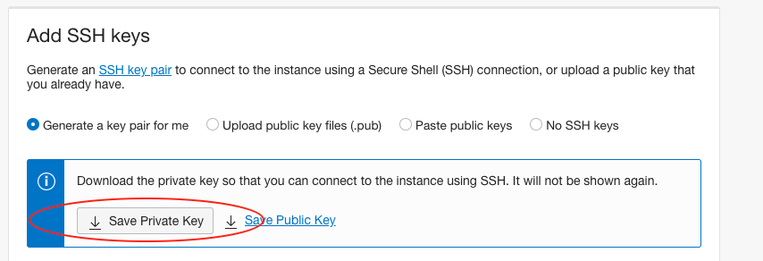

# Installasi IoT Platform

# Topik Bahasan

Installasi IoT Platform

## Kemampuan Akhir yang Direncanakan

- Mahasiswa mampu melakukan instalasi dan konfigurasi IoT platform, baik secara lokal ataupun di cloud masing-masing.
- Mahasiswa mampu mengamankan atau menambahkan keamanan IoT platform
- Mahasiswa mampu menerapkan IoT platform untuk aplikasi sederhan.

## Teori Singkat

IoT platform merupakan sebuah kumpulan alat bantu baik software ataupun hardware yang sangat mempermudah kita dalam
membuat project IoT dalam hal mengumpulkan, memvisualisasikan, dan bahkan sampai dengan menganalisis data dari perangkat
IoT kita. Dengan alat bantu tersebut kita bisa lebih fokus terhadap proses bisnis, sehingga proses development akan
sangat jauh lebih mudah dan cepat.

Hampir semua raksasa internet ataupun layanan cloud menyediakan IoT Platform, misalkan AWS dengan Amazon AWS IoT Core,
Google dengan Google Cloud IoT Core, IBM dengan IBM Watson IoT, Microsoft dengan Microsoft Azure IoT Suite, Blynk IoT
Platform, Node-red, dan masih banyak yang lain. Dari beberapa yang telah disebutkan ada yang bersifat free ataupun
berbayar, disesuaikan dengan kebutuhan project kita.

Pada praktikum yang akan kita lakukan adalah menggunakan node-red sebagai IoT Platform. Node-red adalah sebuah alat
bantu programming sekaligus dalam proses wiring pada perangkat hardware, API, dan layanan online dengan cara yang
menarik.


<p>https://nodered.org/about/resources/</p>

## Praktikum

### 1. Install Node-Red AWS

Node-red menyediakan sebuah editor berbasis browser sehingga mudah untuk dioperasikan pada waktu merangkai sebuah flow
dari sebuah node pada pallete dan dapat di-deploy hanya dengan sekali klik. Node-red dibangun pada sebuah Node.js yang
terkenal dengan ringan untuk dijalankan, konsep _event-driven_, dan menggunakan model non-blocking. Node-red dapat
diinstall dalam sebuah jaringan dengan spesifikasi hardware yang murah seperti raspberry maupun di cloud. Pada praktikum
kali ini akan diinstall pada sebuah layanan cloud yaitu AWS.

> Misalnya belum mendaftar sebagai AWS Educate bisa diganti dengan install di Raspberry Pi atau di komputer local. Tentunya
> ketika install di local dengan sistem operasi windows sangat berbeda dengan langkah yang disajikan pada jobsheet ini,
> Untuk lebih jelasnya bisa melihat dokumentasinya di [https://nodered.org/docs/getting-started/](https://nodered.org/docs/getting-started/)

Berikut ini adalah langkah-langkahnya

1. Silakan login ke akun aws educate, [https://www.awseducate.com/educator/s/](https://www.awseducate.com/educator/s/).
   Jika berhasil akan diarahkan ke halaman AWS educate seperti pada gambar di bawah ini

   

2. Pilih menu `AWS Account - AWS Educate Started Account`, selanjutnya muncul halaman seperti ditunjukkan pada gambar
   berikut

   

3. Pilih `AWS Console` dan muncul halaman `AWS Management Console` seperti berikut ini

   

4. Kemudian silakan pilih `EC2`, untuk membuat sebuah instance langkahnya seperti pada praktikum tentang socket client.
   Silakan cek kembali pada pertemuan [sebelumnya](07/07-socket-client.md).

   > Jangan lupa pada langkah `Configure Security Group`, buatlah sebuah rule untuk protokol `Custom TCP Rule` dengan menambahkan
   > port 1880. Port tersebut digunakan untuk mengakses node-red yang akan kita install pada EC2.

5. Silakan login ke instance yang telah Anda buat, setelah login ketika perintah seperti di bawah ini
    ```shell
    ubuntu@ip-172-31-21-64:~$ node --version
    Command 'node' not found, but can be installed with:
    sudo apt install nodejs
    ubuntu@ip-172-31-21-64:~$ npm --version
    Command 'npm' not found, but can be installed with:
    sudo apt install npm
    ```
   Dari keluaran perintah di atas terlihat bahwa nodejs dan npm belum terinstall, agar node-red bisa berjalan dibutuhkan
   nodejs. Kemudian npm adalah paket manajement atau library manajemen nodejs yang kelak akan kita gunakan ketika ingin
   install library tertentu.

6. Jalankan perintah seperti di bawah ini untuk install keduanya.
    ```shell
    ubuntu@ip-172-31-21-64:~$ sudo apt-get update
    Hit:1 http://us-east-1.ec2.archive.ubuntu.com/ubuntu focal InRelease
    Get:2 http://us-east-1.ec2.archive.ubuntu.com/ubuntu focal-updates InRelease [114 kB]
    Get:3 http://us-east-1.ec2.archive.ubuntu.com/ubuntu focal-backports InRelease [101 kB]
    Get:4 http://security.ubuntu.com/ubuntu focal-security InRelease [109 kB]
   ...
   ubuntu@ip-172-31-21-64:~$ sudo apt-get install -y nodejs build-essential
   ubuntu@ip-172-31-21-64:~$ sudo apt-get install -y npm
   ubuntu@ip-172-31-21-64:~$ sudo npm install -g --unsafe-perm node-red
    ```
7. Setelah langkah di atas selesai, kemudian jalankan node-red dengan mengetik perintah `node-red` pada terminal atau
   putty. Untuk lebih jelasnya dapat dilihat pada ilustrasi di bawah ini
   ```shell
    ubuntu@ip-172-31-21-64:~$ node-red
    10 Apr 14:14:18 - [info]
    
    Welcome to Node-RED
    ===================
    
    10 Apr 14:14:18 - [info] Node-RED version: v1.3.1
    10 Apr 14:14:18 - [info] Node.js  version: v10.19.0
    10 Apr 14:14:18 - [info] Linux 5.4.0-1038-aws x64 LE
    10 Apr 14:14:18 - [info] Loading palette nodes
    10 Apr 14:14:19 - [info] Settings file  : /home/ubuntu/.node-red/settings.js
    10 Apr 14:14:19 - [info] Context store  : 'default' [module=memory]
    10 Apr 14:14:19 - [info] User directory : /home/ubuntu/.node-red
    10 Apr 14:14:19 - [warn] Projects disabled : editorTheme.projects.enabled=false
    10 Apr 14:14:19 - [info] Flows file     : /home/ubuntu/.node-red/flows_ip-172-31-21-64.json
    10 Apr 14:14:19 - [info] Creating new flow file
    ...
    ```
8. Silakan akses alamat `http://[domain atau ip instance Anda]:1880/`, jika berhasil akan muncul tampilan node-red yang
   ditunjukkan pada gambar di bawah ini. Misalkan akses ke `http://ec2-3-90-163-77.compute-1.amazonaws.com:1880/`

   

> Ketika instance dimatikan atau direstart maka Node-Red harus dinyalan kembali, berikut ini adalah perintah yang digunakan
> agar Node-Red tetap berjalan ketika instance restart.
>

```shell
sudo npm install -g --unsafe-perm pm2
pm2 start `which node-red` -- -v
pm2 save
pm2 startup
sudo env PATH=$PATH:/usr/bin /usr/local/lib/node_modules/pm2/bin/pm2 startup systemd -u ubuntu --hp /home/ubuntu
```

Silakan restart instance Anda, seharusnya Node-Red sudah berjalan dan tidak perlu menjalankan kembali. `pm2` adalah
modul manajemen aplikasi yang berjalan pada nodejs.

### 2. Install Node-RED Oracle Cloud

Ketika Anda menggunakan layanan cloud orcle, langkahnya mirip dengan ketika Anda menggunakan AWS dan sebenarnya topik
ini sudah pernah Anda dapatkan ketika mengambil mata kuliah komputasi awan. Secara sederhana dapat mengikuti
langkah-langkah seperti berikut ini

1. Silakan login menggunakan akun oracle cloud Anda, kemudian masuk atau pilih menu `Compute - Instance` seperti
   ditunjukkan pada gambar di bawah ini
   
2. Anda akan akan diarahkan ke daftar instance yang sebelumnya telah dibuat, silakan buat instance baru. Untuk akun
   oracle yang free dibatasi hanya beberapa instance saja, sebaiknya Anda terminate instance yang tidak digunakan. Ikuti
   langkah di bawah ini untuk membuat instance
   
3. Setelah klik tombol `Create instance`, akan muncul halaman properties terkait dengan instance yang akan Anda buat
   misalkan jenis sistem operasi yang digunakan apa, spesifikasi yang digunakan, atau juga terkait dengan model boot
   ketika instance dijalankan. Khusus bagian sistem operasi, silakan memilih ubuntu seperti ditunjukkan pada gambar di
   bawah ini
   
   Dengan cara klik tombol `Change Image` sehingga bisa memilih beberapa pilihan seperti pada gambar barikut
   
   Jika sudah, agar bisa mengakses instance Anda download private key seperti pada tampilan di bawah ini
   
   Terakhir klik Create Instance, sampai muncul tampilan yang menandakan bahwa isntance sedang berjalan seperti pada
   gambar berikut
   

Port default yang digunakan adalah 1880, di Oracle Cloud kita tidak bisa langsung open port sehingga membutuhkan
beberapa langkah untuk melakukan hal tersebut

1. Silakan pilih menu `Networking - Virtual Cloud Networks` seperti ditunjukkan pada gambar berikut

   
2. Selanjutnya pilih VCN yang digunakan sampai muncul halaman `Default Security List`, bisa dengan klik
   tombol `Add Ingress Rule` seperti pada contoh gambar di bawah ini
   
3. Masukkan beberapa informasi seperti ip address mana yang bisa mengakses dan yang paling penting adalah port yang akan
   dibuka agar bisa diakses dari luar. Silakan perhatikan contoh di bawah ini
   
4. Silakan masuk ke instance Anda menggunakan protokol ssh, bisa menggunakan putty atau tool sejenisnya. Pada langkah
   ini membutuhkan private key yang seblumnya telah di-download, khusus untuk pengguna sistem operasi linux atau Mac OS
   perlu mengubah mode file terlebih dahlulu seperti ditunjukkan pada gambar berikut
   
5. Silakan ikuti langkah-langkah seperti pada installasi menggunakan AWS mulai pada langkah no.5. Jika sudah selesai
   silakan buka browser Anda dan masukkan alamat instance Anda diikuti dengan port 1880. Seharusnya akan menampilkan
   halaman Node-RED seperti pada contoh gambar di bawah ini
   

Jangan lupa agar konfigurasi open port pada `Virtual Cloud Networks` memberikan efek, Anda juga harus menjalankan 2
baris perintah seperti ini

```shell
sudo iptables -I INPUT 6 -m state --state NEW -p tcp --dport 1880 -j ACCEPT
sudo netfilter-persistent save
```

> Node-RED bisa juga dilakukan installasi pada mesin lokal atau localhost, caranya sama seperti langkah-langkah di atas.
> Yang paling penting adalah harus sudah terinstall `nodejs dan npm`.

### 3. Menambahkan Keamanan pada Node-Red

Ketika sudah berhasil install Node-RED, kita langsung bisa mengakses halaman editor yang mana terdapat semua flow atau
alur dari project yang telah kita buat. Hal ini tentunya tidak akan dilakukan ketika project yang telah di-deploy,
sehingga dibutuhkan mekanisme untuk membatasi setiap user ketika akan mengakses Node-RED.

Untuk mengamankan sebagai contoh memberikan user password ataupun mengganti protocol https pada halaman Node-RED,
berikut ini cara yang dilakukan untuk menambahkan user dan password pada Node-RED yang telah kita install.

Silakan edit file `settings.js`, file tersebut merupakan file konfigurasi Node-RED. Biasanya terletak pada home
direktori installasi Node-RED. File tersebut terletak di `.node-red/settings.js`

   ```shell
   ubuntu@ip-172-31-21-64:~$ pwd
   /home/ubuntu
   ubuntu@ip-172-31-21-64:~$ ls -al
   total 36
   drwxr-xr-x 6 ubuntu ubuntu 4096 Apr 10 14:38 .
   drwxr-xr-x 3 root   root   4096 Apr 10 14:00 ..
   -rw-r--r-- 1 ubuntu ubuntu  220 Feb 25  2020 .bash_logout
   -rw-r--r-- 1 ubuntu ubuntu 3771 Feb 25  2020 .bashrc
   drwx------ 2 ubuntu ubuntu 4096 Apr 10 14:01 .cache
   drwxrwxr-x 3 ubuntu ubuntu 4096 Apr 10 14:38 .local
   drwxrwxr-x 4 ubuntu ubuntu 4096 Apr 10 14:45 .node-red
   -rw-r--r-- 1 ubuntu ubuntu  807 Feb 25  2020 .profile
   drwx------ 2 ubuntu ubuntu 4096 Apr 10 14:00 .ssh
   -rw-r--r-- 1 ubuntu ubuntu    0 Apr 10 14:08 .sudo_as_admin_successful
   ubuntu@ip-172-31-21-64:~$ ls -al .node-red/settings.js
   -rw-r--r-- 1 ubuntu ubuntu 15473 Apr 10 14:41 .node-red/settings.js
   ```

Buka file `settings.js` menggunakan editor misalkan menggunakan nano dengan perintah `nano .node-red/settings.js`
atau langsung bisa menggunakan SFTP kemudian buka comment baris berikut ini, setelah dibuka seperti berikut

   ```shell
   // Securing Node-RED
    // -----------------
    // To password protect the Node-RED editor and admin API, the following
    // property can be used. See http://nodered.org/docs/security.html for details.
    adminAuth: {
        type: "credentials",
        users: [{
            username: "admin",
            password: "$2b$08$WcJwycUos6FqbUKZsIfGzOqHC4kJQ0GHY7Oz.mR7zaasPtBHuk2gm",
            permissions: "*"
        },{
        username: "odeng",
        password: "$2a$08$5LFz5nVwzCyX/r6rHb4KpuvG16pUwPYHTA/OxBqwTqdNB9a6K/rru",
        permissions: "read"
    }]
    },
   ```

Isikan username, password, dan permisi dari setiap user. Hanya terdapat 2 rule yang dapat digunakan yaitu full akses dan
read. Yang membedakan 2 rule tersebut adalah read tidak bisa digunakan untuk menambahkan library atau pallete ataupun
mengkonfigurasi node-read. Untuk membuat password silakan menggunakan perintah bawaan dari node-red seperti berikut

   ```shell
   ubuntu@ip-172-31-21-64:~$ node-red admin hash-pw
   Password:
   ```

Isikan password di atas sesuai dengan keinginan, password tersebut menggunakan algoritma bcrypt sehingga tidak bisa
dilakukan decrypt. Cara lain yang dapat digunakan membuat password menggunakan perintah

   ```shell
   ubuntu@ip-172-31-21-64:~$ node -e "console.log(require('bcryptjs').hashSync(process.argv[1], 8));" 1234
   $2a$08$sFcvlvl..OIIku1mzjtmFuoHSs7sOpeZS6bwdWaPpS640.JnxNoX.
   ```

Isikan `your-password-here` sesuai dengan password Anda.
> Ketika terjadi error karena library bcryptjs belum diinstall, silakan diinstall menggunakan perintah `npm install bcryptjs --save`

>

Silakan masuk ke Node-RED, seharusnya akan meminta user dan password seperti gambar berikut ini


#### Pertanyaan

1. Gantilah port bawaan Node-RED dan buktikan bahwa Node-RED bisa diakses dari public network?
2. Buktikan dengan tangkapan layar perbedaan antar permisi untuk user read dan full access?

### 3 . Sample Node-Red

Pada praktikum yang ini ditunjukkan menggunakan Node-RED untuk request sebuah end point dan menampilkan response dalam
sebuah mode debug. Silakan mengikuti langkah-langkah di bawah ini

1. Drag sebuah pallete node `inject` pada kategori `network` ke worksheet, perhatikan gambar berikut ini

   

2. Selanjutnya double klik node `inject` yang terdapat pada worksheet sehingga menampilkan jendela properties seperti
   berikut

   

   Ubah name menjadi `make request` dan hapus properti `msg.payload` serta `msg.topic` menggunakan icon `cross`, jika
   sudah jangan lupa klik tombol `Done`.

3. Tambahkan juga node `http request` pada worksheet, sesuaikan properties pada nilai `URL dan name`. Isikan `URL`
   dengan
   `https://raw.githubusercontent.com/prust/wikipedia-movie-data/master/movies.json` dan sedangkan `name` diisi
   dengan `movie request`. Untuk lebih jelasnya dapat dilihat pada gambar berikut ini

   

4. Hubungkan node `make reqeust (inject)` dan `movie request (http request)` dengan cara klik dan drag antar ujung node,
   hasilnya dapat dilihat pada gambar berikut ini

   

5. Tambahkan node `debug` yang terdapat pada kategori `common`, jangan lupa diubah name dengan nama msg. Terakhir
   hubungkan node tersebut dengan node `movie request`. Hasil akhirnya adalah sebagai berikut

   

   

6. Langkah terakhir, silakan klik tombol `Deploy` yang terletak di pojok kanan atas sampai muncul
   popup `successfully deployed`. Jika sudah, klik `make request` dan amati hasilnya pada bagian `debug` (klik icon
   kutu) di jendela sebelah kanan. Untuk lebih jelasnya dapat dilihat pada gambar di bawah ini

   

#### Pertanyaaan

1. Tambahkan kembali `node function` dan `node debug`, yang masing-masing fungsinya adalah untuk memfilter dimana movie
   yang akan tampil hanya movie dengan tahun > 2000 dan untuk menampilkan data filter tersebut.

2. Flow dan output pada debug dapat dilihat seperti berikut ini
   

## Video Pendukung

<p>
<iframe width="933" height="583" src="https://www.youtube.com/embed/10WsBy_Kf_c" title="YouTube video player" frameborder="0" allow="accelerometer; autoplay; clipboard-write; encrypted-media; gyroscope; picture-in-picture" allowfullscreen></iframe>
</p>

## Tugas

Buatlah sebuah flow yang digunakan untuk menentukan sebuah kondisi temperatur dingin, normal, dan panas. Terdapat 3 node
inject masing-masing sebagai berikut;

+ Ketika inject pertama diklik akan muncul di panel debug menampilkan dingin, lewatkan nilai 5 pada node inject pertama.
+ Ketika inject kedua diklik akan muncul di panel debug menampilkan normal, lewatkan nilai 25 pada node inject kedua.
+ Ketika inject ketiga diklik akan muncul di panel debug menampilkan panas, lewatkan nilai 50 pada node inject ketiga.

Perhatian keluaran pada panel debug di bawah ini, itu output yang diharapkan.


