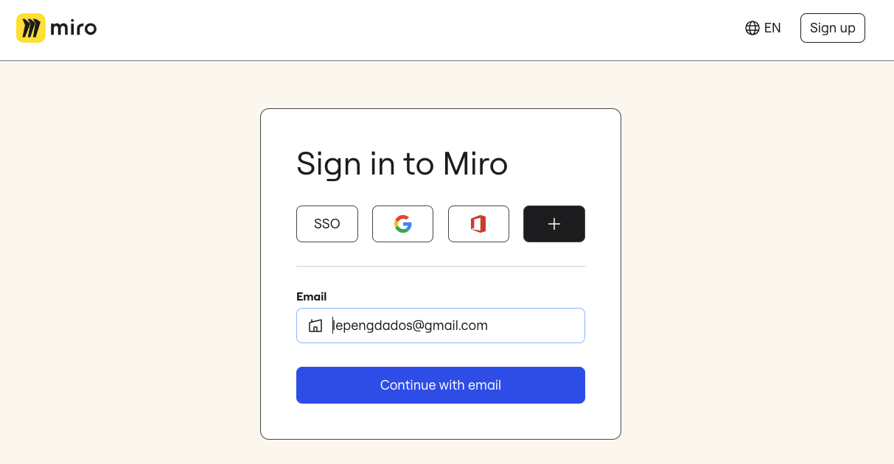
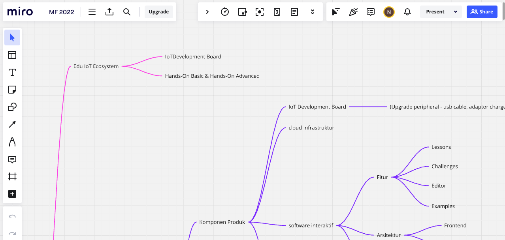

# Pertemuan ke 1: Konsep dan Arsitektur IoT (Teori)

## Topik Bahasan

Pengenalan Elektronika Dasar(Pengantar IoT, Pengantar Elektronik, Pengenalan jenis-jenis & Cara Kerja Sensor, Pengenalan
jenis-jenis & Cara Kerja Aktuator)

## Deskripsi

- Memahami pengertian, peluang, revolusi industri 4.0, dan potensi IoT
- Memahami dan mampu menjelaskan rangkaian elektronika, alat ukur (Multimeter), alat-alat pendukung elektronika (
  Solder,Screw Driver, Pinset dll), dan K3 (Keselamatan dan Kesehatan Kerja).
- Memahami jenis-jenis dan cara kerja sensor seperti: ECG sensor, heart rate sensor, sensor temperatur, sensor
  kelembaban udara, ultrasonic sensor, sensor cahaya, sensor suara, sensor kelembaban tanah, pir sensor, sensor
  pendeteksi gas, dan sensor pendeteksi hujan.
- Pengenalan jenis-jenis & Cara Kerja Aktuator

## Praktikum

### Praktikum Tool Kolaborasi

#### Teori singkat Tentang Miro

Miro adalah platform kolaborasi visual berbasis cloud yang memungkinkan tim untuk bekerja bersama secara real-time
melalui papan tulis digital. Dengan Miro, pengguna dapat membuat dan berbagi papan tulis yang dilengkapi dengan berbagai
alat seperti catatan tempel, diagram, mind maps, dan kanban boards, yang memudahkan brainstorming, perencanaan proyek,
dan pemetaan ide. Untuk menggunakan Miro, Anda perlu mendaftar akun di situs Miro, lalu membuat atau bergabung dengan
sebuah papan. Di papan tersebut, Anda bisa menambahkan elemen visual dengan mudah menggunakan toolbar di sisi layar,
mengundang anggota tim untuk berkolaborasi, dan mengatur ide-ide secara visual dengan fitur drag-and-drop. Anda juga
dapat mengintegrasikan Miro dengan alat produktivitas lainnya seperti Slack, Google Drive, dan Jira untuk meningkatkan
efisiensi kerja tim

#### Keunggulan dan Kelemahan

**Keunggulan Miro:**

1. **Kolaborasi Real-time:** Miro memungkinkan banyak pengguna untuk bekerja pada papan yang sama secara simultan,
   mendukung kerja tim yang lebih dinamis dan efisien, terutama bagi tim yang bekerja secara remote.
2. **Antarmuka yang Intuitif:** Miro memiliki antarmuka pengguna yang ramah dan mudah digunakan, dengan berbagai alat
   yang dapat diakses dengan mudah.
3. **Beragam Template:** Tersedia banyak template yang dapat digunakan untuk berbagai keperluan seperti brainstorming,
   perencanaan proyek, analisis SWOT, dan lain-lain, yang mempercepat proses kerja.
4. **Integrasi dengan Alat Lain:** Miro dapat diintegrasikan dengan berbagai alat produktivitas lainnya seperti Slack,
   Google Drive, Jira, dan Microsoft Teams, meningkatkan efisiensi alur kerja.
5. **Fleksibilitas Visual:** Mendukung berbagai format visual, termasuk gambar, catatan tempel, diagram, dan lainnya,
   memungkinkan pengguna untuk mengorganisir ide dan informasi dengan cara yang paling sesuai.

**Kelemahan Miro:**

1. **Keterbatasan Fitur di Versi Gratis:** Versi gratis dari Miro memiliki keterbatasan dalam jumlah papan yang dapat
   dibuat dan jumlah kolaborator yang dapat diundang, yang bisa menjadi kendala bagi tim besar.
2. **Ketergantungan pada Koneksi Internet:** Karena berbasis cloud, Miro memerlukan koneksi internet yang stabil untuk
   bekerja dengan baik. Koneksi yang lambat atau tidak stabil dapat mengganggu pengalaman pengguna.
3. **Kurva Pembelajaran:** Meskipun antarmuka Miro intuitif, pengguna baru mungkin memerlukan waktu untuk mempelajari
   semua fitur dan cara menggunakannya secara efektif.
4. **Harga:** Bagi beberapa organisasi atau tim kecil, biaya berlangganan Miro versi berbayar bisa dianggap cukup mahal,
   terutama jika memerlukan fitur-fitur premium.
5. **Kinerja pada Papan Besar:** Pada papan dengan banyak elemen visual, kinerja Miro bisa melambat, yang dapat
   mengurangi produktivitas dan efisiensi.

#### Menggunakan Miro

Berikut adalah langkah-langkah dasar untuk menggunakan Miro:

1. **Mendaftar dan Masuk:**
    - Kunjungi situs web Miro di [miro.com](https://miro.com).
    - Klik tombol "Sign up" untuk mendaftar akun baru, atau "Log in" jika sudah memiliki akun.
    - Ikuti petunjuk untuk membuat akun menggunakan email, akun Google, atau SSO (Single Sign-On) perusahaan Anda.

2. **Membuat Papan Baru:**
    - Setelah masuk, Anda akan dibawa ke dashboard Miro.
    - Klik tombol "New Board" atau "Create a new board" untuk membuat papan baru.
    - Pilih template yang sesuai dengan kebutuhan Anda (misalnya, Brainstorming, Kanban, Flowchart) atau pilih "Blank"
      untuk memulai dengan papan kosong.

3. **Menggunakan Alat dan Fitur:**
    - Di sisi kiri layar, terdapat toolbar dengan berbagai alat:
        - **Pen, Highlighter, dan Shape Tools:** Untuk menggambar dan membuat bentuk.
        - **Sticky Notes:** Untuk menambahkan catatan tempel.
        - **Text Box:** Untuk menambahkan teks.
        - **Upload Files:** Untuk mengunggah gambar, dokumen, atau file lainnya.
        - **Templates:** Untuk mengakses template yang telah disediakan.
    - Pilih alat yang ingin Anda gunakan dan mulai menambahkan elemen ke papan Anda.

4. **Mengundang Kolaborator:**
    - Klik tombol "Share" di sudut kanan atas papan.
    - Masukkan email kolaborator yang ingin Anda undang.
    - Atur izin (edit, view, comment) sesuai kebutuhan.
    - Klik "Send Invitation" untuk mengundang mereka ke papan Anda.
   
#### Tugas Praktikum
1. Silakan membuat flowchart sebuah aktivitas hari ini dari bangun tidur sampai tidur lagi menggunakan Miro
2. Kreasikan flowchart tersebut sehingga terlihat menarik

### Video Rekaman

<iframe width="791" height="494" src="https://www.youtube.com/embed/LBoAfWwEdEk?list=PLwf0IXJ0LAVg_NkeZL_KydrtrNGM1MfMp" frameborder="0" allow="accelerometer; autoplay; clipboard-write; encrypted-media; gyroscope; picture-in-picture" allowfullscreen></iframe>

## TUGAS

Carilah sebuah produk IoT baik yang sudah ada atau ide IoT, beberapa point yang harus digali adalah

- Mengapa Anda memilih produk tersebut
- Deskripsi dari produk IoT
- Teknologi yang digunakan produk IoT
- Jumlah pengguna atau yang sudah terjual
- Keunggulan dan Kelemahan dari produk IoT tersebut

Silakan submit pada LMS jawaban tersebut secara individu
