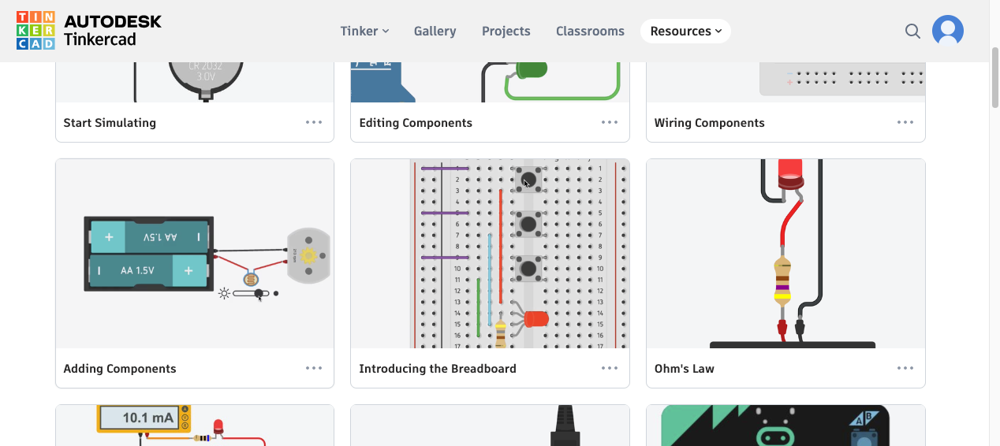
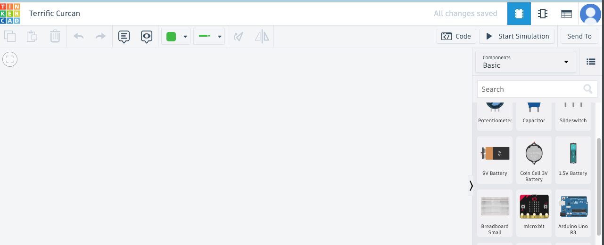
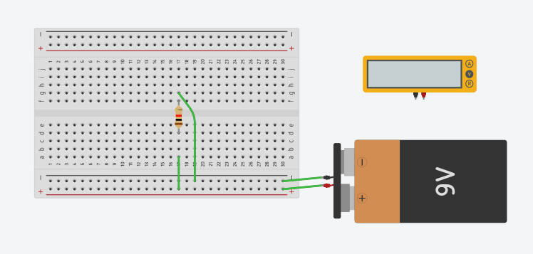
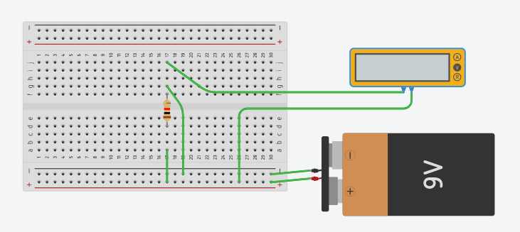

# Pertemuan ke 2: Pengantar Elektronik

## Topik Bahasan

Pengenalan Elektronika Dasar(Pengantar IoT, Pengantar Elektronik, Pengenalan jenis-jenis & Cara Kerja Sensor, Pengenalan
jenis-jenis & Cara Kerja Aktuator)

## Deskripsi

- Memahami pengertian, peluang, revolusi industri 4.0, dan potensi IoT
- Memahami dan mampu menjelaskan rangkaian elektronika, alat ukur (Multimeter), alat-alat pendukung elektronika (
  Solder,Screw Driver, Pinset dll), dan K3 (Keselamatan dan Kesehatan Kerja).
- Memahami jenis-jenis dan cara kerja sensor seperti: ECG sensor, heart rate sensor, sensor temperatur, sensor
  kelembaban udara, ultrasonic sensor, sensor cahaya, sensor suara, sensor kelembaban tanah, pir sensor, sensor
  pendeteksi gas, dan sensor pendeteksi hujan.
- Pengenalan jenis-jenis & Cara Kerja Aktuator

## Praktikum

### Teori Singkat Tinkercad

Tinkercad adalah platform desain dan simulasi online yang memungkinkan pengguna untuk membuat dan menguji model 3D serta
rangkaian elektronik secara intuitif. Dikembangkan oleh Autodesk, Tinkercad menyediakan alat sederhana dan mudah
digunakan yang cocok untuk pemula maupun profesional. Pengguna dapat merancang objek 3D, membuat rangkaian elektronik,
dan bahkan melakukan simulasi interaktif untuk memeriksa fungsionalitas desain mereka. Dengan fitur drag-and-drop,
Tinkercad memfasilitasi pembelajaran STEM (Science, Technology, Engineering, and Mathematics) dan memungkinkan
kolaborasi serta pembagian proyek secara online.

### Praktikum Alat Ukur

Berikut adalah langkah-langkah untuk mengukur tegangan pada resistor menggunakan multimeter di Tinkercad, lengkap dengan
tangkapan layar:

### Langkah-langkah:

1. **Buka Tinkercad:**

- Kunjungi [Tinkercad](https://www.tinkercad.com) dan masuk dengan akun Anda.
- Klik "Circuits" di dashboard dan pilih "Create new Circuit."
  

2. **Tambahkan Komponen:**

- Dari panel komponen di sebelah kanan, tambahkan komponen berikut ke kanvas:
    - Breadboard
    - Resistor
    - Power Supply (Battery 9V)
    - Multimeter
    - Jumper wires
      

3. **Rangkai Komponen:**

- **Resistor:**
    - Tempatkan resistor pada breadboard.
- **Power Supply:**
    - Hubungkan terminal positif power supply (9V) ke salah satu ujung resistor.
    - Hubungkan terminal negatif power supply (GND) ke rail ground pada breadboard.
- **Jumper Wires:**
    - Hubungkan ujung lainnya dari resistor ke rail ground pada breadboard.

  

4. **Tambahkan Multimeter:**

- Dari panel komponen, tambahkan multimeter ke kanvas.
- Atur multimeter ke mode pengukuran tegangan (V).

5. **Menghubungkan Multimeter:**

- Hubungkan probe merah multimeter ke ujung resistor yang terhubung dengan sumber tegangan positif.
- Hubungkan probe hitam multimeter ke ujung resistor yang terhubung dengan ground (GND).
  

6. **Menjalankan Simulasi:**

- Klik tombol "Start Simulation" di Tinkercad.
- Multimeter akan menampilkan tegangan yang ada di resistor.
  

#### Pertanyaan

Ubah satuan Resistance miliohm atau ohm, apa yang terjadi? Jelaskan mengapa bisa demikian?

## Tugas Mandiri

Dengan menggunakan tingkercad silakan mensimulasikan rangkaian seri dan paralel pada sebuah baterai(1.5V) atau power
supply boleh dilengkapi LED atau komponen lain , kemudian ukur menggunakan multimeter tegangan tersebut. Amati dan
simpulkan hasilnya

