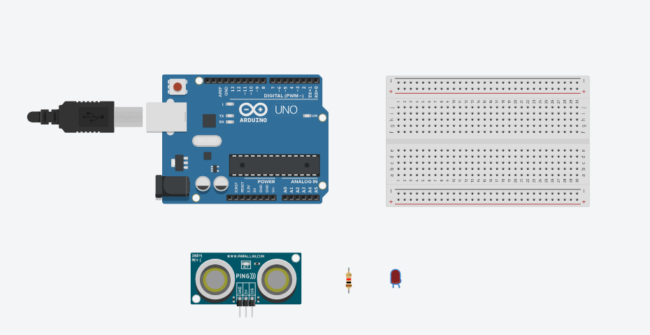
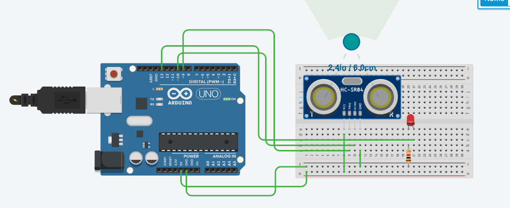

# Pertemuan ke 3: Pengenalan Jenis-Jenis dan Cara Kerja Sensor

## Topik Bahasan

Pengenalan Elektronika Dasar(Pengantar IoT, Pengantar Elektronik, Pengenalan jenis-jenis & Cara Kerja Sensor, Pengenalan
jenis-jenis & Cara Kerja Aktuator)

## Deskripsi

- Memahami pengertian, peluang, revolusi industri 4.0, dan potensi IoT
- Memahami dan mampu menjelaskan rangkaian elektronika, alat ukur (Multimeter), alat-alat pendukung elektronika (
  Solder,Screw Driver, Pinset dll), dan K3 (Keselamatan dan Kesehatan Kerja).
- Memahami jenis-jenis dan cara kerja sensor seperti: ECG sensor, heart rate sensor, sensor temperatur, sensor
  kelembaban udara, ultrasonic sensor, sensor cahaya, sensor suara, sensor kelembaban tanah, pir sensor, sensor
  pendeteksi gas, dan sensor pendeteksi hujan.
- Pengenalan jenis-jenis & Cara Kerja Aktuator

## Praktikum

Berikut adalah langkah-langkah untuk mendemonstrasikan penggunaan sensor ultrasonik dengan menggunakan Tinkercad,
lengkap dengan tangkapan layar:

### Langkah-langkah:

1. **Buka Tinkercad:**

- Kunjungi [Tinkercad](https://www.tinkercad.com) dan masuk dengan akun Anda.
- Klik "Circuits" di dashboard dan pilih "Create new Circuit."

2. **Tambahkan Komponen:**

- Dari panel komponen di sebelah kanan, tambahkan komponen berikut ke kanvas:
    - Breadboard
    - Arduino Uno R3
    - Sensor Ultrasonik HC-SR04
    - Resistor 220 ohm
    - LED
    - Jumper wires



3. **Rangkai Komponen:**

- **Sensor Ultrasonik HC-SR04:**
    - Hubungkan pin VCC sensor ke 5V pada Arduino.
    - Hubungkan pin GND sensor ke GND pada Arduino.
    - Hubungkan pin TRIG sensor ke pin digital 9 pada Arduino.
    - Hubungkan pin ECHO sensor ke pin digital 10 pada Arduino.

- **LED:**
    - Hubungkan anoda LED (kaki panjang) ke salah satu pin digital (misalnya, pin 13) pada Arduino melalui resistor 220
      ohm.
    - Hubungkan katoda LED (kaki pendek) ke GND pada breadboard.

4. **Menambahkan Kode Program:**

- Klik pada Arduino Uno R3 dan pilih opsi "Code."
- Pilih bahasa pemrograman "Blocks + Text" untuk mempermudah pengkodean.
- Tambahkan kode berikut ke editor:

```cpp
#define trigPin 9
#define echoPin 10
#define ledPin 13

void setup() {
  pinMode(trigPin, OUTPUT);
  pinMode(echoPin, INPUT);
  pinMode(ledPin, OUTPUT);
  Serial.begin(9600);
}

void loop() {
  long duration, distance;
  digitalWrite(trigPin, LOW);
  delayMicroseconds(2);
  digitalWrite(trigPin, HIGH);
  delayMicroseconds(10);
  digitalWrite(trigPin, LOW);
  
  duration = pulseIn(echoPin, HIGH);
  distance = (duration / 2) / 29.1;
  
  if (distance < 20) {
    digitalWrite(ledPin, HIGH);
  } else {
    digitalWrite(ledPin, LOW);
  }
  
  Serial.print(distance);
  Serial.println(" cm");
  delay(500);
}
```

5. **Menjalankan Simulasi:**

- Klik tombol "Start Simulation" di Tinkercad.
- Pada jendela serial monitor, Anda akan melihat jarak yang terukur oleh sensor ultrasonik.
- LED akan menyala jika objek berada dalam jarak kurang dari 20 cm dari sensor.



### Tugas Praktikum
1. Silakan ubah jarak benda(objek warna hijau) menjadi < 20 cm apa yang terjadi? Mengapa bisa demikian?
2. Silakan disesuaikan jarak > 30 cm dengan objek sehingga LED bisanya menyala!

## Tugas Mandiri

Dengan menggunakan tingkercad silakan mensimulasikan menggunakan sensor yang lain, misalkan LDR, DHT11, sensor motion,
atau yang lain. Akan lebih baik menggabungkan dari sensor-sensor tersebut. :)

