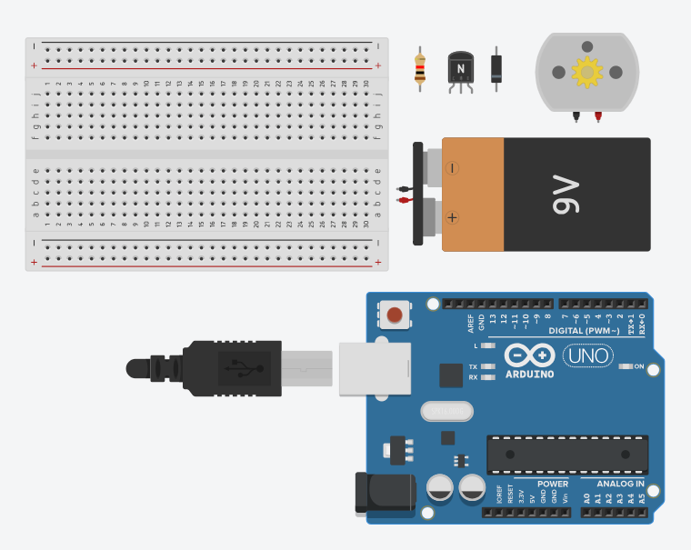

# Pertemuan ke 4: Pengenalan Jenis-Jenis dan Cara Kerja Aktuator

## Topik Bahasan

Pengenalan Elektronika Dasar(Pengantar IoT, Pengantar Elektronik, Pengenalan jenis-jenis & Cara Kerja Sensor, Pengenalan
jenis-jenis & Cara Kerja Aktuator)

## Deskripsi

- Memahami pengertian, peluang, revolusi industri 4.0, dan potensi IoT
- Memahami dan mampu menjelaskan rangkaian elektronika, alat ukur (Multimeter), alat-alat pendukung elektronika (
  Solder,Screw Driver, Pinset dll), dan K3 (Keselamatan dan Kesehatan Kerja).
- Memahami jenis-jenis dan cara kerja sensor seperti: ECG sensor, heart rate sensor, sensor temperatur, sensor
  kelembaban udara, ultrasonic sensor, sensor cahaya, sensor suara, sensor kelembaban tanah, pir sensor, sensor
  pendeteksi gas, dan sensor pendeteksi hujan.
- Pengenalan jenis-jenis & Cara Kerja Aktuator

## Praktikum

Berikut adalah langkah-langkah untuk menggunakan motor DC sebagai aktuator menggunakan Tinkercad:

### Langkah-langkah:

1. **Buka Tinkercad:**

- Kunjungi [Tinkercad](https://www.tinkercad.com) dan masuk dengan akun Anda.
- Klik "Circuits" di dashboard dan pilih "Create new Circuit."

2. **Tambahkan Komponen:**

- Dari panel komponen di sebelah kanan, tambahkan komponen berikut ke kanvas:
    - Breadboard
    - Arduino Uno R3
    - Motor DC
    - Transistor NPN (misalnya, 2N2222)
    - Diode (misalnya, 1N4007)
    - Resistor (220 ohm)
    - Jumper wires

    

3. **Rangkai Komponen:**

- **Motor DC:**
    - Hubungkan salah satu terminal motor DC ke kolektor transistor NPN.
    - Hubungkan terminal lainnya dari motor DC ke anoda diode (anoda adalah sisi tanpa garis).

- **Transistor:**
    - Hubungkan basis transistor ke salah satu pin digital pada Arduino (misalnya, pin 9) melalui resistor 220 ohm.
    - Hubungkan emitor transistor ke rail ground pada breadboard.

- **Arduino:**
    - Hubungkan pin GND pada Arduino ke rail ground pada breadboard.
    - Hubungkan pin digital 9 pada Arduino ke basis transistor melalui resistor 220 ohm.

    

4. **Menambahkan Kode Program:**

- Klik pada Arduino Uno R3 dan pilih opsi "Code."
- Pilih bahasa pemrograman "Blocks + Text" untuk mempermudah pengkodean.
- Tambahkan kode berikut ke editor:

```cpp
int motorPin = 9;

void setup() {
  pinMode(motorPin, OUTPUT);
}

void loop() {
  digitalWrite(motorPin, HIGH);
  delay(1000);
  digitalWrite(motorPin, LOW);
  delay(1000);
}
```


5. **Menjalankan Simulasi:**

- Klik tombol "Start Simulation" di Tinkercad.
- Motor DC akan berputar selama 1 detik, kemudian berhenti selama 1 detik, dan siklus ini akan berulang.

Dengan mengikuti langkah-langkah ini, Anda dapat mendemonstrasikan penggunaan motor DC sebagai aktuator dengan Arduino
di Tinkercad.

## Tugas Mandiri

Dengan menggunakan tingkercad silakan mensimulasikan penggunaan aktuator dan aktuator sekaligus. Silakan dokumentasikan
hasil simulasi dengan screen recording.

