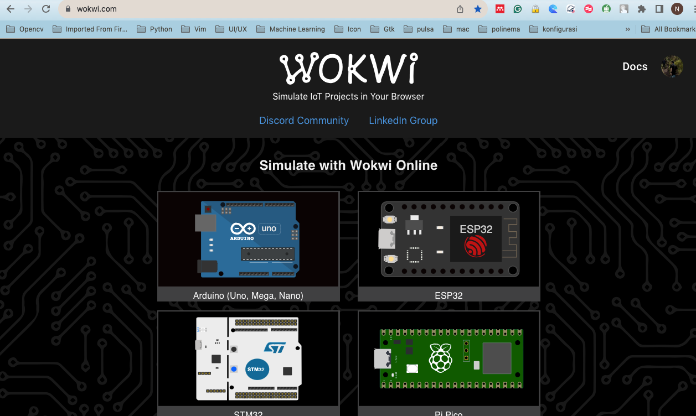
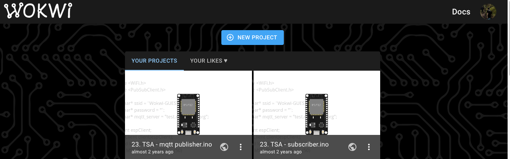
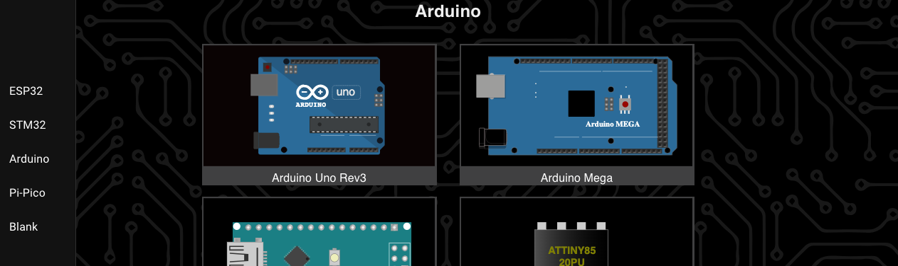
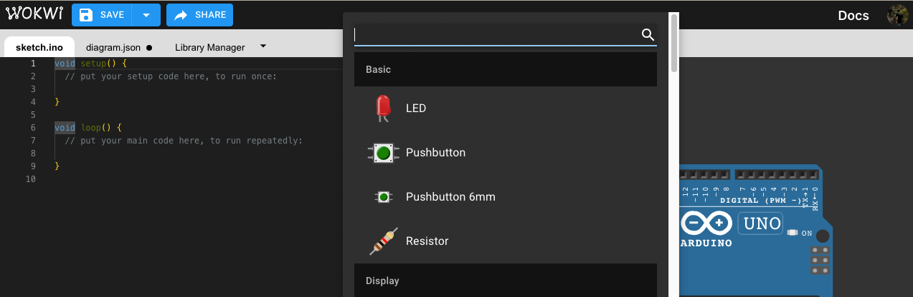
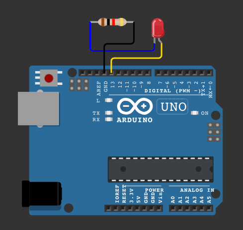
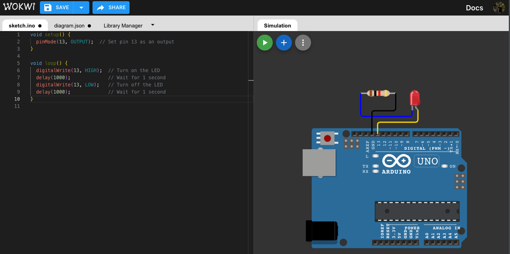

# Pertemuan ke 6: Jenis Electronics Development Board

## Topik Bahasan

Proyek Dasar Mikrokontroller
(Jenis Electronics Development Board dan Bahasa Pemrograman Microcontroller, Pengenalan & Jenis Komunikasi Data,
Pengenalan Teknologi Smart card, Praktik Dasar Elektronika)

## Deskripsi

- Memahami berbagai jenis Electronics Development Board seperti: Arduino Uno/Nano, ATMega Series, STM32, ESP8266, ESP32,
  Raspi Pi Pico, Raspberry Pi, dan Jetson Nano
- Memahami jenis komunikasi data, baik data wired maupun wireless seperti: Komunikasi Serial, I2C, SPI, WiFi, Bluetooth
  / BLE, LoRa, ZigBee, Seluler (2G - 5G), NFC, dan NB-IoT.
- Memahami konsep dan teknologi smart card seperti Mifare, Desfire, Javacard dan protokol komunikasi smart car(APDU).
- Mampu menggunakan solder/desolder dengan benar, mampu mensimulasikan dan merancang rangkaian listrik (fritzing/wokwi),
  Mampu menerapkan dasar pemrograman Arduino.

## Teori Singkat

Wokwi adalah platform simulasi berbasis web yang dirancang untuk membantu pembelajaran dan pengembangan proyek
elektronik, terutama yang melibatkan mikrokontroler seperti Arduino, ESP32, dan Raspberry Pi Pico. Wokwi memungkinkan
pengguna untuk membuat, menguji, dan memodifikasi skema elektronik serta menulis dan menjalankan kode tanpa memerlukan
perangkat keras fisik. Dengan antarmuka yang intuitif dan berbagai komponen virtual yang lengkap, Wokwi menjadi alat
yang sangat berguna bagi pelajar, hobiis, dan profesional untuk mempelajari dasar-dasar elektronik dan pemrograman
mikrokontroler secara interaktif dan mudah.

Salah satu keunggulan utama Wokwi adalah kemampuannya untuk mensimulasikan proyek secara real-time, memungkinkan
pengguna untuk melihat hasil dari kode yang mereka tulis dan perubahan yang mereka buat pada rangkaian elektronik secara
langsung. Ini tidak hanya menghemat waktu dan biaya karena tidak perlu membeli dan merakit perangkat keras, tetapi juga
mengurangi risiko kesalahan dan kerusakan pada komponen fisik. Selain itu, Wokwi menyediakan berbagai contoh proyek dan
tutorial yang membantu pengguna memahami konsep-konsep dasar dan lanjutan dalam elektronika dan pemrograman
mikrokontroler. Integrasi dengan lingkungan pemrograman seperti Arduino IDE membuatnya semakin mudah bagi pengguna untuk
mulai bekerja dengan Wokwi.



## Praktikum

Berikut adalah langkah-langkah untuk praktikum menyalakan LED menggunakan Wokwi dengan board Arduino Uno:

1. **Buka Wokwi**:

  - Kunjungi situs [Wokwi](https://wokwi.com/) dan masuk ke akun Anda atau daftar jika belum memiliki akun.

2. **Buat Proyek Baru**:

  - Klik tombol “New Project” untuk membuat proyek baru.

    

3. **Tambahkan Komponen Arduino Uno**:

  - Setelah berada di antarmuka proyek, tambahkan komponen Arduino Uno dengan mengklik ikon "Arduino Uno" di menu komponen
  atau dengan mencari "Arduino Uno" di kotak pencarian komponen dan menyeretnya ke area kerja.

    

4. **Tambahkan LED**:

  - Cari "LED" di kotak pencarian komponen dan seret komponen LED ke area kerja.

    

5. **Tambahkan Resistor**:

  - Tambahkan resistor dengan cara mencari "Resistor" di kotak pencarian dan menyeretnya ke area kerja. Resistor
  diperlukan untuk menghindari kerusakan pada LED.

6. **Hubungkan Komponen**:

  - **Hubungkan Kaki Panjang (Anoda) LED** ke salah satu pin digital pada Arduino Uno, misalnya pin 13.
  - **Hubungkan Kaki Pendek (Katoda) LED** ke salah satu kaki resistor.
  - **Hubungkan Kaki Lain Resistor** ke GND (Ground) pada Arduino Uno.

    

7. **Tulis Kode Arduino**:

  - Klik pada ikon "Code" atau "Sketch" untuk membuka editor kode Arduino.
  - Tulis kode berikut untuk menyalakan LED:

    ```cpp
    void setup() {
      pinMode(13, OUTPUT);  // Set pin 13 as an output
    }
    
    void loop() {
      digitalWrite(13, HIGH);  // Turn on the LED
      delay(1000);             // Wait for 1 second
      digitalWrite(13, LOW);   // Turn off the LED
      delay(1000);             // Wait for 1 second
    }
    ```

8. **Simulasikan Proyek**:

  - Klik tombol "Start Simulation" atau "Run" untuk memulai simulasi. LED akan mulai berkedip dengan interval 1 detik.
  
    

9. **Periksa Koneksi dan Kode**:

  - Jika LED tidak menyala, periksa kembali koneksi antara komponen dan pastikan kode sudah benar.

10. **Simpan Proyek**:

  - Setelah berhasil, simpan proyek Anda dengan mengklik "Save" dan beri nama proyek Anda.

### Tugas Praktikum

Silakan diganti development board yang lain, dari langkah-langkah di atas.

## Tugas Mandiri

Dengan menggunakan wokwi silakan mensimulasikan penggunaan aktuator dan aktuator sekaligus. Silakan dokumentasikan hasil
simulasi dengan screen recording. **(Sama dengan tugas yang sebelumnya hanya diganti development board yang digunakan)**

