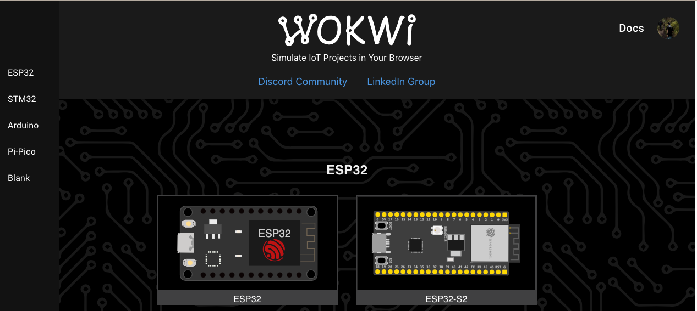
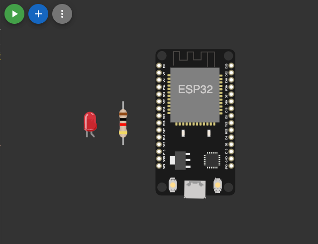
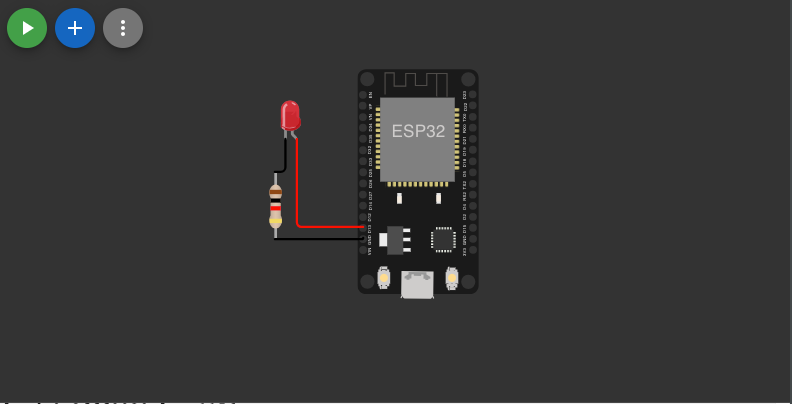
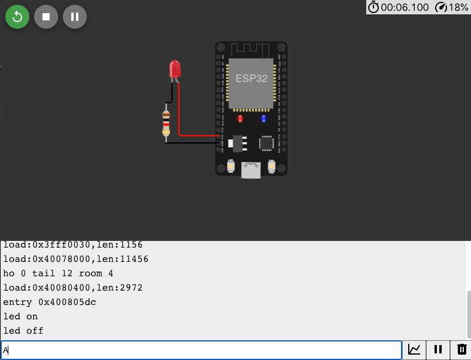

# Pertemuan ke 6: Jenis Komunikasi Data

## Topik Bahasan

Proyek Dasar Mikrokontroller
(Jenis Electronics Development Board dan Bahasa Pemrograman Microcontroller, Pengenalan & Jenis Komunikasi Data,
Pengenalan Teknologi Smart card, Praktik Dasar Elektronika)

## Deskripsi

- Memahami berbagai jenis Electronics Development Board seperti: Arduino Uno/Nano, ATMega Series, STM32, ESP8266, ESP32,
  Raspi Pi Pico, Raspberry Pi, dan Jetson Nano
- Memahami jenis komunikasi data, baik data wired maupun wireless seperti: Komunikasi Serial, I2C, SPI, WiFi, Bluetooth
  / BLE, LoRa, ZigBee, Seluler (2G - 5G), NFC, dan NB-IoT.
- Memahami konsep dan teknologi smart card seperti Mifare, Desfire, Javacard dan protokol komunikasi smart car(APDU).
- Mampu menggunakan solder/desolder dengan benar, mampu mensimulasikan dan merancang rangkaian listrik (fritzing/wokwi),
  Mampu menerapkan dasar pemrograman Arduino.

## Praktikum

Tentu, berikut adalah langkah-langkah untuk membuat proyek di Wokwi yang menghidupkan LED menggunakan komunikasi serial
pada board ESP32:

### Langkah-langkah Menggunakan Wokwi

1. **Masuk ke Wokwi:**
    - Buka [Wokwi](https://wokwi.com/).

2. **Buat Proyek Baru:**
    - Klik "New Project" dan pilih "ESP32".

      

3. **Tambah Komponen:**
    - Klik "Add Part" dan cari "LED".
    - Tambahkan LED ke canvas.
    - Klik "Add Part" dan cari "Resistor".
    - Tambahkan resistor ke canvas.

      

4. **Wiring:**
    - Sambungkan kaki positif LED (anoda) ke salah satu kaki resistor.
    - Sambungkan kaki lain resistor ke pin GPIO 2 pada ESP32.
    - Sambungkan kaki negatif LED (katoda) ke GND pada ESP32.

      

5. **Upload Kode untuk ESP32:**
    - Klik pada ikon "Code" untuk menambahkan kode ke ESP32.
    - Masukkan kode berikut untuk ESP32:

      ```cpp
      void setup()
      {
        pinMode(13, OUTPUT);
        Serial.begin(9600);
      }
      void loop()
      {
        if (Serial.available()) {
          char c = Serial.read();
          if (c == 'A')
          {
            digitalWrite(13, HIGH);
            Serial.println("led on");
          }
          else if (c == 'B')
          {
            digitalWrite(13, LOW);
            Serial.println("led off");
          }
        }
      }
      ```

6. **Run Simulation:**
    - Klik "Start Simulation" untuk menjalankan simulasi.

      

    - Masukkan huruf `A atau B` untuk **menghidupkan/mematikan** LED melalui serial monitor.

## Tugas Mandiri

Dengan menggunakan wokwi silakan mensimulasikan penggunaan aktuator dan aktuator sekaligus menggunakan komunikasi
serial. Silakan dokumentasikan hasil simulasi dengan screen recording.
