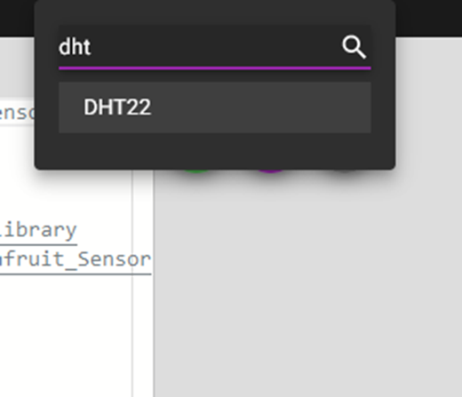
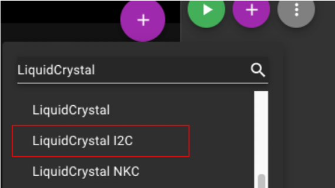
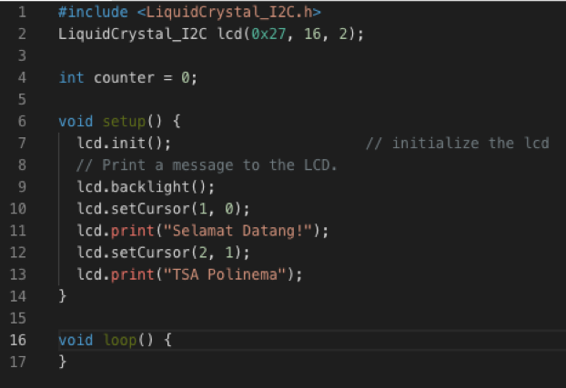
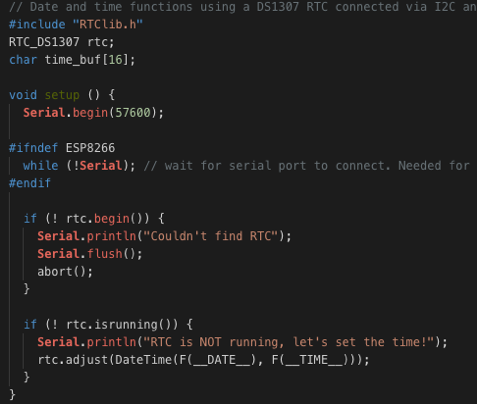
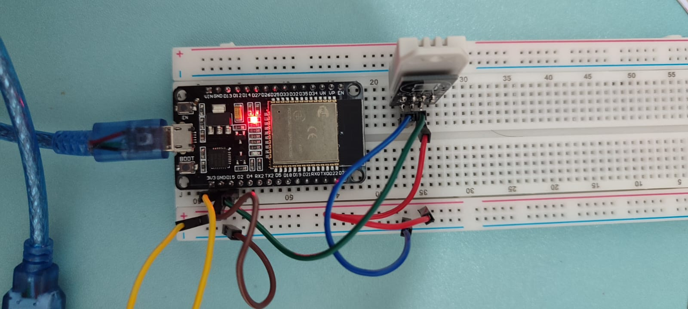

# Pertemuan ke 12 : Praktik Sensor DHT11, LCD, dan RTC!


## Topik Bahasan
Proyek Dasar Internet of Things I (Praktik Pemrograman Mikrokontroler, Praktik Sensor: Sensor DHT11, LCD dan Kipas, Praktik Sensor: Ultrasonic, PIR, dan LDR, Praktik Aktuator: LED dan Relay, Praktik Aktuator: Buzzer dan Servo)

## Deskripsi
- Mampu melakukan instalasi, memahami bahasa pemrograman dan pin pada Arduino. 
- Mampu melakukan uji coba serial monitor dan uji coba PWM dengan potensiometer.
- Mampu merancang dan membuat proyek menggunakan sensor DHT22.
- Mampu merancang dan membuat proyek menggunakan sensor Ultrasonic, PIR, dan LDR.
- Mampu merancang dan membuat proyek menggunakan aktuator LED dan Relay.
- Mampu merancang dan membuat proyek menggunakan aktuator Buzzer dan Servo.

## Teori Singkat

### Sensor Suhu dan Kelembaban

Salah satu sensor diantara sensor-sensor yang lain adalah sensor suhu dan kelembaban. Sensor ini digunakan untuk mengambil data suhu pada lingkungan tertentu beserta tingkat kelembabannya. Salah satu sensor tersebut yang banyak digunakan adalah DHT11 karena secara biaya sangat minim serta mudah digunakan.

Jenis sensor lain yang memiliki fungsi yang sama adalah DHT22, yang membedakan dari tipe ini adalah keakuratan dalam mengambil data suhu dan kelembaban dan juga lama atau jeda dalam pengambilan sampling. DHT22 mengambil sampling setiap 2 detik, sedangkan DHT11 setiap 1 detik. Tentunya DHT22 lebih baik dibandingkan dengan versi terdahulunya, DHT11.

**Spesifikasi sensor DHT11**

| Nama                 | Nilai                       |
| -------------------- | --------------------------- |
| Tegangan             | 3,5 V - 5,5 V               |
| Arus                 | 0,3 mA                      |
| Jangkauan Suhu       | 0 - 50 derajat Celsius      |
| Jangkauan Kelembaban | 20%-90%                     |
| Akurasi Pengukuran   | +- 2 derajat Celsius (Suhu) |
|                      | 5% (Kelembaban)             |

**Spesifikasi sensor DHT22**

| Nama                 | Nilai                         |
| -------------------- | ----------------------------- |
| Tegangan             | 3,5 V - 5,5 V                 |
| Arus                 | 0,3 mA                        |
| Jangkauan Suhu       | -40 - 80 derajat Celsius      |
| Jangkauan Kelembaban | 0% - 100%                     |
| Akurasi Pengukuran   | +- 0.5 derajat Celsius (Suhu) |
|                      | 2 - 5% (Kelembaban)           |

Sumber: https://learn.adafruit.com/dht

Struktur pin pada sensor DHT11 seperti berikut, sebenarnya sama dengan DHT22. Perbedaannya adalah jika DHT22 biasanya penutup menggunakan warna putih.

  

Dari gambar di atas terlihat bahwa terdapat 3 kaki yang masing-masing memiliki fungsi dan peran masing-masing adalah sebagai berikut;

1. `VCC` digunakan untuk memberikan tegangan pada sensor, pada esp dihubungkan pada pin Vin atau 3v3.
2. `Data` digunakan untuk menghubungkan hasil pembacaan data dari nilai suhu atau kelembaban pada sensor, dihubungkan pin tertentu yang tersedia.
3. `Ground` dihubungkan pada pin GND pada esp.

### Praktikum 1: Sensor DHT Arduino dengan Wokwi

Selesaikan langkah-langkah praktikum berikut ini menggunakan Wokwi di browser Anda.

1. Masuk ke Wokwi. Klik New Projects untuk membuat projek baru. Pilih Arduino UNO.

 

2. Tambahkan library “DHT sensor library” pada Library Manager. Pastikan library sudah muncul pada Project Libraries.

 

3. Tambahkan sensor suhu DHT22 dengan klik Add.

 
   
4. Tambahkan kode program. Pastikan DHT_PIN adalah 2

```cpp
#include "DHT.h"

#define DHTPIN 2 

#define DHTTYPE DHT22   

DHT dht(DHTPIN, DHTTYPE);

void setup() {
  Serial.begin(9600);
  Serial.println(F("DHT22 test!"));

  dht.begin();
}

void loop() {
// Wait a few seconds between measurements.
  delay(2000);

  float temperature = dht.readTemperature();
  float humidity = dht.readHumidity();

  // Check if any reads failed and exit early (to try again).
  if (isnan(temperature) || isnan(humidity)) {
    Serial.println(F("Failed to read from DHT sensor!"));
    return;
  }
  Serial.print(F("Humidity: "));
  Serial.print(humidity);
  Serial.print(F("%  Temperature: "));
  Serial.print(temperature);
  Serial.println(F("°C "));
}
```

5. Jalankan simulasi program dengan klik Run. Pastikan hasil pembacaan sensor suhu muncul di bagian bawah (serial monitor). Ubah nilai suhu dengan klik sensor DHT22, atur suhu dan kelembaban. Jika nilai pembacaan sensor pada serial monitor berubah, berarti pemrograman sensor DHT22 sudah berjalan dengan baik.
Klik Stop simulation untuk menghentikan simulasi

 


### Praktikum 2: Praktik LCD, DHT Arduino dengan Wokwi

Selesaikan langkah-langkah praktikum berikut ini menggunakan Wokwi di browser Anda.

1. Masuk ke Wokwi. Klik New Projects untuk membuat projek baru. Pilih Arduino UNO.

 

2. Tambahkan library “LiquidCrystal I2C” pada Library Manager. Pastikan library sudah muncul pada Project Libraries.



3. Tambahkan kode program seperti berikut. Pastikan SDA(A4) dan SCL(A5) sudah sesuai.




4. Jalankan simulasi program dengan klik Run. Untuk menampilkan data pada sebuah LCD diwakili dengan baris dan kolom, yang dimulai dari baris ke 0 dan kolom ke 0. Banyaknya data yang bisa ditampilkan tergantung dari spesifikasi LCD, misalkan 16x2 berarti hanya bisa menampilkan 32 digit atau karakter. Klik Stop simulation untuk menghentikan simulasi


### Praktikum 3: Praktik RTC, LCD, DHT Arduino dengan Wokwi

Selesaikan langkah-langkah praktikum berikut ini menggunakan Wokwi di browser Anda.

1. Masuk ke Wokwi. Klik New Projects untuk membuat projek baru. Pilih Arduino UNO.

 

2. Tambahkan library “DS1307RTC dan RTClib” pada Library Manager. Pastikan library sudah muncul pada Project Libraries.


3. Tambahkan kode program seperti pada gambar. Pastikan library sudah dipanggil, menambahkan kode program pada setup(), dan pada loop().




4. Rangkai sesuai pada gambar di bawah dengan komunikasi menggunakan I2C. Pastikan komunikasi I2C telah sesuai. Klik Start simulation untuk menjalankan simulasi.
   


## Praktik OLED, DHT ESP dengan Wokwi
+ Kunjungi link project ini untuk melihat implementasi DHT dan OLED di ESP32 -https://wokwi.com/projects/375444707313967105

## Praktik DHT ESP dengan Thonny
+ Skenario



  
+ Berikut code untuk membaca suhu dan kelembaban dengan sensor DHT22

```python
from machine import Pin
from time import sleep_ms
from dht import DHT22

# create dht-sensor instance
dhtSensor = DHT22(Pin(15))  

temperature = 0.0  # variable to save temperature value
humidity = 0.0     # variable to save humidity value

while True:
    dhtSensor.measure() # read sensor measurements
    temperature = dhtSensor.temperature()
    humidity = dhtSensor.humidity()

    print("T: %.1f C" %temperature)  # output temperature value
    print("H: %.1f %%" %humidity)  # output humidity value
    
    sleep_ms(2000); # pause for two seconds (2.000 milliseconds)
```

+ Hasil pembacaan sensor


  
## Tugas Mandiri 
Selesaikan langkah-langkah praktikum berikut ini menggunakan Wokwi di browser Anda.

**Tugas 1**
- Rangkai seusai dengan gambar. Tampilkan nilai suhu dan kelembaban dalam LCD. Tampilkan juga waktu dalam format YYYY/MM/DD HH:mm:ss pada LCD. Contoh: 2024/07/23 08:00:00


**Tugas 2**
- Tambahkan logika, ketika suhu < 20 maka akan tampil di LCD “DINGIN, sedangkan nilai suhu 20 - 50 “BIASA SAJA”, serta jika > 50 akan menampilkan “PANAS”.
Tampilkan juga waktu dalam format YYYY/MM/DD HH:mm:ss pada LCD. Contoh: 2024/07/23 08:00:00


