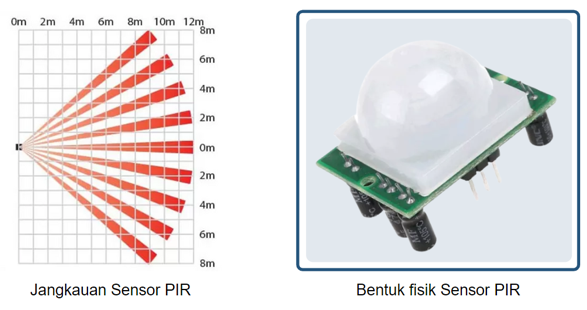
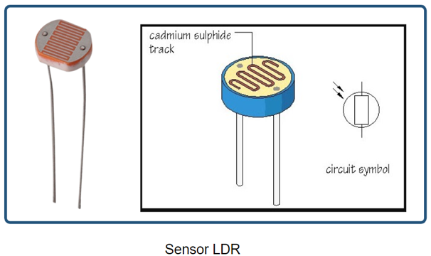
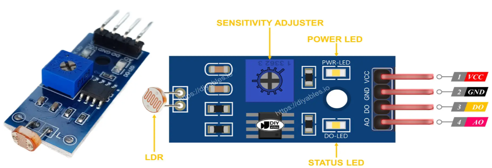
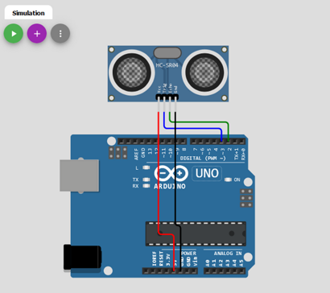
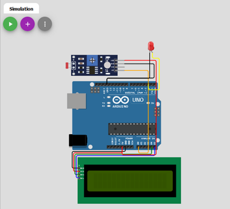
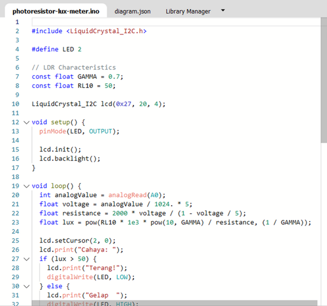
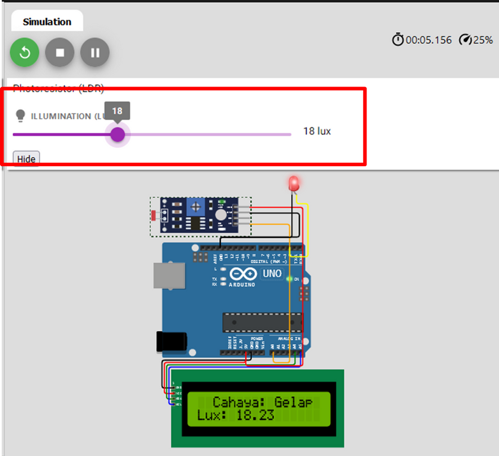
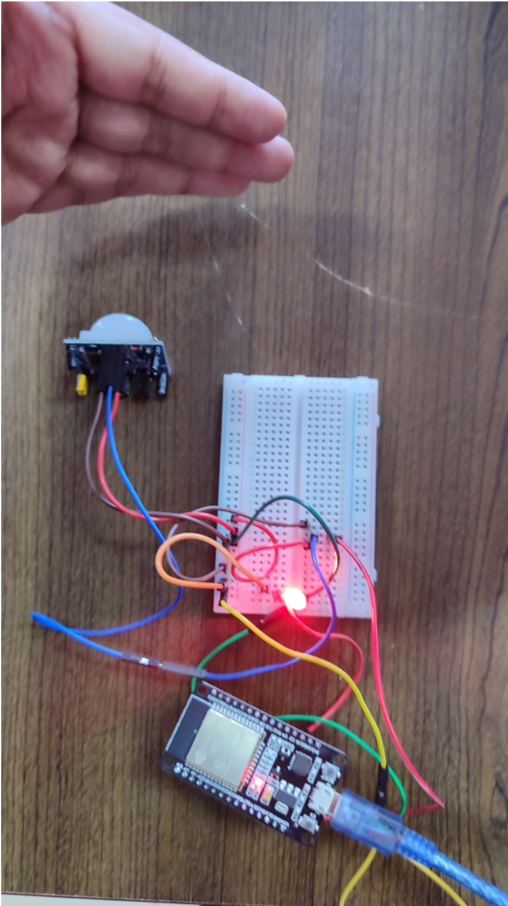
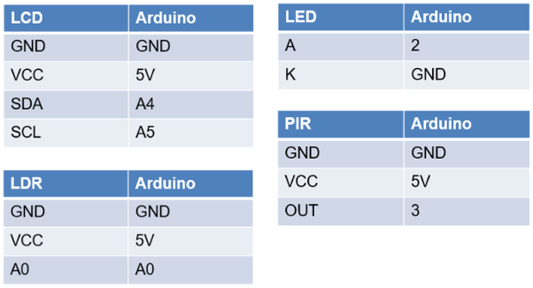
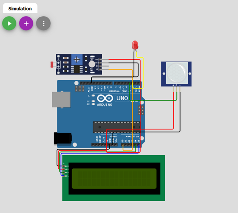

# Pertemuan ke 13 : Praktik Sensor Ultrasonic PIR LDR


## Topik Bahasan
Proyek Dasar Internet of Things I (Praktik Pemrograman Mikrokontroler, Praktik Sensor: Sensor DHT, LCD, Praktik Sensor: Ultrasonic, PIR, dan LDR, Praktik Aktuator: LED dan Relay, Praktik Aktuator: Buzzer dan Servo)

## Deskripsi
- Mampu melakukan instalasi, memahami bahasa pemrograman dan pin pada Arduino. 
- Mampu melakukan uji coba serial monitor dan uji coba PWM dengan potensiometer.
- Mampu merancang dan membuat proyek menggunakan sensor DHT22.
- Mampu merancang dan membuat proyek menggunakan sensor Ultrasonic, PIR, dan LDR.
- Mampu merancang dan membuat proyek menggunakan aktuator LED dan Relay.
- Mampu merancang dan membuat proyek menggunakan aktuator Buzzer dan Servo.

## Teori Singkat

### Sensor Ultrasonic

Sensor ultrasonik adalah sebuah sensor yang berfungsi untuk mengubah besaran fisis (bunyi/gelombang ultrasonik) menjadi besaran listrik dan sebaliknya. 

Sensor ultrasonik dapat digunakan untuk mengukur jarak dengan suatu benda tertentu.

Gelombang ultrasonik adalah gelombang bunyi yang mempunyai frekuensi sangat tinggi yaitu 20.000 Hz. Bunyi ultrasonik tidak dapat di dengar oleh telinga manusia. Bunyi ultrasonik dapat didengar oleh anjing, kucing, kelelawar, dan lumba-lumba. Bunyi ultrasonik nisa merambat melalui zat padat, cair dan gas. 

  

Cara kerja sensor ini didasarkan pada prinsip dari pantulan suatu gelombang suara sehingga dapat dipakai untuk menafsirkan eksistensi (jarak) suatu benda dengan frekuensi tertentu.

 

Dengan rumus sebagai berikut:
S =  jarak (cm)
T = waktu (detik) 

 

Dimana:
+ S = adalah jarak antara sensor dengan benda yang diukur (m).
+ t = adalah waktu yang dibutuhkan sinyal untuk kembali ke sensor (s).
+ 340 = adalah kecepatan dari gelombang suara (340 m/s)
+ 2 = adalah faktor pembagi jarak karena gelombang suara mengalami pemantulan

Sensor ultrasonik HC-SR04 menggunakan sonar untuk menentukan jarak suatu objek. 

Sensor ini dapat membaca dari 2 cm hingga 400 cm (0,8 inci hingga 157 inci) dengan akurasi 0,3 cm (0,1 inci).

Selain itu, modul khusus ini dilengkapi dengan modul pemancar dan penerima ultrasonik.


**Spesifikasi sensor HC-SR04**

| Nama                 | Nilai                         |
| -------------------- | ----------------------------- |
| Tegangan             | 3,3 V - 5,5 V                 |
| Arus                 | 15 mA                         |
| Frekuensi            | 40 kHz                        |
| Jangkauan minimal    | 2 cm                          |
| Jangkauan maksimal   | 4 meter                       |
| Sudut pengukuruan    | 15º                           |
| Toleransi            | 0,3 cm                        |

Pinout dari sensor ultrasonik adalah sebagai berikut


### Sensor PIR
**Sensor PIR (Passive Infra Red)** merupakan sensor yang memanfaatkan pancaran gelombang inframerah yang dipancarkan oleh benda sekitar. Dengan demikian, sensor ini dapat mengetahui adanya pergerakan yang ada di depannya.

Jangkauan sensor PIR dengan objek maksimal 12m dengan sudut sebaran 60 derajat.



**Cara kerjanya sensor PIR** yaitu pyroelectric pada sensor menerima gelombang inframerah dari benda sekitar dan menghasilkan arus listrik. Untuk memastikan yang dibaca adalah benar-benar gerakan, terdapat komparator untuk membandingkan dengan gelombang lain yang diterima. Jika terdapat perbedaan, maka output sensor akan mengeluarkan tegangan listrik.


Pinout dari sensor PIR adalah sebagai berikut


### Sensor Cahaya
**Sensor cahaya atau LDR (Light Dependent Resistor)** pada dasarnya adalah sebuah komponen yang memiliki resistansi yang dapat berubah ubah sesuai dengan cahaya yang diterima. Sensor ini memiliki 2 kaki yang tidak berpolaritas, sehingga pemasangan boleh terbalik.Modul sensor cahaya LDR dapat merasakan dan mengukur cahaya di sekitarnya. Modul ini memiliki dua output: output digital yang dapat berupa Low atau High dan output analog



Sensor ini akan meningkat resistansi atau hambatannya apabila cahaya yang diterima sedikit. Sebaliknya, apabila cahaya yang diterima banyak maka resistansinya akan mengecil.

Cara mengecek/mengukur sensor ini adalah dengan multimeter dan mengatur pada posisi Ohm. Saat mendapatkan cahaya terang resistansi akan berkurang disbanding dengan tidak mendapatkan cahaya. Sensor ini dapat dimanfaatkan untuk saklar lampu otomatis.

 

Pinout dari sensor LDR.

+ VCC->sudah jelas
+ GND->sudah jelas
+ DO pin->Ini adalah pin keluaran digital. ini memberikan sinyal HIGH saat gelap dan LOW saat terang. Kita dapat mengatur ambang batas antara gelap dan terang menggunakan potensiometer bawaan
+ AO pin->Ini adalah pin keluaran analog. Nilainya berkurang jika cahaya semakin terang dan meningkat seiring dengan semakin gelapnya cahaya

 


## Praktikum 1: Arduino dan Sensor Ultrasonic dengan Wokwi

Selesaikan langkah-langkah praktikum berikut ini menggunakan Wokwi di browser Anda.

1. Masuk ke Wokwi. Klik New Projects untuk membuat projek baru. Pilih Arduino UNO.

 

2. Tambahkan komponen baru dengan klik Add (+). Tambahkan HC-SR04 Sensor Ultrasonik

 

3. Hubungkan seluruh komponen sebagai berikut.
- VCC -> 5V
- Trig -> 3
- Echo -> 2
- Gnd -> GND

 

   
4. Tambahkan kode program.Program tersebut digunakan untuk menampilkan hasil pembacaan data sensor ultrasonik. Hasil pembacaan ditampilkan di serial monitor. Jalankan simulasi dengan kllik Start Simulation.


```cpp
#define ECHO_PIN 2
#define TRIG_PIN 3

void setup(){
  Serial.begin(115200);
  pinMode(LED_BUILTIN, OUTPUT);
  pinMode(TRIG_PIN, OUTPUT);
  pinMode(ECHO_PIN, INPUT);
}

float readDistanceCM(){
  digitalWrite(TRIG_PIN, LOW);
  delayMicroseconds(2);
  digitalWrite(TRIG_PIN, HIGH);
  delayMicroseconds(10);
  digitalWrite(TRIG_PIN, LOW);
  int duration = pulseIn(ECHO_PIN,HIGH);
  return duration * 0.034 / 2;
}

void loop(){
  digitalWrite(TRIG_PIN, LOW);
  delayMicroseconds(2);
  digitalWrite(TRIG_PIN, HIGH);
  delayMicroseconds(10);
  digitalWrite(TRIG_PIN, LOW);
  int duration = pulseIn(ECHO_PIN,HIGH);
  float distance = duration * 0.034 / 2;

Serial.print("Jarak: ");
Serial.println(readDistanceCM());
}
```

5. Klik Serial Monitor (bawah) untuk melihat hasil pembacaan sensor. Ubah jarak dengan klik pada sensor, lakukan pengubahan jarak. Jika jarak berhasil muncul, berarti pembacaan data sensor sudah berhasil. Klik Stop simulation untuk menghentikan simulasi

 


## Praktikum 2: Praktik Arduino dan Sensor PIR


Selesaikan langkah-langkah praktikum berikut ini menggunakan Wokwi di browser Anda.

1. Masuk ke Wokwi. Klik New Projects untuk membuat projek baru. Pilih Arduino UNO.

 

2. Tambahkan komponen baru dengan klik Add (+). Tambahkan Sensor PIR. Tambahkan LED dan resistor.


3. Hubungkan seluruh komponen sebagai berikut.
- VCC -> 5V
- D -> 2
- Gnd -> GND


4. Tambahkan kode program. Program tersebut digunakan untuk menampilkan hasil pembacaan data sensor PIR atau motion. Hasil pembacaan berupa teks di Serial Monitor atau LED yang menyala

```cpp
int ledPin = 13;
int inputPin = 2;
int pirState = LOW;
int val = 0;

void setup(){
  pinMode(ledPin, OUTPUT);
  pinMode(inputPin, INPUT);

  Serial.begin(9600);
}

void loop(){
  val = digitalRead(inputPin);
  if (val == HIGH){
    digitalWrite(ledPin, HIGH);
    if (pirState == LOW){
      Serial.println("Gerakan terdeteksi!");
      pirState = HIGH;
    }
  } else {
    digitalWrite(ledPin, LOW);
    if (pirState == HIGH){
      Serial.println("Tidak ada gerakan!");
      pirState = LOW;
    }
  }
}
```

5. Klik Sensor PIR, dan klik Simulate motion untuk mensimulasikan adanya suatu gerakan.
Klik Stop Simulation untuk menghentikan simulasi. Muncul tulisan pada serial monitor, dan lampu LED akan menyala. LED akan mati saat tidak terdapat gerakan.


## Praktikum 3: Praktik Arduino dan Sensor LDR

Selesaikan langkah-langkah praktikum berikut ini menggunakan Wokwi di browser Anda.

1. Masuk ke Wokwi. Klik New Projects untuk membuat projek baru. Pilih Arduino UNO.

 

2. Tambahkan komponen baru dengan klik Add (+). Tambahkan Sensor Photoresistor (LDR). Tambahkan LED dan resistor. Tambahkan LCD 16x2 (I2C).


3. Hubungkan seluruh komponen sebagai berikut.




4. Buatlah program seperti ditunjukan pada gambar. Program tersebut digunakan untuk membaca nilai pembacaan sencor cahaya (lux) dan ditampilan pada LCD. Selain LCD, lampu LED akan hidup sesuai dengan nilai yang diperoleh sensor LDR. Klik Start Simulation untuk memulai simulasi.



5. Klik Sensor LDR, dan atur nilai sesuai dengan keinginan. Klik Stop Simulation untuk menghentikan simulasi. Saat nilai lux tinggi maka LED akan mati dan LCD menunjukkan cahaya terang. Saat nilai lux rendah maka LED akan menyala dan LCD menunjukkan cahaya gelap.




## Praktik ESP dengan Wokwi/ Praktik Riil
+ Kunjungi link project ini untuk melihat implementasi sensor ultrasonik di ESP32 -https://wokwi.com/projects/404851305115009025

+ Berikut contoh implementasi sensor PIR di ESP32
+ Wiring


  
+ Coding

https://wokwi.com/projects/404881060239442945

+ Hasil


  
## Tugas Mandiri 
Selesaikan langkah-langkah praktikum berikut ini menggunakan Wokwi di browser Anda.

**Tugas 1**
- Buatlah program yang dapat mendeteksi adanya gerakan (motion) khusus pada malam hari.






