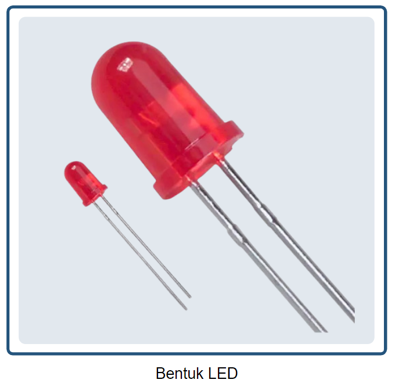
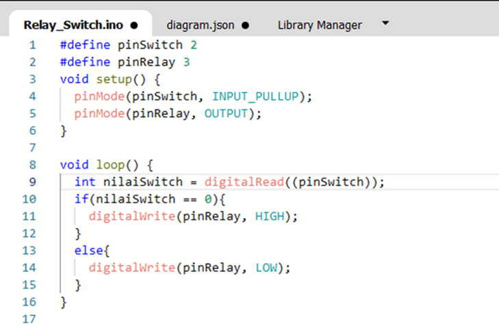

# Pertemuan ke 14 : Praktik Aktuator LED dan Relay

## Topik Bahasan
Proyek Dasar Internet of Things I (Praktik Pemrograman Mikrokontroler, Praktik Sensor: Sensor DHT, LCD, Praktik Sensor: Ultrasonic, PIR, dan LDR, Praktik Aktuator: LED dan Relay, Praktik Aktuator: Buzzer dan Servo)

## Deskripsi
- Mampu melakukan instalasi, memahami bahasa pemrograman dan pin pada Arduino. 
- Mampu melakukan uji coba serial monitor dan uji coba PWM dengan potensiometer.
- Mampu merancang dan membuat proyek menggunakan sensor DHT22.
- Mampu merancang dan membuat proyek menggunakan sensor Ultrasonic, PIR, dan LDR.
- Mampu merancang dan membuat proyek menggunakan aktuator LED dan Relay.
- Mampu merancang dan membuat proyek menggunakan aktuator Buzzer dan Servo.

## Teori Singkat

### Pengertian Aktuator

**Aktuator** adalah sebuah peralatan mekanis untuk menggerakkan atau mengontrol sebuah mekanisme atau sistem. Aktuator diaktifkan dengan menggunakan lengan mekanis yang biasanya digerakkan oleh motor listrik. Aktuator biasanya adalah suatu output dari suatu sistem yang dikendalikan mikrokontroller.

Contoh: Motor DC, relay, solenoid valve, servo motor, stepper motor, dll.

### LED (Light Emmiting Diode)

**LED (Light Emmiting Diode)** merupakan  komponen elektronika yang dapat memancarkan  cahaya ketika diberikan tegangan maju. LED merupakan keluarga Dioda yang terbuat dari bahan semikonduktor.

**Cara kerja LED** hampir sama dengan Dioda yang memiliki dua kutub yaitu kutub Positif (P) dan Kutub Negatif (N).  LED hanya akan memancarkan cahaya apabila dialiri tegangan maju (bias forward) dari Anoda menuju ke Katoda.

**Penggunaan LED**
LED memiliki 2 buah kaki, yaitu:

- Anoda (+) yang memiliki kaki lebih panjang dan dihubungkan ke sumber tegangan positif.
- Katoda (-) yang memiliki kaki lebih pendek dan dihubungkan ke ground.

### Relay
**Relay** adalah saklar elektromekanikal yang digunakan untuk membuka dan menutup rangkaian listirk serta menstimulasi listrik kecil untuk mengendalikan katup pada arus yang lebih besar.  Komponen yang menyusun relay ada diantaranya yaitu elektromagnetik (coil), armature, switch contact point (saklar), dan spring.

**Cara Kerja Relay**

Relay bekerja atau aktif saat coil dipicu dengan tegangan positif atau negatif (tergantung spesifikasi). Saat relay aktif maka akan merubah pin NO menjadi terhubung, dan NC menjadi terputus. Terdapat 2 mode dalam relay yaitu NO (Normally Open) dan NC (Normally Close).

NO merupakan kondisi pin relay terbuka (tidak terhubung) jika relay tidak aktif. NC merupakan kondisi pin relay sudah terhubung saat relay tidak aktif, sehingga saat relay aktif pin NC akan terputus/terbuka.

**Implementasi Relay** 

Relay banyak sekali diimplementasikan di industri, otomotif, dll.
Relay tersebut berfungsi memutus dan menghubungkan arus listrik sesuai dengan keinginan. Contoh pada gambar disamping, lampu akan menyala apabila mendapatkan sinyal input pada input relay.

## Praktikum 1: Arduino, HC-SR04 dan LED

Selesaikan langkah-langkah praktikum berikut ini menggunakan Wokwi di browser Anda.

1. Masuk ke Wokwi. Klik New Projects untuk membuat projek baru. Pilih Arduino UNO.

 

2. Tambahkan komponen baru dengan klik Add (+).Tambahkan HC-SR04 Sensor Ultrasonik, 3 buah LED

 

3. Hubungkan seluruh komponen sebagai berikut.

 
 

   
4. Buatlah program seperti ditunjukan pada gambar.
Program tersebut digunakan untuk memberikan notifikasi ketinggian air menggunakan LED.
+ LED merah = air tinggi
+ LED Kuning = air sedang
+ LED Hijau = air rendah

Klik Start Simulation untuk memulai simulasi.

 

5. Klik Sensor Ultrasonik.
+ Atur jarak menjadi <100 cm, lampu kuning akan menyala
+ Atur jarak menjadi <50 maka lampu hijau akan menyala.
+ Jika jarak lebih dari 100 cm maka lampu merah akan menyala

Klik Stop Simulation untuk menghentikan simulasi.

 
 

## Praktikum 2: Praktik Arduino, Relay dan LED

Selesaikan langkah-langkah praktikum berikut ini menggunakan Wokwi di browser Anda.

1. Masuk ke Wokwi. Klik New Projects untuk membuat projek baru. Pilih Arduino UNO.

 

2. Tambahkan komponen baru dengan klik Add (+). Tambahkan DPDT Relay, LED, dan Slide Switch.

 

3. Hubungkan seluruh komponen sebagai berikut.

 
 

4. Buatlah program seperti ditunjukan pada gambar. Program tersebut digunakan untuk menyalakan LED melalui Relay dengan menggunakan switch. Jika Switch ON, maka lampu merah menyala, jika Switch OFF maka lampu hijau menyala. Klik Start Simulation untuk memulai simulasi.
   
 

5. Klik Switch untuk mengaktifkan dan menonaktifkan switch. Klik Stop Simulation untuk menghentikan simulasi.
+ Jika switch on, maka relay akan aktif dan lampu LED merah akan menyala.
+ Sebaliknya, jika switch off maka relay nonaktif dan LED hijau menyala.

   

   
## Tugas Mandiri 
Selesaikan langkah-langkah praktikum berikut ini menggunakan Wokwi di browser Anda.

**Tugas 1**
1. Masuk ke Wokwi. Klik New Projects untuk membuat projek baru. Pilih Arduino UNO.

 

2. Tambahkan komponen baru dengan klik Add (+). Tambahkan Sensor PIR. Tambahkan DPDT Relay. Tambahkan LED.

 

3. Hubungkan seluruh komponen sebagai berikut.

 
 

4. Buatlah program dimana program tersebut digunakan untuk menampilkan hasil pembacaan data PIR menggunakan serial monitor. Hasil pembacaan berupa teks di Serial Monitor.

5.  Klik Sensor PIR untuk melakukan simulasi adanya gerakan di dekat sensor. Klik Stop Simulation untuk menghentikan simulasi. Relay akan menyala apabila terdapat gerakan, lalu LED akan menyala. LED akan terus menyala selama gerakan masih terdeteksi.

 

**Tugas 2**

Berdasarkan rangkaian challenge 1, Buatlah rangkaian pada wokwi dengan menambahkan sensor HC-SR04
Tambahkan logika, ketika terdeteksi adanya objek bergerak dan jarak objek < 1 meter maka lampu LED akan menyala berkedip-kedip dan memunculkan notif “Awas Maling” di serial monitor.

 
