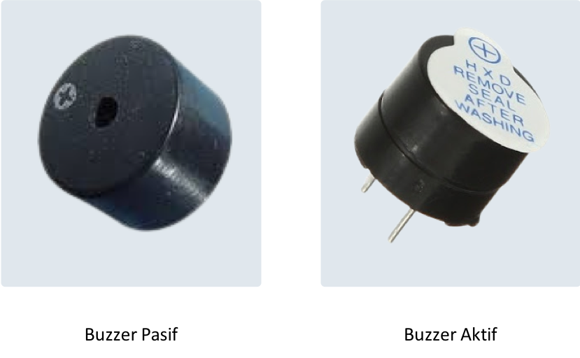
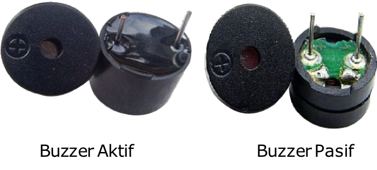
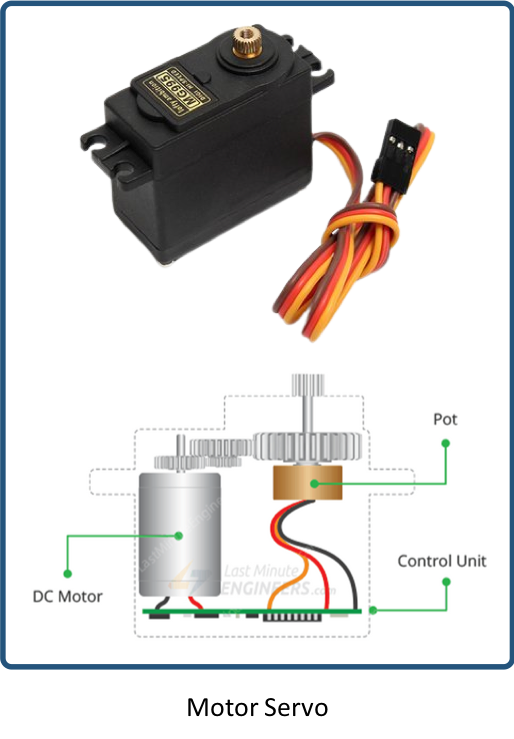
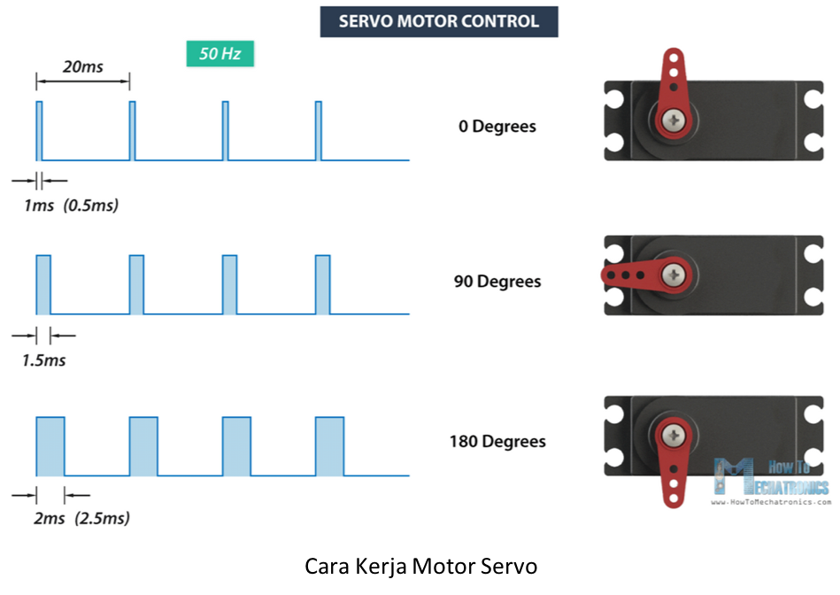
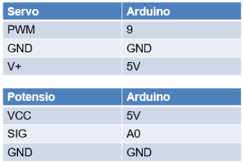
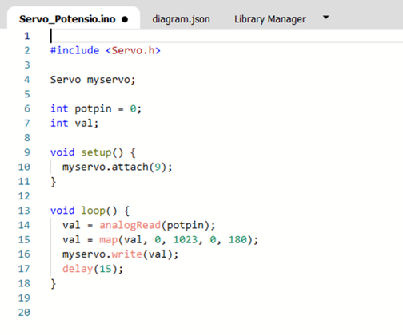
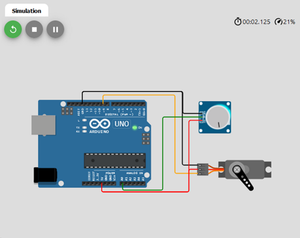
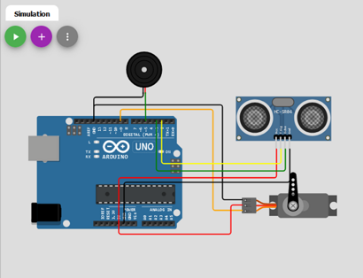
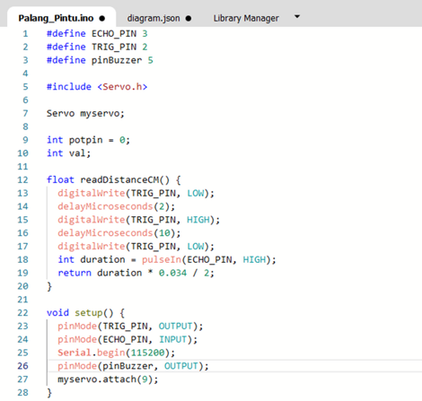

# Pertemuan ke 16 : Praktik Aktuator: Buzzer dan Servo


## Topik Bahasan
Proyek Dasar Internet of Things I (Praktik Pemrograman Mikrokontroler, Praktik Sensor: Sensor DHT, LCD, Praktik Sensor: Ultrasonic, PIR, dan LDR, Praktik Aktuator: LED dan Relay, Praktik Aktuator: Buzzer dan Servo)

## Deskripsi
- Mampu melakukan instalasi, memahami bahasa pemrograman dan pin pada Arduino. 
- Mampu melakukan uji coba serial monitor dan uji coba PWM dengan potensiometer.
- Mampu merancang dan membuat proyek menggunakan sensor DHT22.
- Mampu merancang dan membuat proyek menggunakan sensor Ultrasonic, PIR, dan LDR.
- Mampu merancang dan membuat proyek menggunakan aktuator LED dan Relay.
- Mampu merancang dan membuat proyek menggunakan aktuator Buzzer dan Servo.

## Teori Singkat

### Pengertian Aktuator

**Aktuator** adalah sebuah peralatan mekanis untuk menggerakkan atau mengontrol sebuah mekanisme atau sistem. Aktuator diaktifkan dengan menggunakan lengan mekanis yang biasanya digerakkan oleh motor listrik. Aktuator biasanya adalah suatu output dari suatu sistem yang dikendalikan mikrokontroller.

Contoh: Motor DC, relay, solenoid valve, servo motor, stepper motor, dll.


### Buzzer

**Buzzer atau Beeper** merupakan komponen elektronik yang digunakan untuk menghasilkan suara atau bip. 

Buzzer merupakan perangkat output yang mengubah sinyal listrik menjadi suara berdasarkan frekuensi yang ditentukan.

Fungsi buzzer adalah sebagai komponen yang menghasilkan output berupa bunyi beep. Kegunaan buzzer yang paling umum yaitu sebagai alarm, indikator suara, dan timer. 


**Jenis-jenis Buzzer**

Terdapat 2 jenis buzzer, yaitu aktif dan pasif

Buzzer aktif adalah buzzer yang sudah memiliki suaranya sendiri saat diberikan tegangan listrik.
 
Buzzer pasif adalah jenis buzzer yang tidak memiliki suara sendiri sehingga perlu menentukan jenis suara yang akan digunakan.

Cara mengetes buzzer aktif atau pasif yaitu hubungkan pin + buzzer pada tegangan positif dan hubungkan pin – buzzer pada ground. Jika buzzer menyala, maka buzzer tersebut adalah buzzer aktif.



**Modul Buzzer, Skema Modul Buzzer**




### Motor Servo

**Motor servo** adalah perangkat elektromekanis yang dirancang menggunakan sistem kontrol jenis loop tertutup (servo) sebagai penggerak dalam sebuah rangkaian yang menghasilkan torsi dan kecepatan berdasarkan arus listrik dan tegangan yang diberikan.

Motor servo bekerja dengan memutar gear dengan derajat tertentu sesuai dengan keinginan.



The Engineering Mindset - https://www.youtube.com/watch?v=1WnGv-DPexc


**Cara Kerja Motor Servo**

Cara kerja motor servo bergantung lebar pada sinyal modulasi yang memakai sistem kontrol. Lebar sinyal tersebut nantinya yang akan menjadi penentu bagaimana posisi dari sudut putaran yang ada pada bagian poros motor.

Motor servo biasa digunakan pada projek yang membutuhkan mekanisme gerakan mekanik dengan besar sudut tertentu.

**Contoh servo SG90**

Sesuai dengan datasheet servo SG90, untuk dapat bekerja, servo membutuhkan sinyal PWM dengan ketentuan sebagai berikut : 
-  Rotational Range: 180° 
-  Pulse Cycle: ca. 20 ms 
-  Pulse Width: 500-2400 μs 

Untuk itu, perlu dicari nilai konversi dari satuan waktu (ms) ke nilai 16 bit untuk dapat menggerakkan servo ke sudut yang diinginkan. Caranya seperti berikut ini : 
-  Time(t)=1detik=1000ms 
-  Untuk mendapatkan pulse cycle (pc) sebesar 20 ms maka dibutuhkan frekuensi (freq) 
sebesar 50 Hz, perhitungannya : pc = t / freq 
pc = 1000 / 50 pc = 20 ms


- Untuk sudut 0° membutuhkan pulse width (pw) sebesar 500 μs, maka duty cycle (dc) nya sebesar :
dc = pw / pc
dc = 500 μs / 20 ms = 500 μs / 20000 μs dc = 0.025 = 2.5%

- Untuk sudut 180° membutuhkan pulse width (pw) sebesar 2400 μs, maka duty cycle (dc) nya sebesar :
dc = pw / pc
dc = 2400 μs / 20 ms = 2400 μs / 20000 μs dc = 0.12 = 12%

- Merubah nilai duty cycle (dc) ke integer 16-bit
• Sudut 0° = duty cycle 2.5%
• Sudut 180° = duty cycle 12%
= 0.0250*65536 = 1638 = 0.1200*65536 = 7864





## Praktikum 1: Praktik Arduino, Buzzer

Selesaikan langkah-langkah praktikum berikut ini menggunakan Wokwi di browser Anda.

1. Masuk ke Wokwi. Klik New Projects untuk membuat projek baru. Pilih Arduino UNO.

 

2. Tambahkan komponen baru dengan klik Add (+). Tambahkan buzzer.

 

3. Hubungkan seluruh komponen sebagai berikut.

- + -> 7
- - -> GND

 

   
4. Buatlah program seperti ditunjukan pada gambar.
Program tersebut digunakan untuk memberikan sinyal kepada buzzer agar menghasilkan suara.
Suara yang dihasilkan dapat bervariasi tergantung frekuensi yang diberikan pada program.

Klik Start Simulation untuk memulai simulasi.

 

```cpp
int buzzerPin = 7;

void setup(){
  pinMode(buzzerPin, OUTPUT);
}

void loop(){
  tone(buzzerPin, 150);
  delay(1000);

  noTone(buzzerPin);

  delay(1000);

  tone(buzzerPin, 100,1000);
  delay(2000);

}
```

5. Buzzer akan otomatis menyala/menghasilkan suara sesuai dengan program yang sudah dibuat.

Klik Stop Simulation untuk menghentikan simulasi

 
 


## Praktikum 2: Praktik Arduino, Servo dan Potensiometer


Selesaikan langkah-langkah praktikum berikut ini menggunakan Wokwi di browser Anda.

1. Masuk ke Wokwi. Klik New Projects untuk membuat projek baru. Pilih Arduino UNO.

 

2. Tambahkan komponen baru dengan klik Add (+). Tambahkan library Servo pada Library manager. Tambahkan Servo dan Potensiometer.


 

3. Hubungkan seluruh komponen sebagai berikut.

 
 

4. Buatlah program seperti ditunjukan pada gambar. Program tersebut digunakan untuk memutar/menggerakka sudut servo sesuai dengan input potensiometer. Klik Start Simulation untuk memulai simulasi.
   
 

```cpp
#include <Servo.h>

Servo myservo;


int potpin = 0;
int val;

void setup(){
 myservo.attach(9);
}

void loop(){
 val = analogRead(potpin);
 val = map(val, 0, 1023, 0, 180);
 myservo.write(val);
 delay(15);
}

```

5. Klik Potensiometer untuk mengatur nilai potensiometer. Atur arah sesuai dengan keinginan. Servo akan bergerak sesuai dengan input potensiometer. Klik Stop Simulation untuk menghentikan simulasi.


   


## Praktikum 3: Project Palang Mall


Selesaikan langkah-langkah praktikum berikut ini menggunakan Wokwi di browser Anda.

1. Masuk ke Wokwi. Klik New Projects untuk membuat projek baru. Pilih Arduino UNO.

 

2. Tambahkan komponen baru dengan klik Add (+). Tambahkan Sensor HC-SR04 Ultrasonic. Tambahkan Servo. Tambahkan Buzzer.

 

3. Hubungkan seluruh komponen sebagai berikut.

 
 

4. Buatlah program seperti ditunjukan pada gambar. Program tersebut digunakan untuk mengatur sudut servo apabila input sensor ultrasonik menunjukkan kurang dari 100 maka servo akan bergerak. Saat servo bergerak, diikuti dengan suara buzzer.

 

5. Klik Sensor Ultrasonic untuk melakukan simulasi adanya objek yang mendekat. Jika jarak kurang dari 100 maka servo (palang) akan tertutup dan menyalakan buzzer (sirine). Servo akan tertutup selama jarak masih kurang dari 100. Klik Stop Simulation untuk menghentikan simulasi.

 

## Praktikum 4: Praktik Servo dengan ESP32 Micropython

Selesaikan langkah-langkah praktikum berikut ini menggunakan Wokwi di browser Anda.

1. Masuk ke Wokwi. Klik New Projects untuk membuat projek baru.

https://wokwi.com/projects/new/micropython-esp32

2. Buat skenario seperti gambar. Hubungkan pin pwm ke D15 pada esp32.

 

3. Kode program sebagai berikut.

```python
from machine import Pin, PWM 
from utime import sleep_ms

servo = PWM(Pin(15)) 
servo.freq(50) 
servo.duty_u16(1638)

while True:
  servo.duty_u16(1638) 
  sleep_ms(1000) 
  servo.duty_u16(7864) 
  sleep_ms(1000)
```

4.  Jalankan program dengan klik play simulasi, anda dapat merubah sudut perputaran servo dengan menyesuaikan duty cycle ke int 16-bit 


## Tugas Mandiri 
Selesaikan langkah-langkah praktikum berikut ini menggunakan Wokwi di browser Anda.

**Tugas 1**

Buat program agar servo turun secara bertahap dan perlahan seperti pada persimpangan Mall yang asli. Pada saat yang sama Ketika servo turun perlahan, buzzer terus berbunyi dan LED berkedip


**Tugas 2**

Buat program memanfaatkan servo, sensor ultrasonic, LED dan buzzer
Jika orang mendekat pada jarak tertentu, maka buzzer akan berbunyi dan servo akan terbuka
Setelah orang tersebut lewat, maka servo akan kembali tertutup dan lampu LED akan menyala
Buat keterangan pada tiap state nya pada serial monitor


@2024 https://www.polinema.ac.id/
