# Pertemuan ke 17 : Pengenalan Macam-Macam Platform IoT dan Koneksi W-LAN


## Topik Bahasan
Mengenal berbagai macam platform IoT yang tersedia di internet seperti ThingsBoard, Blynk, ThingSpeak, Antares, Thinger.Io dan bagaimana memanfaatkan platform tersebut didalam proyek IoT

## Deskripsi
- Mampu menggunakan dan merancang aplikasi di Thingsboard
- Mampu menggunakan dan merancang aplikasi di ThingSpeak
- Mampu menggunakan dan merancang aplikasi di Blynk
- Mampu menggunakan dan merancang aplikasi di Arduino IoT
- Mampu menggunakan dan merancang aplikasi di Thinger.Io
- Mengenal lingkungan pengembangan aplikasi IoT di Antares
- Mengenal layanan IoT yang disediakan oleh AWS
- Mampu untuk mensimulasikan proyek IoT yang terhubung ke platform IoT dan menampilkan data

## Teori Singkat
Platform IoT merupakan suatu sistem yang terdiri dari perangkat keras dan perangkat lunak untuk menerapkan teknologi Internet of Things. Platform IoT terus berkembang dan bertambah banyak seiring dengan kebutuhan IoT. Contoh platform IoT: Thingsboard, Blynk, Thingspeak, Arduino IoT Cloud, Antares, AWS IoT, Thinger, dll.


## Thingsboard
ThingsBoard adalah platform IoT open-source untuk mengumpulkan data, pemrosesan, visualisasi data, dan manajemen perangkat IoT. ThingsBoard memungkinkan konektivitas perangkat melalui protokol IoT standar industri - MQTT, CoAP, dan HTTP dan mendukung penyebaran cloud dan lokal.  ThingsBoard menggabungkan skalabilitas, toleransi kesalahan, dan kinerja sehingga kita tidak akan pernah kehilangan data. 
Website thingsboard : https://thingsboard.io/


### Penggunaan Thingsboard
Penggunaan Thingsboard cukup sederhana, karena untuk menciptakan sebuah dashboard IoT yang terlihat profesional, cukup dengan drag and drop saja.  Thingsboard ini mempunyai dua fungsi utama yakni sebagai broker dalam terminologi IoT (core services) dan sebagai web presentation atau penyaji data (web UI)

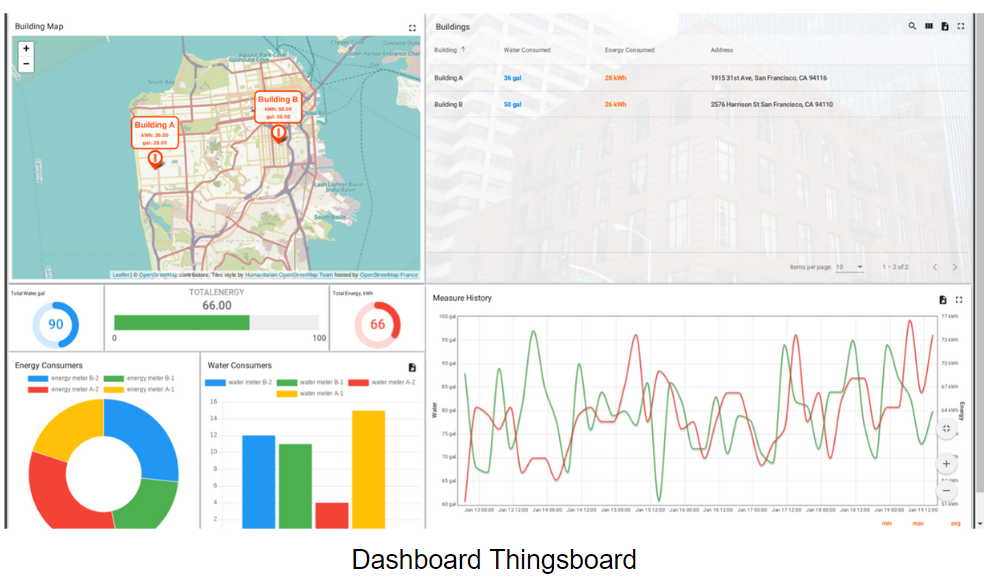

### Fitur Thingsboard
1. **Menyediakan dan mengelola perangkat.** Thingsboard menyediakan fitur untuk mengelola perangkat secara online melalui IoT dengan aman karena dilengkapi dengan berbagai autentikasi.
2. **Mengumpulkan dan visualisasi data.** Pengelolaaan data yang diperoleh dari perangkat IoT dapat divisualisasikan dengan dashboard sehingga mudah dalam pembacaan data.


3. **Memproses dan membuat rules.** Selain memproses data, thingsboard memungkinkan untuk pembuatan rules dari data yang diperoleh, rules bekerja diluar dari perangkat yang mengirimkan data.

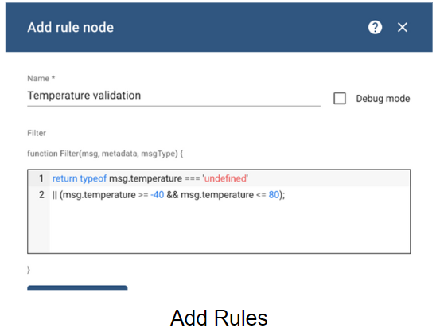

4. **Dashboard IoT Real-Time.** Data yang dikirimkan menggunakan protokol MQTT dan CoAP sehingga pengiriman data yang cepat sehingga dashboard (tampilan) dapat diupdate dengan cepat dan real-time.

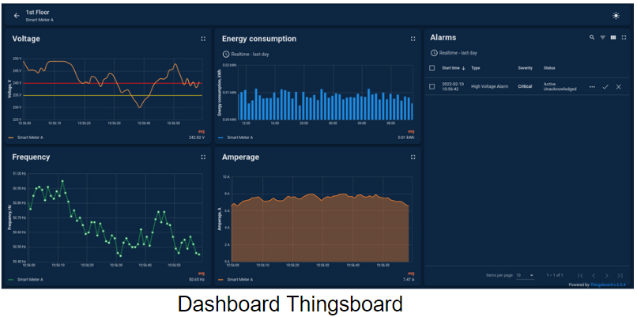

5. **Berorientasi pada Skalabilitas.** Thingsboard memungkinkan untuk skalabilitas dalam implementasi IoT. Sehingga saat memerlukan penyimpanan data dalam jumlah besar Thingsboard sudah siap.
Thingsboard juga dapat meminimalisir kesalahan dengan fitur microservices

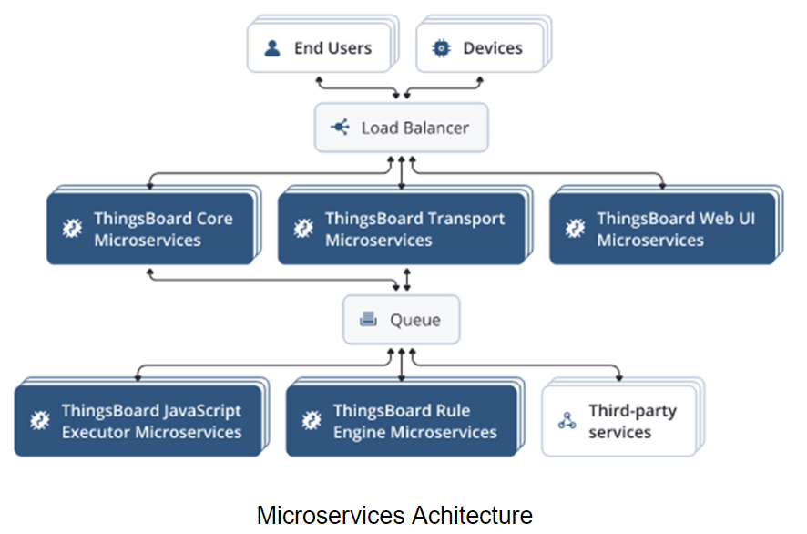

## Blynk IoT
Blynk adalah platform IoT untuk aplikasi mobile pada Android dan iOS yang bertujuan untuk kendali berbagai development board seperti Arduino, Raspberry Pi, ESP8266, WEMOS D1, dll. Platform ini sangat mudah digunakan untuk monitoring dan controlling berbagai perangkat IoT karena pemrograman pada board yang tidak rumit dan konfigurasi pada mobile app yang sangat mudah.

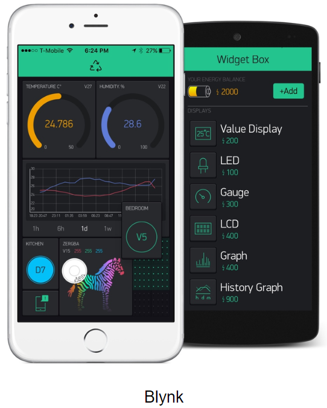

### Fitur Blynk IoT
1. **Blynk.App** Merupakan fitur Blynk IoT yang memungkinkan untuk membuat dashboard dalam Android atau iOS tanpa menggunakan koding. Tampilan yang disajikan sangat menarik dan mudah dipahami.
2. **Blynk.360** Konfigurasi data, perangkat, dan user dilakukan melalui website Blynk IoT. Website ini memungkinkan untuk mengatur data yang diterima sekaligus dapat digunakan sebagai dashboard layaknya pada mobile apps.

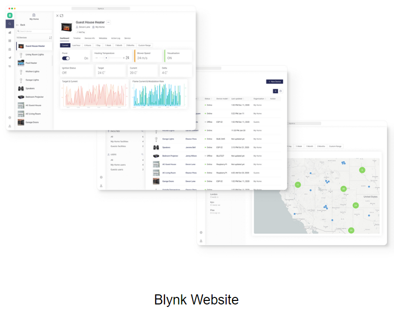

3. **Templates** Blynk menyediakan fitur templates yang dapat digunakan untuk mengatur skalabilitas data. Selain itu templates dapat bekerja pada banyak devices dengan cara kerja yang hampir sama.
4. **Blynk.inject** Blynk memiliki mekanisme mengkoneksikan perangkat IoT dengan mudah dan fleksibel. Dengan ini, perangkat tidak perlu diprogram ulang saat ingin mengganti Wifi.

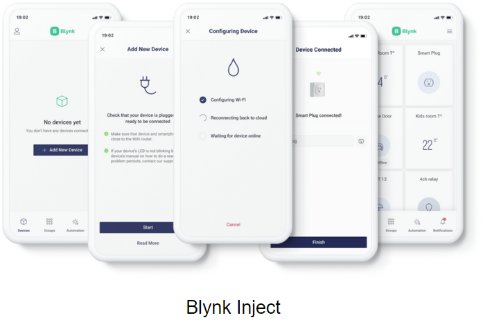

5. **Blynk.Air** Salah satu fitur unggulan dari Blynk adalah updates Over the Air (OTA) sehingga memungkinkan kita mengupdate program secara online tanpa datang ke lokasi perangkat IoT tersebut. Fitur ini sangat memudahkan kita apabila perangkat yang dikelola banyak dan tersebar di berbagai lokasi. Beberapa perangkat yang mendukung update OTA yaitu ESP8266, ESP32, ESP8266, MKR1000, MKR WiFi 1010, TI CC3220sf. 


## Thingspeak
ThingSpeak merupakan platform open source IoT dan API untuk menyimpan dan mengambil data dari berbagai perangkat menggunakan protokol HTTP melalui Internet. ThingSpeak didukung perangkat lunak komputasi numberik yaitu Matlab. Menyediakan visualisasi data secara realtime dan dengan dukungan Matlab, memungkinkan untuk menambahkan data untuk keperluan analisis data dan pemrosesan.
Website: https://thingspeak.com


ThingSpeak lebih cocok digunakan sebagai data logger, analytics, dan data visualization. Berikut fitur Thingspeak:
1. **ThingSpeak lebih cocok digunakan sebagai data logger, analytics, dan data visualization.** Thingspeak memungkinkan pembuatan dashboard berupa grafik dan sejenisnya untuk menyajikan data secara realtime. Dashboard tersebut dapat disematkan di website, aplikasi, dll sehingga pengunaan lebih fleksibel.
2. **Agregasi data dari penyedia pihak ketiga.** Thingspeak memungkinkan untuk menggabungkan data dari pihak lain diluar Thingspeak. Sehingga data yang dikumpulkan lebih komprehensif untuk mendukung projek tertentu. Task IoT analytics terjadwal guna menganalisis data Event Scheduling Menjalankan aksi berdasarkan data yang diterima

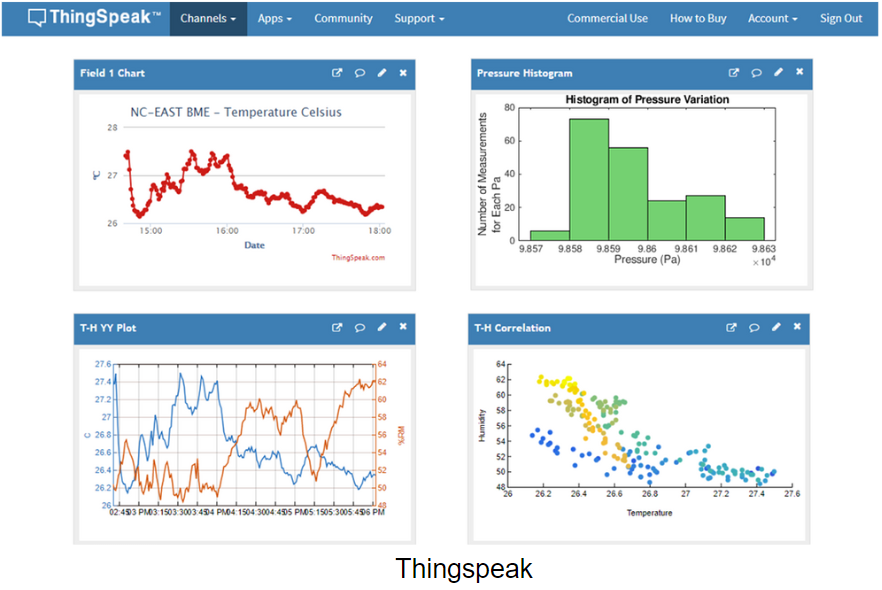

### Fitur Thingspeak
1. **Task IoT analytics.** Integrasi dengan Matlab membuat Thingspeak powerful dalam analisis data, ditambah dengan penjadwalan dalam waktu tertentu untuk melakukan analisis.


2. **Event Scheduling.** Thingspeak juga memungkinkan untuk melakukan tindakan tertentu berdasarkan rules yang sudah dibuat. Hal ini memudahkan pengguna dalam melakukan tindakan tertentu terhadap sistem.

## Arduino IoT Cloud
Arduino IoT Cloud adalah layanan Internet of Things yang disediakan oleh Arduino untuk melakukan monitoring dan controlling melalui device IoT. Arduino IoT Cloud mendukung berbagai development boards seperti Arduino, ESP8266, ESP32, Raspberry Pi, dll.


### Fitur Arduino IoT Cloud:
1. **Realtime Dashboard** Dashboard pada Arduino IoT Cloud dapat menampilkan data dengan cepat dan relatime. Selain itu dashboard yang disajikan simple dan mudah dipahami oleh pengguna. Hanya saja, widget yang dapat ditambahkan cukup terbatas karena Arduino IoT Cloud masih dalam tahap pengembangan.


2. **Terintegrasi dengan Arduino Create** Arduino Create merupakan fitur dari Arduino yang digunakan untuk memprogram development board secara online tanpa software. Arduino IoT Cloud mendukung ekosistem ini sehingga pengguna lebih mudah dalam pemrograman perangkat development board. 

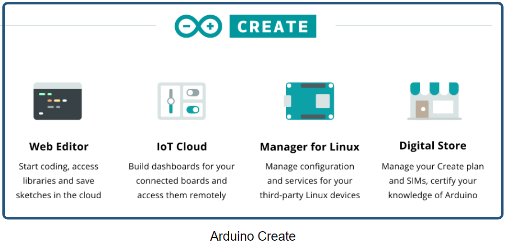

3. **Fleksibel digunakan untuk berbagai devices** Arduino IoT Cloud mendukung untuk koneksi dengan berbagai development board yang banyak dijumpai seperti Arduino, ESP8266, ESP32, Raspberry Pi, dll sehingga pengguna dapat dengan mudah mengimplementasikan teknologi IoT.

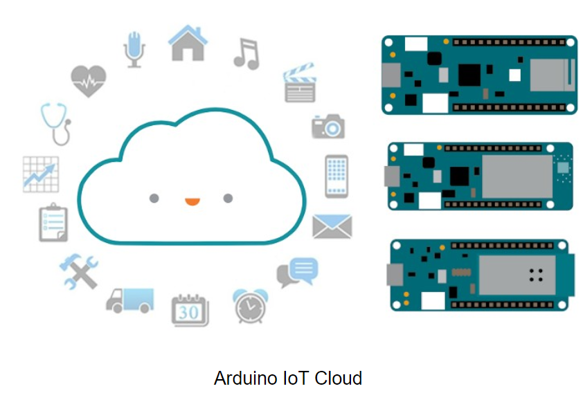

## Antares
ANTARES merupakan produk dan layanan Internet of Things (IoT) di bawah naungan PT Telekomunikasi Indonesia. ANTARES memiliki 4 pilar utama, yaitu IoT Platform, IoT Connectivity, IoT Solution, dan Devices. Antares didukung protokol MQTT, HTTP dan CoAP.
Website: https://antares.id/


### Fitur Antares:
1. **Aman.**  Seluruh komunikasi ditransmisikan di jalur yang telah dienkripsi. Segalanya diatur agar sangat handal, aman, dan tagguh di atas Secure Transport Layer.
2. **Handal.** Antares mampu mengelola infrastruktur IoT selama 24 penuh. Artinya, Antares menyediakan layanan IoT yang handal baik untuk kepentingan development ataupun bisnis.
3. **Beragam Perangkat.** Antares medukung berbagai macam perangkat atau development board seperti Arduino, ESP8266, ESP32, Android, Raspberry Pi, dll dan berbagai macam bahasa pemrograman.
4. **Open API.** Antares juga menyediakan fitur open API sehingga kita dapat mengatur dahsboard atau data diluar website Antares (jika diinginkan) sehingga lebih fleksibel. 

## AWS (Amazon Web Services)
AWS IoT merupakan layanan dari Amazon khusus untuk implementasi IoT baik dalam development maupun skala bisnis/industri. AWS memungkinkan untuk mengkoneksikan dan melakukan manajemen miliaran perangkat yang terhubung di AWS
Website: https://aws.amazon.com/iot/


### Fitur AWS
1. **Layanan IoT yang komplit.** AWS IoT memiliki layanan berupa manajemen perangkat, penyimpanan, penampil, dan analitik data untuk mengambil keputusan.

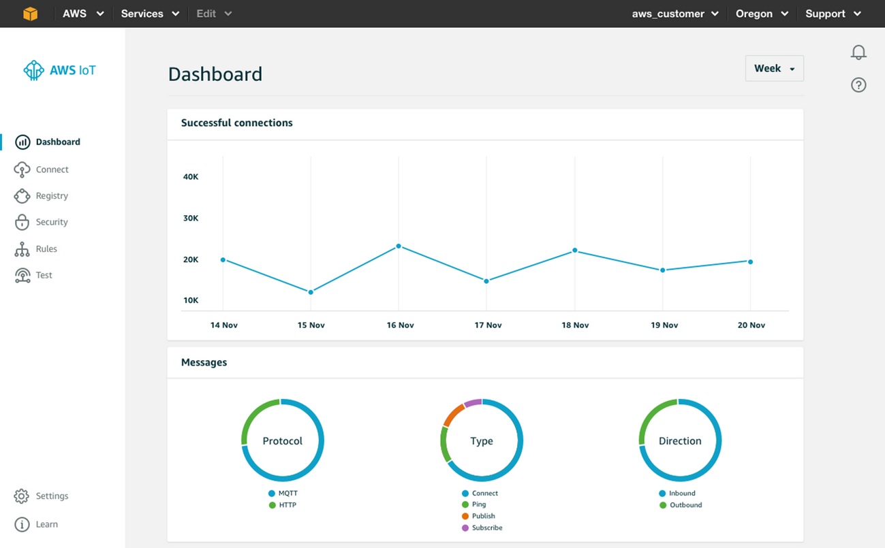

2. **Aman.** AWS menangani data dengan mengutamakan keamanan. AWS menggunakan AWS IoT Device Defender untuk melakukan perlindungan data seperti enkripsi, autentikasi, kontrol akses, dll.

3. **Dukungan AI dan ML.** AWS menyatukan AI (Artificial Intelligence), ML (Machine Learning, dan IoT sehingga membuat perangkat menjadi lebih cerdas. Salah satunya untuk prediksi data.
4. **Skalabilitas.** AWS menyiapkan untuk skalabilitas hingga miliaran perangkat dapat ditampung di server AWS. AWS IoT juga mudah diintegrasikan dengan berbagai layanan AWS lainnya


## Thinger.io
Thinger.io adalah platform Internet of Things (IoT) open source yang menyediakan fitur cloud untuk menghubungkan berbagai perangkat yang terkoneksi dengan internet. Thinger.io juga dapat memvisualisasikan hasil pembacaan sensor dalam bentuk nilai atau grafik dalam sebuah dashboard. 

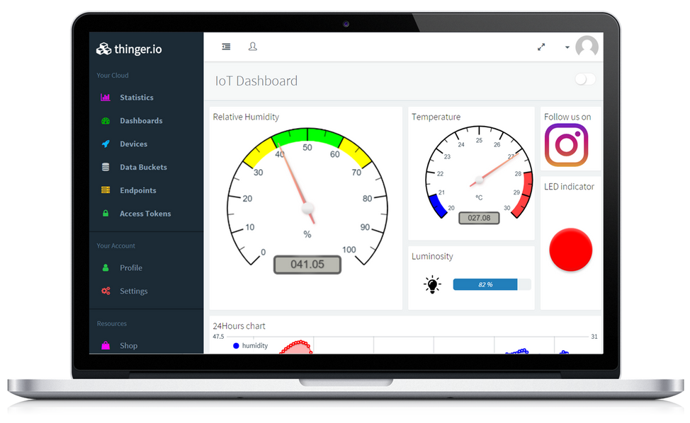

### Fitur Thinger.io
1. **Cloud platform.** Platform yang dibangun oleh Thinger memiliki kemudahan dalam pengoperasiannya dengan tetap memerhatikan kecepatan, keamanan, dan kemudahan eskalasi. 
2. **Kompatibel dengan berbagai hardware.** Seperti platfom yang lainnya, Thinger kompatibel dengan berbagai development board yang banyak digunakan seperti Arduino, ESP8266, ESP32, Raspberry Pi, bahkan Intel Edison.

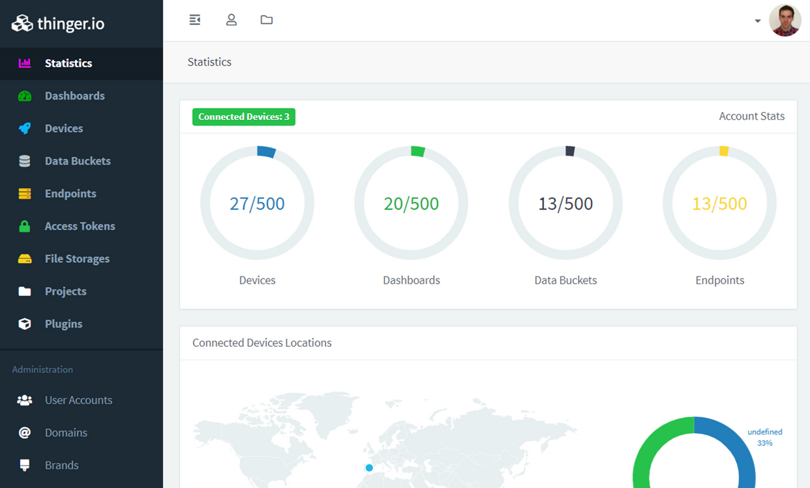

3. **Kode program sederhana.** Thinger.io membutuhkan koding didalamnya, namun kode program yang disajikan cukup sederhana, mudah digunakan, dan mudah dipahami.

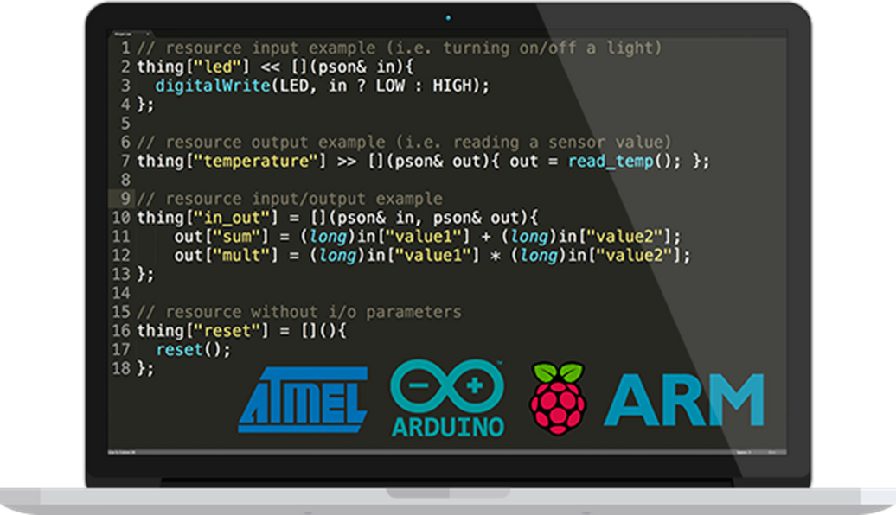

4. **Skalabilitas.** Thinger menawarkan fitur kemudahan dalam skalabilitas sehingga tidak perlu khawatir jika penggunaan jangka panjang dan memerlukan penyimpanan yang besar.

## Web Server Lokal
ESP32 dan ESP8266 memungkin kan untuk digunakan atau bertindak sebagai web server. Web server adalah sebuah software (perangkat lunak) yang memberikan layanan berupa data melalui protokol HTTP atau HTTPS. ESP32 dan ESP8266 juga mendukung layanan web server lain untuk mendukung layanan tersebut seperti PHP, CSS, Java Script, dll. Umumnya web server yang dibangun pada ESP32 dan ESP8266 bersifat lokal, sehingga yang bisa mengakses adalah perangkat yang terhubung dengan jaringan yang sama dengan ESP32 dan ESP8266 baik menggunakan WiFi atau kabel LAN.


## Praktik Menghubungkan ESP32 dan Blynk
1. Buat account baru di https://blynk.cloud/dashboard/register
2. Setelah berhasil membuat account baru, silahkan login ke Blynk menggunakan account anda. Anda akan masuk ke dalam halaman Blynk.Console seperti ditunjukkan oleh Gambar

    - 

3. Buat template baru dengan klik pada tombol **+ New Template**. Isikan informasi yang diperlukan pada form **Create New Template** seperti ditunjukkan oleh Gambar 

    - 
4. Buat device baru melalui menu **Devices** dan klik tombol **+ New Device** seperti ditunjukkan oleh Gambar 

    - 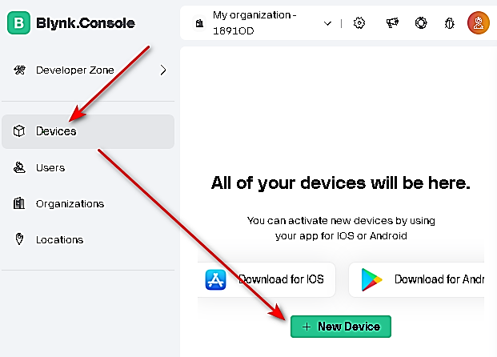

5. Pilih, pembuatan new device dari template seperti ditunjukkan oleh Gambar 

    - 

6. Isikan identitas new device sesuai dengan Gambar 

    - 

7. Klik pada tombol **Edit Dashboard** seperti ditunjukkan oleh Gambar. Dashboard digunakan untuk mengatur tampilan antarmuka aplikasi pengontrol perangkat IoT di Wokwi dengan menambahkan berbagai pilihan widget yang tersedia.

    - 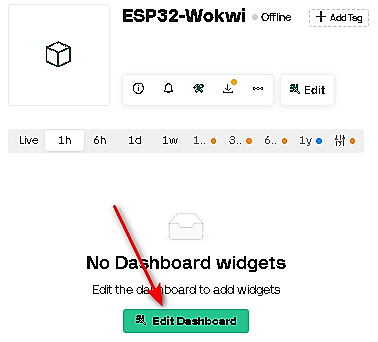

8. Drag and drop widget Switch dari widget box ke Dashboard seperti ditunjukkan oleh Gambar. Selain widget switch, terdapat widget lain yang dapat anda pilih sesuai kebutuhan

    - 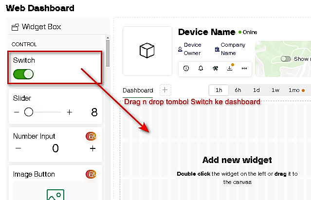

9. Klik tombol **Settings** pada widget Switch untuk menambahkan datastream pada widget Switch seperti ditunjukkan oleh Gambar. Datastream berguna sebagai sarana komunikasi read/write antara aplikasi dan perangkat IoT

    - 

10. Lakukkan konfigurasi pada Switch seperti ditunjukkan oleh Gambar. Kemudian, untuk datastream pilih **Virtual Pin**

    - 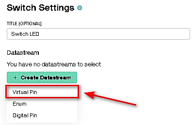

11.	Kemudian, pada Virtual Pin Datastream, lakukan konfigurasi seperti pada Gambar dan kemudian klik tombol Create

    - 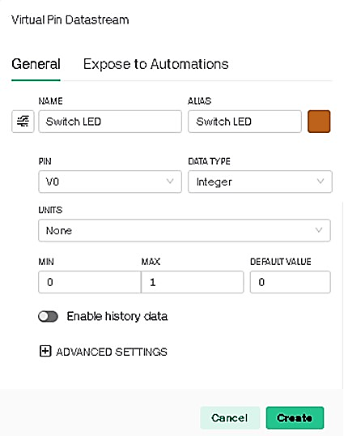

12.	Klik tombol **Save** untuk menyimpan perubahan yang terjadi pada **widget Switch**
13.	Klik tombol **Save And Apply** untuk menyimpan perubahan pada **Dashboard**
14.	Kemudian, pada device anda, klik pada icon Developer Tools untuk mendapatkan ID dan token yang nanti digunakan untuk menghubungkan perangkat IoT dan aplikasi anda seperti ditunjukkan oleh Gambar

    - 

15.	Pada halaman **Developer tools,** carilah **Firmware info** dan kemudian copy-paste **FIRMWARE CONFIGURATION** pada notepad untuk nanti digunakan dalam pemrograman Arduino seperti ditunjukkan oleh Gambar. Setelah anda copy, anda bisa tutup halaman Developer Tools

    - 

16.	Buka Wokwi, dan buatlah project baru dengan menambahkan LED didalamnya seperti ditunjukkan oleh Gambar

    - 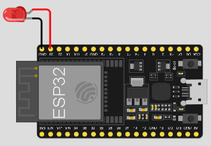

17.	Pada Library Manager, tambahkan library Blynk seperti ditunjukkan oleh Gambar 

    - 

18.	Setelah itu, pada sketch, copy-kan firmware configuration yang tadi anda dapatkan dari Blynk dan lanjutkan dengan menuliskan baris kode seperti berikut ini.

```cpp
#define BLYNK_TEMPLATE_ID "TMPL6bpRYvnXn"
#define BLYNK_TEMPLATE_NAME "Led Controller"
#define BLYNK_AUTH_TOKEN "_l044ITu2wI9vCLexvx93oHsJ1zsmXXX"

#include <WiFi.h>
#include <BlynkSimpleEsp32.h>

#define led_pin 23

char ssid[] = "Wokwi-GUEST";
char pass[] = "";

#define BLYNK_PRINT Serial

BLYNK_WRITE(V0){
  int value = param.asInt();
  digitalWrite(led_pin, value);
  Serial.print("Data from blynk : ");
  Serial.println(value);
}

void setup(){
  pinMode(led_pin, OUTPUT);

  Blynk.begin(BLYNK_AUTH_TOKEN, ssid, pass);
  Serial.begin(115200);
  Serial.println("System started ...");
}

void loop(){
  Blynk.run();
}
```

19.	Compile dan jalankan project Wokwi anda
20.	Cobalah kendalikan lampu LED melalui Blynk dengan mematikan/menghidupkan LED melalui switch. Cek dulu apakah Blynk anda sudah dalam status Online, apabila belum cobalah refresh browser anda seperti ditunjukkan oleh Gambar.

    - 

21.	Apabila terdapat kendala, cobalah restart ulang Wokwi atau Blynk anda.

## Tugas Individu
Silakan mendaftar atau membuat akun sebanyak 3 platform IoT, tampilkan tangkapan layar halaman dashboard Anda


