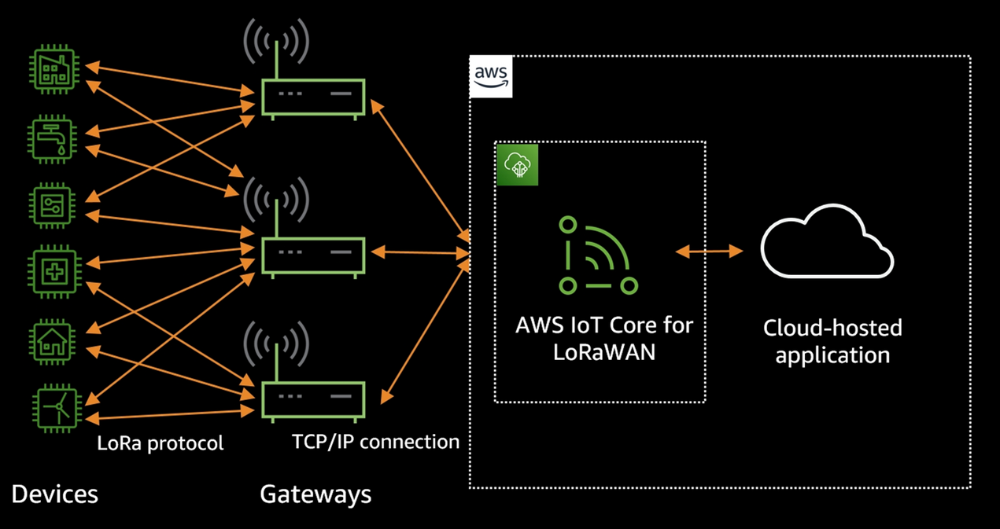
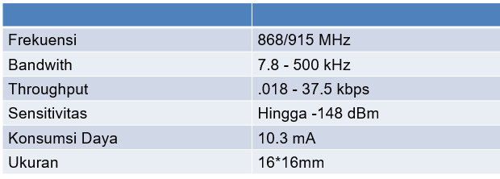
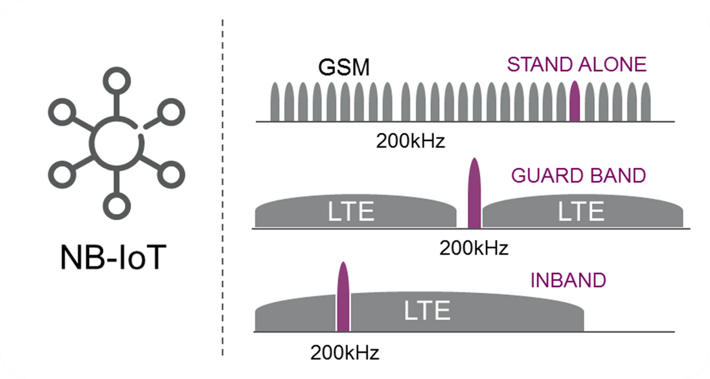
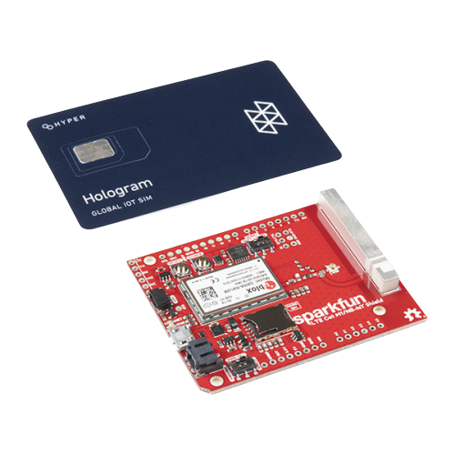
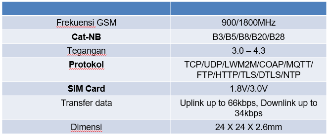

# Pertemuan ke 18 : Pengenalan dan Demo LPWAN - LoRa, NB-IoT


## Topik Bahasan
Mengenal berbagai macam teknologi komunikasi nirkabel jarak jauh daya rendah yang dapat diimplementasikan didalam proyek IoT seperti teknologi LPWAN, LoRa, dan IoT serta dapat mengimplementasikan dan menguji coba teknologi komunikasi tersebut

## Deskripsi
- Mengenal dan mampu menjelaskan berbagai macam teknologi komunikasi nirkabel daya rendah yang dapat diimplementasikan dalam perangkat IoT
- Mampu untuk mengimplementasikan komunikasi nirkabel daya rendah didalam proyek IoT yang dibuat

## Teori Singkat
Teknologi nirkabel berdaya rendah menyediakan komunikasi antar objek dalam jarak jauh, tetapi kecepatan transfer data di antara objek tersebut relatif rendah (50 kbit/detik atau kurang). Perangkat dengan jenis komunikasi ini mengonsumsi lebih sedikit energi, menggunakannya lebih lambat, dan dapat bekerja tanpa perlu mengisi ulang daya dalam waktu lama. Perangkat IoT, seperti peralatan untuk rumah dan kota pintar, adalah contoh terbaik penggunaan komunikasi nirkabel dengan konsumsi daya rendah. Teknologi ini diterapkan dalam sistem pencahayaan, pasokan air, pengawasan video, pemanas, dan pengendalian lingkungan. Bidang aplikasi populer lainnya adalah meteran pintar, mesin pembayaran, dan berbagai sensor. Ada banyak solusi teknologi nirkabel berdaya rendah, yang akan membuat bingung dalam memilihnya. Berikut ini adalah beberapa teknologi yang populer yang telah dimanfaatkan dan diproduksi secara massal untuk jaringan telekomunikasi, otomasi industri, dan pasar konsumen:

+ LPWAN;
+ LoRa
+ NB-IOT;
+ Z-Wave;
+ Zigbee;
+ Bluetooth Low-Energy;
+ Wi-Fi HaLow;
+ Sigfox;
+ LTE-M.

## LPWAN
LPWAN (Low Power Wide Area Network) merupakan jenis telekomunikasi nirkabel jaringan area luas yang dirancang untuk memungkinkan komunikasi jarak jauh pada rendah sedikit menilai antara hal - hal (objek yang terhubung), seperti sensor dioperasikan pada baterai. 

  - 

LPWAN adalah sebuah teknologi nirkabel yang sangat sesuai dengan kebutuhan spesifik perangkat machine-to-machine (M2M) dan IoT. Penggunaan LPWAN biasanya untuk smart city dan sektor industri yang tidak memerlukan kecepatan dan bandwidth yang sama dengan perangkat seluler konsumen. 

Teknologi LPWAN mendukung transfer data dalam paket data kecil dengan ukuran mulai dari 10 hingga 1000 byte. Hal ini memungkinkan peningkatan efisiensi dan kecepatan yang dioptimalkan mulai dari 3 Kbps hingga 375 Kbps. 

Karena Jaringan LPWAN beroperasi dengan efisiensi daya dan bandwidth yang lebih tinggi serta pada area yang lebih luas, infrastruktur dan perangkat keras yang dibutuhkan pun lebih sedikit, sehigga terjadi efisiensi biaya.
Contoh: perangkat untuk pemantauan kualitas udara, deteksi hunian, pelacakan aset, dan pemantauan lingkungan, dll.

  - 

Penggunaan salah satu LPWAN yaitu LoRaWAN pada pendeteksi lingkungan seperti persediaan air, kapasitas sampah, vending machine, deteksi api, dll yang terhubung ke gateway yang kemudian akan dikirimkan ke internet.

### Keunggulan LPWAN
1. **Long range.** LPWAN mendukung konektivitas yang sangat jauh bahkan hingga 10 Km, bahkan bisa menembus bawah tanah. Jangkauan biasanya diukur dengan sensitivitas sinyal penerima, LPWAN bahkan bisa mencapai -130 dBm untuk dapat bertukar data.

  - 

2. **Long power.** Sistem LPWAN mengadopsi beberapa pendekatan untuk mengoptimalkan efisiensi daya, sehingga baterai dapat bertahan selama bertahun-tahun pada perangkat. Perangkat dapat diatur menjadi deep sleep (tidur) saat tidak melakukan transmisi data. Selanjutnya, protokol pada Akses Kontrol Layer dapat meminimalkan overhead data.

  - 

3. **Low cost.** Protokol LPWAN yang disederhanakan, bandwith yang diturunkan, dan transfer data yang ringan dapat menurunkan biaya pemasangan infrastruktur dan perangkat keras yang diperlukan.

  - 

## LoRa (Long Range)
LoRa merupakan sistem komunikasi wireless untuk Internet of Things, menawarkan komunikasi jarak jauh ( > 15 km di remote area) dan berdaya rendah (5–10 tahun). LoRa merupakan teknologi IoT yang di bangun oleh Cycleo of Grenoble (Prancis), lalu di akuisisi oleh Semtech pada 2012 dengan menggunakan frekuensi 433, 868, 915, dan 923 MHz tergantung regulasi negara.

Indonesia oleh Kominfo akan mengikuti standar frekuensi LoRa yang ditetapkan oleh LoRa Alliance untuk kawasan Asia yaitu pada frekuensi 923–925 MHz (AS923). 

  - 

### Keunggulan LoRa
1. Geolocation, memungkinkan mendeteksi lokasi keberadaan suatu benda tanpa biaya alias gratis. 
2. Biaya Rendah, dapat mengurangi biaya dengan mengurangi biaya infrastruktur, biaya operasional dan sensor-sensor yang mempunyai jaringan nya sendiri.
3. Terstandar, dibuat agar dapat berinteraksi den berfungsi dengan produk atau sistem lain.
4. Daya Rendah, dengan konsumsi daya yang dibutuhkan hanya berkisar dari 13 ma hingga 15 ma. Sehingga baterai dapat bertahan 20 tahun. 
5. Jarak Jauh, LoRa dapat memancarkan hingga 100km. 
6. Aman, Tertanam end-to end enkripsi AES128 
7. Kapasitas Tinggi, Mendukung jutaan pesan per base station, ideal untuk operator jaringan publik yang melayani banyak pelanggan

### Penggunaan LoRa
LoRa diterapkan untuk pengiriman data dari sensor ke gateway yang berupa LoRaWAN atau LoRa Gateway. Gateway tersebut dapat terhubung ke Platform IoT seperti Thingsboard, Blynk, atau AWS IoT

  - 

Salah satu perangkat LoRa yang dapat diterapkan di Indonesia adalah Modul LoRa SX1276 dengan frekuensi 915 MHz. 

  - 

Spesifikasi:
  - 

## NB-IoT
NB-IoT (Narrowband Internet of Things) merupakan teknologi telekomunikasi Low Power Wide Area Network (LPWAN) bagian dari roadmap teknologi 5G yang dirancang secara khusus agar komunikasi antar mesin semakin masif dengan cakupan jaringan konektivitas yang lebih luas hingga dua kali dari teknologi GSM. Teknologi NB-IoT juga mampu menghasilkan ketahanan baterai dari perangkat hingga 10 tahun dan dapat menghemat cost dengan biaya modul yang rendah.

  - 

NB-IoT menggunakan subset (bagian) dari standar jaringan LTE, tetapi membatasi bandwidth menjadi satu pita sempit 200kHz. Atau dapat dibilang bahwa NB-IoT menumpang pada frekuensi jaringan GSM yang sudah ada. Ia menggunakan modulasi OFDM untuk komunikasi downlink dan SC-FDMA untuk komunikasi uplink. NB-IoT juga dapat beroperasi menggunakan pita 200 KHz yang tidak digunakan yang sebelumnya digunakan oleh GSM.

  - 

NB-IoT saat ini banyak dikembangkan oleh perusahaan telekomunikasi yang sebelumnya sudah membangun infrastruktur komunikasi GSM, LTE, dll. dengan menggunakan frekuensi berlisensi. Maka dari itu untuk dapat terhubung melalui jaringan NB-IoT kita harus membayar layanan tersebut menggunakan SIM Card layaknya penggunaan jaringan LTE pada ponsel.

  -  

Contoh komponen NB-IoT yaitu modul SIM7000E, SIM7000C, dan SIM7020C 

Spesifikasi SIM7000E
  - 

## Praktik Implementasi LoRa
1. Buatlah dua buah perangkat IoT dengan masing-masing perangkat memiliki skema seperti gambar berikut 

    - 

2. Tergantung dari frekuensi yang anda gunakan, untuk panjang antena harus disesuaikan dengan frekuensi yang digunakan agar sinyal LoRa dapat dipancarkan/dikirim secara optimal dengan ketentuan :
    + 915 MHz: 81,9 mm
    + 868 MHz: 86,3 mm
    + 915 MHz: 81,9 mm
3. Install library LoRa pada Arduino IDE seperti gambar berikut ini

    - 

4. Tuliskan dua buah kode program/sketch, yaitu sketch untuk sender, dan sketch untuk receiver. Berikut ini kodenya :

    **sender.ino**
    ```cpp
          
      #include <SPI.h>
      #include <LoRa.h>

      //define the pins used by the transceiver module
      #define ss 5
      #define rst 14
      #define dio0 2

      int counter = 0;

      void setup() {
        //initialize Serial Monitor
        Serial.begin(115200);
        while (!Serial);
        Serial.println("LoRa Sender");

        //setup LoRa transceiver module
        LoRa.setPins(ss, rst, dio0);
        
        //replace the LoRa.begin(---E-) argument with your location's frequency 
        //433E6 for Asia
        //868E6 for Europe
        //915E6 for North America
        while (!LoRa.begin(868E6)) {
          Serial.println(".");
          delay(500);
        }
        // Change sync word (0xF3) to match the receiver
        // The sync word assures you don't get LoRa messages from other LoRa transceivers
        // ranges from 0-0xFF
        LoRa.setSyncWord(0xF3);
        Serial.println("LoRa Initializing OK!");
      }

      void loop() {
        Serial.print("Sending packet: ");
        Serial.println(counter);

        //Send LoRa packet to receiver
        LoRa.beginPacket();
        LoRa.print("hello ");
        LoRa.print(counter);
        LoRa.endPacket();

        counter++;

        delay(10000);
      }
    ```

    **receiver.ino**
    ```cpp
      #include <SPI.h>
      #include <LoRa.h>

      //define the pins used by the transceiver module
      #define ss 5
      #define rst 14
      #define dio0 2

      void setup() {
        //initialize Serial Monitor
        Serial.begin(115200);
        while (!Serial);
        Serial.println("LoRa Receiver");

        //setup LoRa transceiver module
        LoRa.setPins(ss, rst, dio0);
        
        //replace the LoRa.begin(---E-) argument with your location's frequency 
        //433E6 for Asia
        //868E6 for Europe
        //915E6 for North America
        while (!LoRa.begin(868E6)) {
          Serial.println(".");
          delay(500);
        }
        // Change sync word (0xF3) to match the receiver
        // The sync word assures you don't get LoRa messages from other LoRa transceivers
        // ranges from 0-0xFF
        LoRa.setSyncWord(0xF3);
        Serial.println("LoRa Initializing OK!");
      }

      void loop() {
        // try to parse packet
        int packetSize = LoRa.parsePacket();
        if (packetSize) {
          // received a packet
          Serial.print("Received packet '");

          // read packet
          while (LoRa.available()) {
            String LoRaData = LoRa.readString();
            Serial.print(LoRaData); 
          }

          // print RSSI of packet
          Serial.print("' with RSSI ");
          Serial.println(LoRa.packetRssi());
        }
      }
    ```
5. Jalankan kedua buah perangkat IoT tersebut dan perhatikan data yang ditransmisikan melalui serial monitor pada Arduino IDE. Hasilnya kurang lebih seperti ditunjukkan oleh gambar berikut ini

    **sender**
    - 

    **receiver**
    - 

## Tugas Kelompok
1. Cari lah jurnal yang memanfaatkan Lora dan NB-IOT Masing-masing 1 jurnal
    + Buat Rangkumannya dalam bentuk Slide Presentasi
    + Jelaskan

## Tugas Individu
1. Rancanglah suatu system IoT yang memanfaatkan Lora atau NB-IOT
    + Terdapat Tujuan sistem
    + Sensor dan Aktuator yang digunakan
    + Visualisasi Rancangan Sistem 
    + Perkiraan Biaya pembuatan Sistem
2. Buat dalam bentuk slide 


