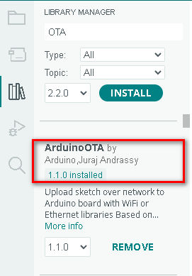
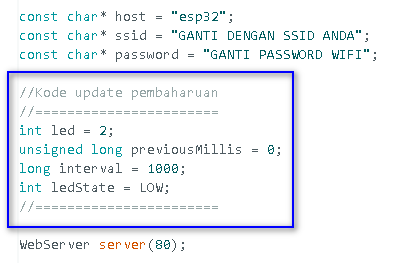
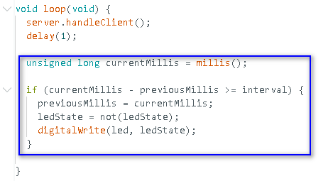
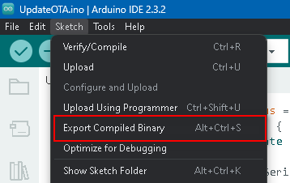
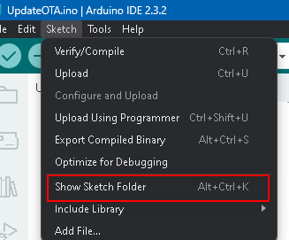
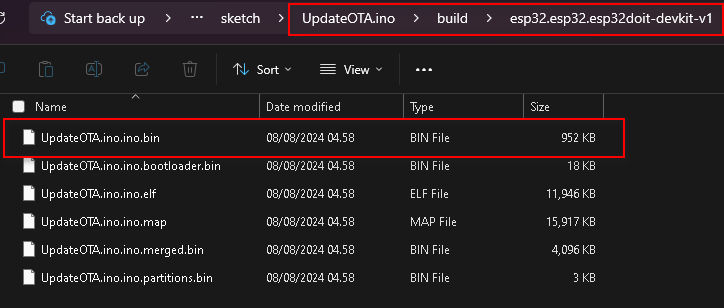
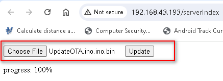

# Pertemuan ke 19 : Update Over the Air (OTA)

## Topik Bahasan
Mempelajari tentang apa itu update OTA, sejarah awal tentang update OTA, mekanisme update melalui OTA, kelebihan dan kekurangan update OTA, dan praktik update software melalui OTA

## Deskripsi
- Mampu menjelaskan dan mendeskripsikan tentang apa itu update OTA
- Mengetahui sejarah perkembangan update OTA
- Mampu menerapkan update OTA didalam perangkat IoT menggunakan web updater

## Teori Singkat
Over the air (OTA) merupakan pengiriman software, firmware, ataupun data lain menggunakan media nirkabel ke perangkat seperti mobile phones, set-top boxes, electric car, atau juga perlengkapan komunikasi secure voice.

## Sejarah OTA
- Operator seluler mengirim pembaruan OTA melalui SMS
- Mengkonfigurasi pembaruan data di kartu SIM;
- Mendistribusikan pembaruan sistem; 
- Layanan akses, seperti protokol akses nirkabel (WAP) atau layanan pesan multimedia (MMS)
- Pembaruan OTA juga memungkinkan operator seluler untuk mengaktifkan langganan pengguna
- OEM dapat menggunakan pembaruan OTA untuk memperbaiki bug melalui firmware dan mengubah antarmuka pengguna
- Proliferasi IoT menggunakan update OTA untuk autonomous vehicle, smart home speaker, dan perangkat IoT yang lain.
- Frekuensi yang tidak berlisensi, seperti 868 MHz, dan penggunaan protokol transmisi kecepatan data rendah.
- Apple memperkenalkan pembaruan OTA ke perangkat iOS dengan rilis iOS 5.0.1
- Menghubungkan perangkat ke komputer menggunakan kabel USB dan memperbarui OS melalui iTunes
- Apple dapat mengirimkan pembaruan dari jarak jauh dalam file zip yang tidak terenkripsi

## Cara Kerja OTA (Manual)
- Pembaruan OTA manual memberi tahu pengguna tentang pembaruan yang tersedia
- Pengguna dapat menerima atau menolak mengunduh pembaruan di perangkat mereka
- Operator seluler juga dapat mengirim pesan SMS ke semua pengguna yang memiliki perangkat tertentu
- Meminta mereka untuk menghubungi nomor untuk menerima pembaruan perangkat lunak saat yang paling nyaman

## Cara Kerja OTA (Otomatis)
- Sistem back-end operator seluler dapat mendorong pembaruan firmware ke perangkat pengguna
- Original Equipment Manufacturer (OEM) dapat menggunakan produk yang mengotomatiskan pembaruan OTA
- Perangkat yang berada di lokasi terpencil, seperti sensor IoT, atau perangkat yang tidak sering berhubungan dengan manusia

## Kelebihan OTA
- Lebih efisien bagi OEM untuk memperbaiki bug dan memperbarui perangkat lunak
- Mengatasi masalah sebelum perangkat diluncurkan, yang dapat menghemat waktu dan uang OEM
- Mengurangi proses pengembangan perangkat lunak dan jaminan kualitas (QA)
Lebih mudah memperbarui perangkat lunak pada perangkat yang sulit diakses
- Nyaman bagi pengguna akhir karena mencegah mereka dari keharusan pergi ke toko fisik

## Kekurangan OTA
- Dapat memungkinkan peretas mengubah perangkat lunak perangkat
- Peretas dapat mendorong pembaruan tidak resmi yang memperkenalkan kerentanan keamanan.
- Memasang adware dan spyware untuk mengumpulkan informasi pribadi dari perangkat

## Praktikum OTA
1. Praktikum ini adalah praktikum singkat yang bertujuan untuk menunjukkan bagaimana memprogram OTA memakai ESP32 dan web updater didalam Arduino IDE
2. OTA web updater memungkinkan untuk mengupdate kode terbaru kedalam ESP32 menggunakan web browser tanpa membutuhkan koneksi serial antara ESP32 dan komputer

    - 

3.  Sketch Arduino IDE pertama kali harus diupload ke ESP32 menggunakan serial port/USB. Sketch ini harus memiliki kode untuk web updater sehingga nantinya dapat digunakan untuk mengupload kode program yang baru melalui browser
4. Web updater akan membuat ESP32 menjadi web server sehingga memungkinkan untuk mengaksesnya untuk mengupload skecth baru melalui web browser
5. Untuk setiap sketch baru yang akan diupload, harus memiliki rutin web updater, bila tidak maka anda tidak akan dapat mengakses web browser lagi dan tidak dapat melakukan update over-the-air
6. Untuk memulai memprogram OTA, install dulu library ArduinoOTA seperti gambar dibawah ini

    - 

7. Tuliskan kode program yang menyertakan web updater ke file sketch dan beri nama sesuai kehendak anda. Kode ini menyertakan akses ke jaringan WiFi anda.
8. Compile dan upload kode program tersebut ke ESP32 anda.
9. Segera setelah proses upload berhasil, bukalah Serial Monitor pada Arduino IDE dengan baud rate 115200, dan copy-lah alamat IP ESP32 yang tampil di terminal seperti ditunjukkan oleh gambar dibawah ini. Apabila belum muncul, maka matikan terus hidupkan lagi ESP32 anda

    - 

10. Buka web browser pada komputer anda, dan isikan alamat IP ESP32 kedalam web browser sehingga muncul halaman login seperti gambar dibawah ini (pastikan komputer dan ESP32 anda terhubung ke jaringan yang sama). Untuk login, gunakan :
    - **username** : admin
    - **password** : admin

    **Note :** Anda dapat mengganti username dan password didalam kode program

    - 

11. Untuk mengupdate kode program didalam ESP32 anda melalui update OTA (melalui web updater) maka anda perlu menyiapkan file binary baru dengan ekstensi **.bin** (file sketch baru yang sudah di-compile). Tambahkan kode program ini kedalam file sketch yang lama dimana tambahan kode program ini bertujuan untuk meng-update fungsionalitas dari kode program yang lama sehingga dapat membuat LED biru pada board ESP32 berkedip.

    - 
    - 
    - 

12. Compile kode program tersebut menjadi file binary melalui menu **Sketch -> Eksport Compiled Binary** pada Arduino IDE seperti gambar dibawah ini

    - 

13. Kemudian, buka sketch folder anda melalu menu **Sketch -> Show sketch folder** pada Arduino IDE seperti gambar dibawah ini

    - 

14. Didalam folder sketch, masuklah kedalam folder **build** dan cari file dengan ekstensi **.bin** seperti gambar dibawah ini. File ini yang nanti akan kita upload untuk mengupdate software didalam ESP32

    - 

15. Upload file tadi melalui web updater seperti ditunjukkan oleh gambar dibawah ini dan kemudian klik tombol **update** untuk melakukan proses updating hingga 100%

    - 

16. Bila proses update selesai, seharusnya saat ini anda dapat melihat pada ESP32 led biru berkedip yang menandakan bahwa proses update OTA berhasil

## Tugas Individu ##
1. Silakan mencari teknologi yang sudah menerapakan model update menggunakan OTA, deskripsikan model update tersebut baik software ataupun firmware seperti apa
2. Cobalah cari contoh coding lainnya metode update OTA yang dapat diterapkan pada perangkat IoT
