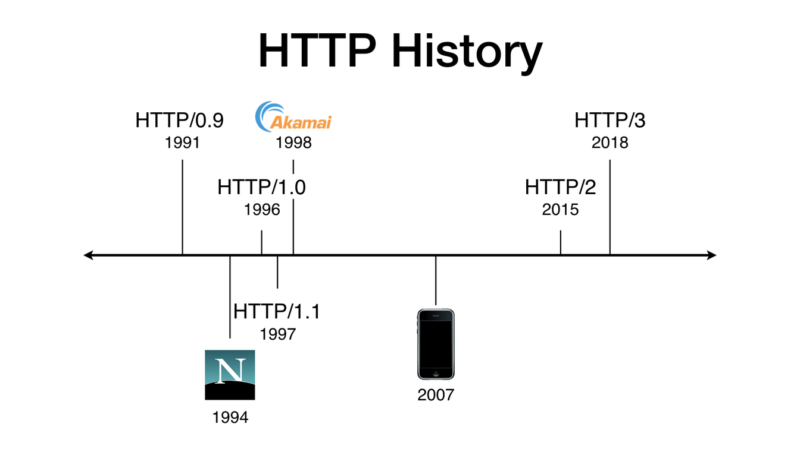
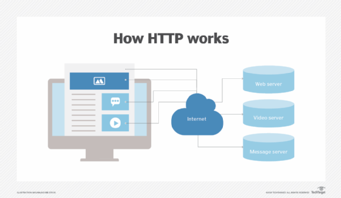
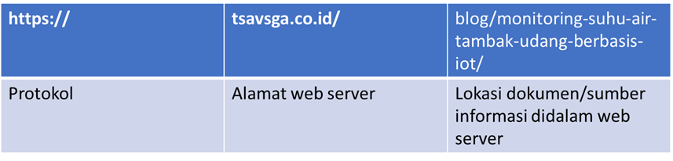
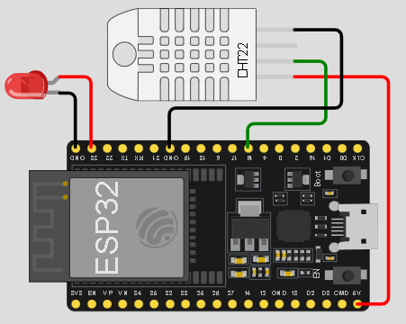

# Pertemuan ke 21 : Komunikasi Protokol HTTP


## Topik Bahasan
Mempelajari tentang protokol HTTP dan pemanfaatannya didalam pengembangan proyek IoT

## Deskripsi
- Mengetahui sejarah HTTP
- Mengetahui karakteristik protokol HTTP
- Mengetahui cara kerja protokol HTTP
- Mampu mengimplementasikan protokol HTTP untuk membangun konektivitas antara perangkat IoT dengan Blynk
- Mampu mempraktikkan cara mengambil/meng-update data di Blynk menggunakan Blynk HTTPS API

## Teori Singkat
Hypertext Transfer Protocol (HTTP) adalah sebuah protokol jaringan lapisan aplikasi yang digunakan untuk sistem informasi terdistribusi, kolaboratif, dan menggunakan hipermedia. HTTP adalah dasar dari World Wide Web (WWW) yang digunakan untuk memuat halaman web menggunakan tautan hypertext. Saat ini HTTP sudah banyak berkembang sehingga memiliki banyak kegunaan yaitu tidak hanya untuk mengambil dokumen hypertext, tetapi juga gambar dan video atau untuk mengirim konten ke server, misalnya hasil formulir HTML.


## Sejarah HTTP
HTTP pertama kali digunakan sekitar tahun 1990. Pada saat itu, protokol HTTP yang berkembang adalah versi 0.9. Saat itu HTTP hanya bisa melakukan transfer data dengan data mentah yang dikirimkan dan tidak bisa melihat tipe dari dokumen itu sendiri. 
- Tahun 1996 - HTTP versi 1.0. Terdapat perubahan yang bertujuan untuk memfasilitasi tipe dokumen yang akan di kirim beserta dengan endkoding yang digunakan dalam pengiriman data dokumen tersebut.
- Tahun 1999 - HTTP versi 1.1 terdapat perubahan untuk memfasilitasi proxy, cache dan koneksi yang persisten.
- Tahun 2015 – HTTP versi 2.0 diterbitkan yang mendukung keamanan dengan TLS (Transport Layer Security)
- Tahun 2018 – HTTP versi 3.0 dengan menggunakan protokol UDP (User Datagram Protocol)



## Cara Kerja HTTP
HTTP membantu user dalam mengakses berbagai web resources seperti halaman website, dokumen, video, dll. pada web server. User menggunakan browser agar dapat mengakses berbagai macam resource di dalam web server dengan menggunakan URL. Protokol HTTP membantu koneksi yang membantu user untuk web server dengan URL tersebut.



Contoh penggunaan http adalah saat kita mengunjungi https://tsavsga.co.id/blog/monitoring-suhu-air-tambak-udang-berbasis-iot/  



Melalui URL tersebut, protokol HTTP bertugas untuk mengirimkan permintaan (request) dan memberikan respon (response) dari request URL yang diberikan. Contohnya seperti menghapus (deleted), memperbarui (update), atau mengganti (replace) file yang ada di dalam server.


### HTTP Request
HTTP request merupakan aktivitas dimana client meminta data kepada server melalui alamat URL tertentu. Biasanya proses request dilakukan oleh client melalui web browser seperti Chrome,  Firefox, Safari, dll. 

### HTTP Response
HTTP Response merupakan sebuah aktivitas dimana server memberikan jawaban terhadap request yang dikirim oleh client sebelumnya. Respon yang diberikan oleh server setelah mengirimkan data yang diinginkan adalah mengirimkan status line atau response header. Berikut ini adalah beberapa status header : 
- 1xx, artinya request dari client diterima server, dan dilanjutkan dengan memberikan tindakan selanjutnya dari client
- 2xx, artinya server berhasil merespon permintaan client
- 3xx, artinya adanya redirection (pengalihan permintaan client)
- 4xx, artinya error pada client. Sehingga server tidak dapat membaca dan memproses permintaan client (kesalahan sintak HTML, atau sintak yang ditulis tidak full)
- 5xx, artinya terdapat kesalahan internal, biasanya berasal dari kesalahan pada database server.

## Praktik Komunikasi HTTP
### Wokwi dan Blynk
1. Buka kembali proyek aplikasi IoT yang telah dibuat di [Pertemuan 17](https://aioti.sinaungoding.com/0n/Pertemuan_17.html), baik yang di Blynk maupun di Wokwi
2. Pada Templates yang telah anda buat pada materi sebelumnya, tambahkan Datastreams seperti ditunjukkan oleh gambar berikut ini

    - 

3. Klik tombol  untuk mengaktifkan mode Edit datastream (ubah/hapus/tambah) 
4. Tambahkan dua buah datastream berupa **virtual pin** dengan melakukan klik pada tombol  dengan masing-masing datastream memakai parameter seperti ditunjukkan oleh gambar

    - 
    - 

5. Edit tampilan dashboard pada Blynk dengan menambahkan dua buah gauge untuk menampilkan suhu dan kelembapan dari datastream yang tadi telah dibuat seperti terlihat pada gambar dibawah ini

    - 

6. Setelah semua tahap di Blynk selesai dikerjakan, selanjutnya buka kembali proyek IoT di Wokwi dan tambahkan skema rangkaian dengan sensor DHT22 seperti ditunjukkan oleh gambar berikut ini

    - 

7. Pada Wokwi, jangan lupa untuk menambahkan library DHTesp seperti ditunjukkan oleh gambar dibawah ini

    - 

8. Tuliskan kode program berikut ini ke Wokwi

```cpp
//ganti dengan template id Blynk anda
#define BLYNK_TEMPLATE_ID "TMPL6bpRYvnXn"
//ganti dengan template name Blynk anda
#define BLYNK_TEMPLATE_NAME "Led Controller"
//ganti dengan token Blynk anda
#define BLYNK_AUTH_TOKEN "_l044ITu2wI9vCLexvx93oHsJ1zsmXXX"

#include <WiFi.h>
#include <BlynkSimpleEsp32.h>
#include <DHTesp.h>

#define led_pin 23
#define dht_pin 16

DHTesp dht;
BlynkTimer timer;

float tem = 0.0f;
float hum = 0.0f;
char ssid[] = "Wokwi-GUEST";
char pass[] = "";

//fungsi ini untuk membaca data yang berasal dari blynk
BLYNK_WRITE(V0){
  int value = param.asInt();
  digitalWrite(led_pin, value);
  Serial.print("Data from blynk : ");
  Serial.println(value);
}

//fungsi yang dijalankan oleh timer-nya blynk
void blynkTimer(){
  tem = dht.getTemperature();
  hum = dht.getHumidity();
  Serial.print("Temperature = ");
  Serial.print(String(tem,2));
  Serial.print(", Humidity = ");
  Serial.println(String(hum,2));
  Blynk.virtualWrite(V1,tem);
  Blynk.virtualWrite(V2,hum);
}

void setup(){
  pinMode(led_pin, OUTPUT);
  dht.setup(dht_pin, DHTesp::DHT22);

  //connect ke server blynk
  Blynk.begin(BLYNK_AUTH_TOKEN, ssid, pass);
  //set timer blynk agar berjalan setiap 1000 ms
  timer.setInterval(1000L,blynkTimer);

  Serial.begin(115200);
  Serial.println("System started ...");
}

void loop(){
  Blynk.run();
  timer.run();
}
```

9. Compile dan jalankan program di Wokwi. Kemudian, amati perubahan gauge di Blynk ketika anda merubah nilai temperature dan humidity di Wokwi.
10. Selamat, anda telah dapat membuat aplikasi monitoring and controlling perangkat IoT menggunakan Blynk

### Operasi Read dan Update Data di Blynk Menggunakan HTTPS API
Blynk menyediakan HTTPS API agar platform lain (misal, aplikasi mobile, desktop, web) dapat memanfaatkan data yang tersedia di Blynk untuk kebutuhan lain yang dapat mendukung fungsionalitas dari perangkat IoT yang telah dikembangkan. Contoh penggunaan API yang dimiliki Blynk sebagai berikut :
1. Mengambil nilai dari datastream tertentu

    Syntax

    ```
    https://{server_address}/external/api/get?token={token}&{pin}
    ```

    Contoh penggunaan 
    
    ```
    https://blynk.cloud/external/api/get?token=_l044ITu2wI9vCLexvx93oHsJ1zsms1p&V1
    ```

    Hasil
    
    

2. Mengambil nilai dari beberapa datastream 

    Syntax
    
    ```
    https://{server_address}/external/api/get?token={token}&{pin}&{pinX}
    ```

    Contoh penggunaan

    ```
    https://blynk.cloud/external/api/get?token=_l044ITu2wI9vCLexvx93oHsJ1zsms1p&V1&V2
    ```

    Hasil

    

3. Meng-update beberapa nilai datastream secara bersamaan

    Syntax
    
    ```
    https://{server_address}/external/api/batch/update?token={token}&{pin1}={value1}&{pin2}={value2}
    ```

    Contoh penggunaan

    ```
    https://blynk.cloud/external/api/batch/update?token=_l044ITu2wI9vCLexvx93oHsJ1zsms1p&V1=50&V2=75
    ```

    Hasil

    

## Tugas Kelompok
1. Modifikasilah perangkat IoT/proyek IoT kelompok kalian yang ada di Wokwi agar terhubung ke Blynk dengan menambahkan fungsionalitas monitoring dan controlling.

2. Demokan juga, cara manipulasi nilai yang ditampilkan di dashboard blynk dengan menggunakan HTTPS API 


