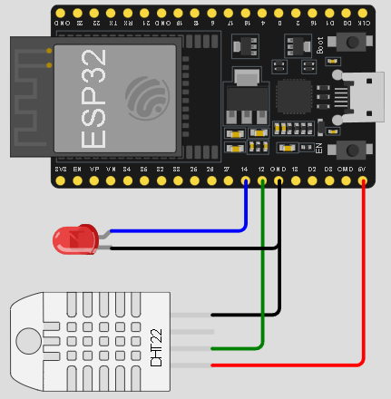

# Pertemuan ke 22 : Pengenalan dan Praktik REST API


## Topik Bahasan
Mengenal REST API sebagai sebuah antarmuka pemrograman aplikasi yang memungkinkan komunikasi dan pertukaran data antara berbagai perangkat lunak atau sistem melalui protokol HTPP

## Deskripsi
- Memahami landasan teori REST API
- Mampu menjelaskan macam-macam verbs yang digunakan dalam REST API
- Mampu menggunakan HTTP verbs didalam REST API untuk keperluan untuk mengambil dan mengirim data. 
- Mampu menjelaskan mengenai HTTP response code dari REST API
- Mampu mengimplementasikan REST API dalam komunikasi data antara perangkat IoT dengan web service / REST API pada Firebase


## Teori Singkat

### API
API (Application Programming Interface) yaitu sebuah software yang memungkinkan para developer untuk mengintegrasikan dan mengizinkan dua aplikasi yang berbeda secara bersamaan untuk saling terhubung satu sama lain dan bertukar data. Penggunaan API bertujuan untuk saling berbagi data antar aplikasi yang berbeda, mempercepat proses pengembangan aplikasi dengan cara menyediakan sebuah function yang terpisah.


**Cara Kerja API**
API secara eksplisit memanfaatkan metodologi HTTP yang ditentukan oleh protokol RFC 2616. Permintaan ke API bisa menggunakan method GET untuk mengambil sumber daya, PUT untuk mengubah status atau memperbarui sumber daya, yang dapat berupa objek, file, atau blok, POST untuk membuat sumber daya itu, dan DELETE untuk menghapusnya.


### REST API
REST API (Representational State Transfer Application Programming Interface) adalah sebuah antarmuka pemrograman aplikasi yang memungkinkan komunikasi dan pertukaran data antara berbagai perangkat lunak atau sistem melalui protokol HTTP. 

REST API mengikuti prinsip-prinsip desain arsitektur REST, yang membuatnya fleksibel dan ringan untuk mengintegrasikan aplikasi dan menghubungkan komponen dalam arsitektur layanan mikro.

REST API sering digunakan dalam pengembangan aplikasi berbasis web karena kemampuannya untuk menangani berbagai jenis permintaan HTTP seperti GET, POST, PUT, dan DELETE. Ini memungkinkan aplikasi untuk berinteraksi dengan server dan mengakses, mengambil, serta menggunakan data secara efisien.


**Komponen dalam REST API**
Rest API memilki komponen penting untuk dapat bekerja yaitu:
1. **URL Design**

      RESTful API diakses menggunakan protokol HTTP. Penamaan dan struktur URL yang konsisten akan menghasilkan API yang baik dan mudah untuk dimengerti developer. URL API biasa disebut endpoint dalam pemanggilannya.

      

2. **HTTP Verbs**

    Setiap request yang dilakukan terdapat metode yang dipakai agar server mengerti apa yang sedang di request client:
    + **GET** adalah metode HTTP Request yang paling mudah, metode ini digunakan untuk membaca atau mendapatkan data dari sumber.
    + **POST** adalah metode HTTP Request yang digunakan untuk membuat data baru dengan menyisipkan data dalam body saat request dilakukan
    + **PUT** adalah metode HTTP Request yang biasanya digunakan untuk melakukan update data resource.
    + **DELETE** adalah metode HTTP Request yang digunakan untuk menghapus suatu data pada resource.
    + **PATCH** dalam HTTP verbs digunakan untuk melakukan modifikasi parsial pada sumber daya yang ada di server. Berbeda dengan metode PUT yang menggantikan seluruh sumber daya dengan data baru, PATCH hanya mengirimkan perubahan yang ingin dilakukan, bukan seluruh data sumber daya

3. **HTTP Response Code**

    HTTP Response Code adalah kode standarisasi dalam menginformasikan hasil request kepada client. Secara umum terdapat 5 kelompok yang biasa kita jumpai pada RESTful API yaitu :
    + **1xx,** artinya request dari client diterima server, dan dilanjutkan dengan memberikan tindakan selanjutnya dari client
    + **2xx,** artinya server berhasil merespon permintaan client
    + **3xx,** artinya adanya redirection (pengalihan permintaan client)
    + **4xx,** artinya error pada client. Sehingga server tidak dapat membaca dan memproses permintaan client (kesalahan sintak HTML, atau sintak yang ditulis tidak full)
    + **5xx,** artinya terdapat kesalahan internal, biasanya berasal dari kesalahan pada database server.

      

4. **Format Response**

    Setiap request yang dilakukan client akan menerima data response dari server, response tersebut biasanya berupa data XML (Extensible Markup Language) ataupun JSON (JavaScript Object Notation). Setelah mendapatkan data response tersebut barulah client bisa menggunakannya dengan cara memparsing data tersebut dan diolah sesuai kebutuhan.

    

## Praktik REST API Menggunakan Firebase Realtime Database 
### Mendaftar dan Konfigurasi Firebase
1. Buka halaman web Firebase di https://firebase.google.com. Apabila anda belum memiliki account Firebase daftarlah terlebih dulu menggunakan account Google anda.
2. Didalam halaman console firebase https://console.firebase.google.com, buatlah sebuah proyek baru di firebase dengan nama **IoT TSA VSGA** dengan langkah-langkah seperti ditunjukkan oleh gambar dibawah ini. Tunggu hingga proses pembuatan proyek selesai.

    

3. Pada halaman dashboard console Firebase buatlah Firebase Realtime Database dengan mengikuti langkah-langkah seperti di gambar

    

4. Tambahkan sebuah node baru pada root dengan nama node **control_led** dengan child bernama **led** dengan nilai **off** seperti gambar dibawah ini

    

### Mempersiapkan Perangkat IoT
1. Buatlah sebuah proyek baru di Wokwi menggunakan ESP32 dan bahasa pemrograman Micropython seperti ditunjukkan oleh gambar dibawah ini

    

2. Tuliskan kode program dalam micropython seperti berikut ini dan simpan dengan nama **main.py** (di Wokwi, otomatis tersimpan dengan nama main.py)

```python
from utime import ticks_ms, sleep
from machine import Pin, Timer
import time
import ntptime
import urequests as urlReq
import network
import json
import gc
import dht

dht22 = dht.DHT22(Pin(12))
led2 = Pin(14,Pin.OUT)
trying = 0

#ganti alamat database server ini dengan alamat URL yang sesuai dengan milik anda
urlWeb1 = "https://GANTI_DENGAN_ALAMAT_SERVER_FIREBASE_ANDA/current_suhu_dan_humidity"
urlWeb2 = "https://GANTI_DENGAN_ALAMAT_SERVER_FIREBASE_ANDA/history_suhu_dan_humidity"
urlWeb3 = "https://GANTI_DENGAN_ALAMAT_SERVER_FIREBASE_ANDA/control_led"

ssid = "Wokwi-GUEST"
passwd = ""

gc.enable()
station = network.WLAN(network.STA_IF)
while station.isconnected() == False:
    station.active(True)
    try:
        station.connect(ssid,passwd)
    except:
        print("Connecting ...")
        trying+=1
        sleep(5)
    if trying == 5:
        print("Tidak dapat terhubung ke jaringan ...")
    break

#mendapatkan data dari control_led dalam bentuk JSON
def t1(t):
	global led2
	res = urlReq.get(urlWeb3+".json").json()
	if res['led'] == 'on':
		led2.value(1)
	else:
		led2.value(0)
	print(res['led'])

#menyimpan history suhu dan tekanan
def t2(t):
    global dht22
    dht22.measure()
    tem = dht22.temperature()
    hum = dht22.humidity()
    #sinkronisasi dengan time server
    ntptime.settime()
    (y,m,d,h,mn,s,wd,yd) = time.localtime()
    #menyiapkan data yang akan dikirim
    payload = { "suhu":"{0:.2f}".format(tem),"tekanan":"{0:.2f}".format(hum),\
    "datetime":"{}-{}-{} {}:{}:{}".format(y,m,d,h,mn,s)}	    
    #data diformat ke dalam bentuk json
    data = (json.dumps(payload)).encode()	
    #mengirim data untuk pembacaan suhu dan humidity saat ini
    res = urlReq.patch(url=urlWeb1+"/data.json", data=data).json()
    #mengirim data untuk disimpan sebagai log/history
    res = urlReq.put(url=urlWeb2+"/{}.json".format(ticks_ms()), data=data).json()
    print('terkirim : ',res)

if trying<5:
	ip, mask, gw, dns = station.ifconfig()
	print("Terhubung ke jaringan")
	print("IP = {}\nNetmask = {}\nGateway = {}\nDNS = {}".format(ip,mask,gw,dns))
	
	#timer ke-1 akan dijalankan setiap 5 detik
	process1 = Timer(0,mode=Timer.PERIODIC,period=4999,callback=t1)
	#timer ke-2 akan dijalankan setiap 5 detik
	process2 = Timer(1,mode=Timer.PERIODIC,period=5000,callback=t2)
```

3. Jalankan simulasi di Wokwi, maka anda akan melihat terminal menampilkan informasi seperti gambar berikut ini

    

4. Kemudian, di console Firebase anda, anda akan dapat melihat bahwa data yang dikirimkan dari ESP32 menggunakan REST API akan masuk ke Realtime Database milik anda seperti diperlihatkan oleh gambar dibawah ini

    

5. Anda dapat mematikan/menghidupkan LED pada ESP32 dengan mengganti nilai LED pada firebase menjadi **on** atau **off** seperti gambar berikut

    

## Tugas Kelompok
Dari contoh yang sudah ditampilkan, coba tambahkan servo motor dan sensor ultrasonic ke dalam rangkaian ESP tersebut. Buat agar data dari sensor ultrasonic dapat terkirim ke Firebase Realtime Database. Selain itu, coba kendalikan servo motor dari Firebase Realtime Database. Atau, anda dapat berkreasi dengan ide-ide yang lain.
