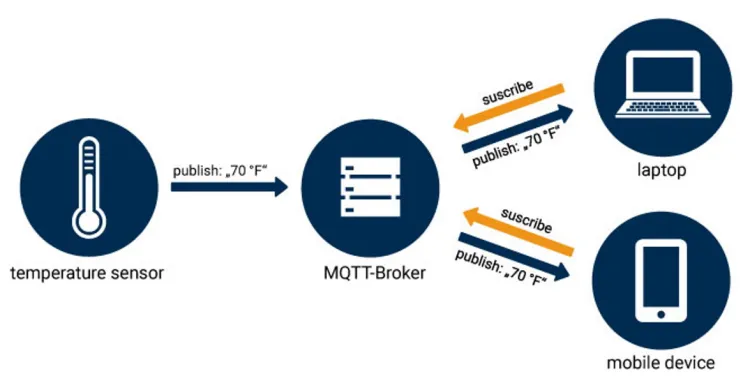
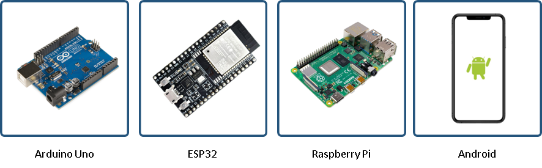
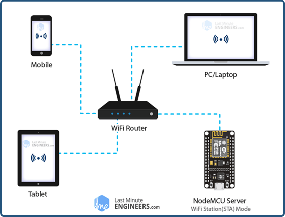
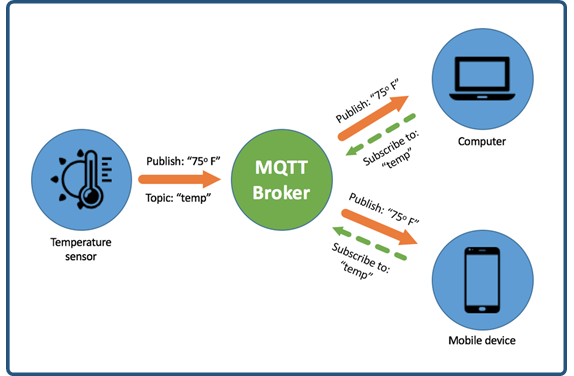
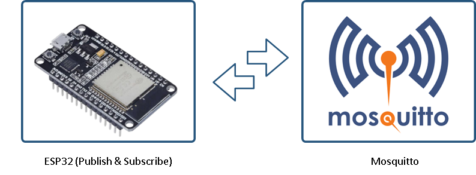
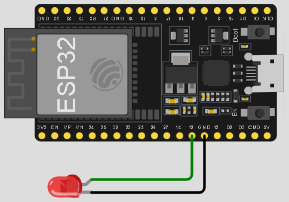
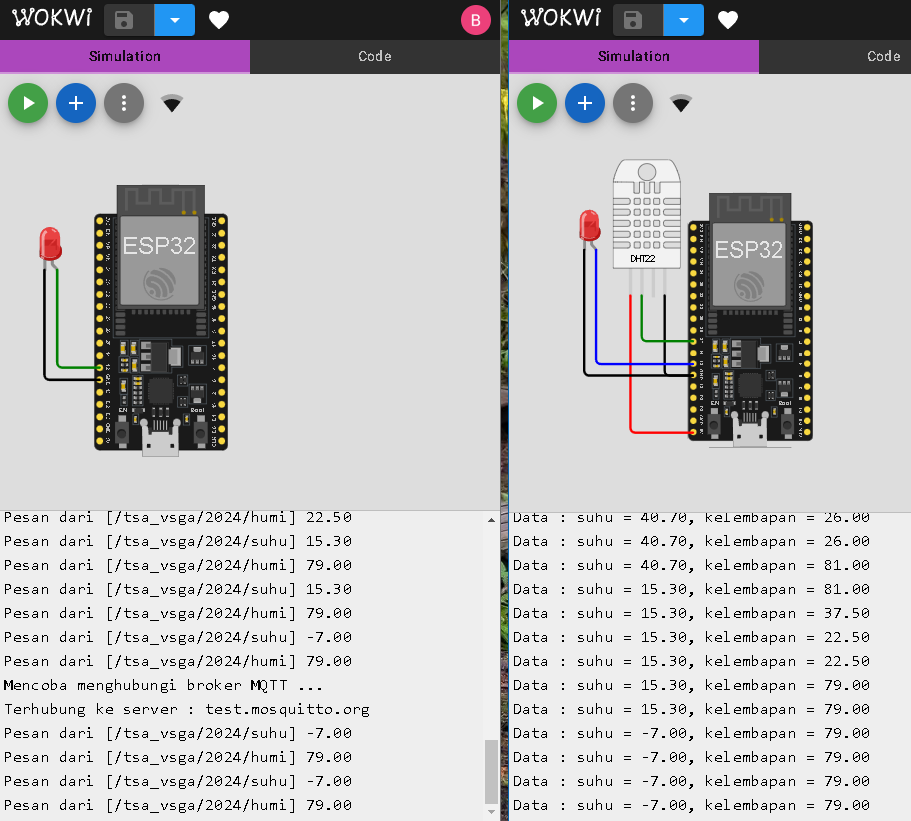

# Pertemuan ke 23 : Pengenalan dan Praktikum MQTT


## Topik Bahasan
Mengenal protokol MQTT sebagai protokol komunikasi ....

## Deskripsi
asdasd


## Teori Singkat

### MQTT
MQTT (Message Queuing Telemetry Transport) adalah protokol komunikasi pengiriman pesan yang dibentuk dengan TCP/IP berdasarkan model messaging publish-subscribe dan dirancang khusus untuk machine to machine (M-2-M) yang tidak memiliki alamat khusus. 



Publisher mengirim pesan ke broker, subscriber menerima pesan yang dibutuhkan dari broker, dan broker akan menyampaikan pesan yang diminta dari pengirim ke penerima. Publisher dan subscriber adalah klien MQTT yang hanya berkomunikasi dengan broker MQTT. Contoh publisher dan subscriber adalah mikrokontroller, komputer, smartphone, dll.

### Sejarah MQTT
MQTT awalnya dikembangkan oleh Andy Stanford-Clark berkolaborasi dengan Arlen Nipper (sekarang CirrusLink) dalam merancang sebuah protokol untuk berkomunikasi dengan sistem SCADA di industri minyak dan gas. Sejak Internet of Things menjadi populer, MQTT juga melonjak. 


- 2008 - Broker MQTT open-source pertama, Mosquitto diciptakan.
- 2012 - Projek Eclipse Paho menyediakan library klien MQTT open-source untuk Java, C, JavaScript, dan Python dan dari sana daftar library klien MQTT telah bertambah.
- Akhir 2014 - MQTT versi 3.1.1 menjadi standar OASIS dan membuka jalan untuk MQTT untuk menjadi standar ISO.
0 2017 – MQTT banyak digunakan oleh perusahaan teknologi terkemuka seperti Amazon, Microsoft, IBM, dll.

### Broker, Publish, Subscribe dan Topic
**1. Broker**

Broker pada MQTT berfungsi untuk mengorganisir data publish dan subscribe dari berbagai device. Broker bisa diibaratkan sebagai server data yang memiliki alamat IP khusus. Beberapa contoh dari Broker yang ada seperti Mosquitto, HiveMQ, dan Mosca.


**2. Publish**

Publish merupakan cara suatu perangkat untuk mengirimkan datanya ke subscribers. Pengirim data tersebut dinamakan publisher. Biasanya pada publisher adalah sebuah device yang terhubung dengan sensor tertentu. Contoh publisher adalah Arduino, ESP32, Raspberry Pi, Android, dll.



**3. Subscribe**

Subscribe merupakan cara suatu device untuk menerima berbagai macam data dari publisher melalui broker. Penerima data disebut subscriber. Subscriber dapat berupa aplikasi monitoring sensor dan sebagainya, subscriber ini yang nantinya akan meminta data dari publisher melalui broker.



**4. Topic**

Topic seperti halnya pengelompokan data disuatu kategori tertentu yang dibuat oleh user. Pada sistem kerja MQTT protokol ini, topic bersifat wajib untuk membedakan data satu dengan yang lainnya. Pada setiap transaksi data antara Publisher dan Subscriber harus memiliki suatu topic tertentu. Contoh penggunaan topic: “temperature”, “humidity“, dll.



**5. Cara Kerja MQTT**

MQTT sejak awal memang dirancang untuk komunkasi Machine-to-Machine. MQTT mengirim data sebagai byte array, yang mana ini menjadi kelebihan protokol MQTT karena data yang dikirimkan sangat kecil. Pada saat Protokol MQTT di uji dengan jaringan 3G, Protokol MQTT 93 kali lebih cepat daripada HTTP, karena paket headernya hanya 2 byte. Publisher mengirimkan data/messages dengan topic tertentu kepada broker. Pengiriman data dapat melalui WiFi, GSM, LTE, dll. Subcriber kemudian mengambil data/messages yang diperlukan dengan topik tertentu di broker.


**6. MQTT vs HTTP**

Perbandingan MQTT dengan HTTP


**7. Mosquitto**

Eclipse Mosquitto™ adalah Message broker yang mengimplementasikan protokol MQTT versi 3.1 dan 3.1.1. Broker Mosquitto cukup handal terutama dalam sistem internet of things karena sudah digunakan oleh banyak user. Mosquitto telah mendukung berbagai sistem operasi mulai dari Mac OS, Microsoft Windows, dan berbagai varian distro Linux. Website: https://mosquitto.org


**8. Keamanan Pada Mosquitto**

Mosquitto mendukung keamanan dengan mengenkripsi port yang digunakan dalam transmisi data. Beberapa port yang dapat digunakan yaitu:
- 1883 : MQTT, unencrypted, unauthenticated
- 1884 : MQTT, unencrypted, authenticated
- 8883 : MQTT, encrypted, unauthenticated
- 8884 : MQTT, encrypted, client certificate required
- 8885 : MQTT, encrypted, authenticated
- 8886 : MQTT, encrypted, unauthenticated
- 8887 : MQTT, encrypted, server certificate deliberately expired
- 8080 : MQTT over WebSockets, unencrypted, unauthenticated
- 8081 : MQTT over WebSockets, encrypted, unauthenticated
- 8090 : MQTT over WebSockets, unencrypted, authenticated
- 8091 : MQTT over WebSockets, encrypted, authenticated

## Praktik MQTT dengan Mosquitto
Praktik pengiriman data dari ESP32 ke Mosquitto, kemudian ESP32 tersebut mengambil data dari Mosquitto yang baru saja dikirim. Server Mosquitto yang dipakai ada pada alamat https://test.mosquitto.org/ 



**1. Membuat publisher**

Buat project di wokwi dengan nama **mqtt_publisher** dengan rangkaian dan kode sebagai berikut 


```cpp
#include <WiFi.h>
#include <PubSubClient.h>
#include <DHTesp.h>

#define dht22_pin 27
#define led_pin 12
// #define MSG_BUFFER_SIZE	(50)

unsigned long lastMsg = 0;
unsigned long now = 0;
char mqttServer[] = "test.mosquitto.org";
char ssid[] = "Wokwi-GUEST";
char pass[] = "";
String tem="", hum="";

DHTesp dht;
TempAndHumidity dhtData;
WiFiClient espClient;
PubSubClient mqttClient(espClient); //object client mqtt

//koneksi ke wifi
void wifiSetup() {
  delay(10);

  Serial.println();
  Serial.print("Connect to ");
  Serial.println(ssid);

  WiFi.mode(WIFI_STA);
  WiFi.begin(ssid, pass);

  while (WiFi.status() != WL_CONNECTED) {
    delay(500);
    Serial.print(".");
  }

  randomSeed(micros());

  Serial.println("");
  Serial.println("WiFi connected");
  Serial.println("IP address: ");
  Serial.println(WiFi.localIP());
}

//koneksi ke broker
void mqttConnect(){
  digitalWrite(led_pin, LOW);
  while(!mqttClient.connected()){
    Serial.println("Mencoba menghubungi broker MQTT ...");
    
    //memberikan ID pada client secara random
    String mqttClientId = "TSA-VSGA-24-";
    mqttClientId+=String(random(0xffff),HEX);

    //mencoba koneksi ke broker
    if(!mqttClient.connect(mqttClientId.c_str())){
      Serial.print("Gagal terhubung, status = ");
      Serial.print(mqttClient.state());
      Serial.println("Coba lagi dalam 5 detik ...");
      delay(5000);
    }
  }
  digitalWrite(led_pin, HIGH);
  Serial.print("Terhubung ke server : ");
  Serial.println(mqttServer);
  mqttClient.publish("/tsa_vsga/2024", "connected");
}

void setup() {
  Serial.begin(115200);
  pinMode(12, OUTPUT);
  dht.setup(dht22_pin, DHTesp::DHT22);
  wifiSetup();
  mqttClient.setServer(mqttServer,1883);
}

void loop() {
  if(!mqttClient.connected()){
    mqttConnect();
  }
  mqttClient.loop();
  now = millis();

  //mode publisher
  //mengatur agar pengiriman data terjadi tiap 2 detik
  if(now-lastMsg > 2000){
    lastMsg = now;
    dhtData = dht.getTempAndHumidity();
    tem = String(dhtData.temperature,2);
    hum = String(dhtData.humidity,2);
    mqttClient.publish("/tsa_vsga/2024/suhu",tem.c_str());
    mqttClient.publish("/tsa_vsga/2024/humi",hum.c_str());
    Serial.println("Data : suhu = "+tem+", kelembapan = "+hum);
  }
}
```

**2. Membuat subscriber**

Buat project di wokwi dengan nama **mqtt_publisher** dengan rangkaian dan kode sebagai berikut 



```cpp
#include <WiFi.h>
#include <PubSubClient.h>

#define led_pin 12

unsigned long lastMsg = 0;
unsigned long now = 0;
char mqttServer[] = "test.mosquitto.org";
char ssid[] = "Wokwi-GUEST";
char pass[] = "";

WiFiClient espClient;
PubSubClient mqttClient(espClient); //object client mqtt

//koneksi ke wifi
void wifiSetup() {
  delay(10);

  Serial.println();
  Serial.print("Connect to ");
  Serial.println(ssid);

  WiFi.mode(WIFI_STA);
  WiFi.begin(ssid, pass);

  while (WiFi.status() != WL_CONNECTED) {
    delay(500);
    Serial.print(".");
  }

  randomSeed(micros());

  Serial.println("");
  Serial.println("WiFi connected");
  Serial.println("IP address: ");
  Serial.println(WiFi.localIP());
}

//koneksi ke broker
void mqttConnect(){
  digitalWrite(led_pin, LOW);
  while(!mqttClient.connected()){
    Serial.println("Mencoba menghubungi broker MQTT ...");
    
    //memberikan ID pada client secara random
    String mqttClientId = "TSA-VSGA-24-";
    mqttClientId+=String(random(0xffff),HEX);

    //mencoba koneksi ke broker
    if(!mqttClient.connect(mqttClientId.c_str())){
      Serial.print("Gagal terhubung, status = ");
      Serial.print(mqttClient.state());
      Serial.println("Coba lagi dalam 5 detik ...");
      delay(5000);
    }
  }
  digitalWrite(led_pin, HIGH);
  Serial.print("Terhubung ke server : ");
  Serial.println(mqttServer);
  mqttClient.subscribe("/tsa_vsga/2024/suhu");
  mqttClient.subscribe("/tsa_vsga/2024/humi");
}

//fungsi callback
void callback(char* topic, byte* payload, unsigned int length) {
  String data = "";
  Serial.print("Pesan dari [");
  Serial.print(topic);
  Serial.print("] ");
  for (int i = 0; i < length; i++) {
    data += (char)payload[i];
  }
  Serial.println(data);
}

void setup() {
  Serial.begin(115200);
  pinMode(12, OUTPUT);
  wifiSetup();

  //memilih server yang akan dihubungi
  mqttClient.setServer(mqttServer,1883);
  
  //memilih function yang berfungsi sebagai callback
  //(yang menerima pesan masuk)
  mqttClient.setCallback(callback);
}

void loop() {
  if(!mqttClient.connected()){
    mqttConnect();
  }
  mqttClient.loop();
}
```

**3. Menjalankan simulai**

Jalankan publisher dan subscriber tersebut. Dari hasil percobaan dapat dilihat bahwa publisher dan subscriber sudah dapat berkomunikasi melalui broker dengan hasil : 1) publisher berhasil mengirim pesan ke broker dan mempublish suatu topik, dan 2) subscriber berhasil mendapatkan pesan dari broker berdasarkan topik yang dia subscribe



## Tugas Kelompok
Buatlah proyek MQTT dengan memanfaatkan dua buah ESP32 atau lebih. Pada setiap ESP32 tambahkan sensor dan/atau aktuator. Buat agar setiap ESP32 menjadi publisher dan sekaligus menjadi subscriber sehingga dapat mengirim dan menerima data dari sensor/aktuator antara satu sama lainnya.