# Pertemuan ke 24 : Konsep, Strategi, dan Implementasi IoT dengan ThingsBoard


## Topik Bahasan
ThingsBoard adalah salah satu platform IoT open-source untuk mengumpulkan data, pemrosesan, visualisasi data, dan manajemen perangkat device. Thingsboard ini mempunyai dua fungsi utama yakni sebagai broker dalam terminologi IoT (core services) dan sebagai web presentation atau penyaji data (web UI).

## Deskripsi
- Menjelaskan ThingsBoard sebagai salah satu platform IoT
- Menjelaskan implementasi IoT dengan ThingsBoard

## Teori Singkat
### Konsep IoT
Internet of things merupakan sebuah konsep di mana suatu benda atau objek ditanamkan teknologi-teknologi seperti sensor dan software dengan tujuan untuk berkomunikasi, mengendalikan, menghubungkan, dan bertukar data melalui perangkat lain selama masih terhubung ke internet.


### Strategi Membuat Solusi IoT
Dalam membuat sebuah solusi IoT maka diperlukan tiga buah pertimbangan. Secara sederhana solusi IoT membutuhkan beberapa pertimbangan. Seperti biaya server, keamanan, komponen atau hardware yang dibuat dan tampilan interface yang akan digunakan berbasis mobile atau web dekstop. Disini Thingsboard memberikan biaya server yang terjangkau, keamanan yang teruji, dan tampilan yang mudah dikonfigurasikan. Ini sangat cocok untuk memulai sebuah solusi IoT.

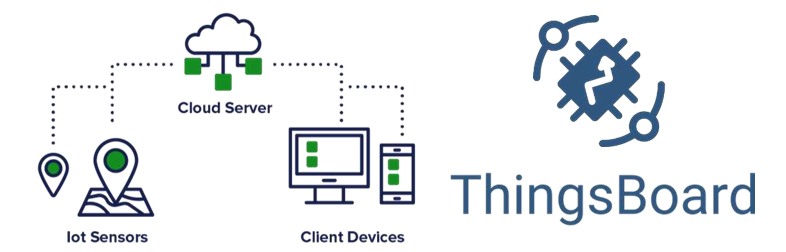

### Thingsboard
ThingsBoard adalah salah satu platform IoT open-source untuk mengumpulkan data, pemrosesan, visualisasi data, dan manajemen perangkat device. Thingsboard ini mempunyai dua fungsi utama yakni sebagai broker dalam terminologi IoT (core services) dan sebagai web presentation atau penyaji data (web UI).

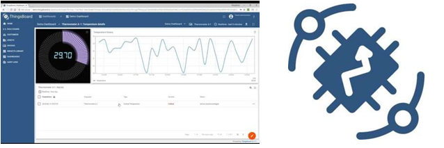

#### Fitur Thingsboard
**1. Data Telemetry**

Thingsboard mampu mengumpulkan dan menyimpan data telemetri dengan cara yang handal, bertahan dari kegagalan jaringan dan perangkat keras. Akses data yang dikumpulkan menggunakan dashboard web yang dapat disesuaikan atau API sisi server.


**2. Multi Tenancy**

Thingsboard Mendukung penginstalan multi-tenant. Multi-tenancy adalah arsitektur cloud yang memungkinkan setiap tenant dari suatu layanan cloud berbagi daya komputasi dengan tenant lainnya. Tenant dalam hal ini bisa disebut sebagai pengguna atau pihak yang menyewa suatu layanan cloud.


**3. Visualisasi Data**

Thingsboard Menyediakan 30+ widget yang dapat dikonfigurasi out of the box dan kemampuan untuk membuat widget sendiri menggunakan editor bawaan.

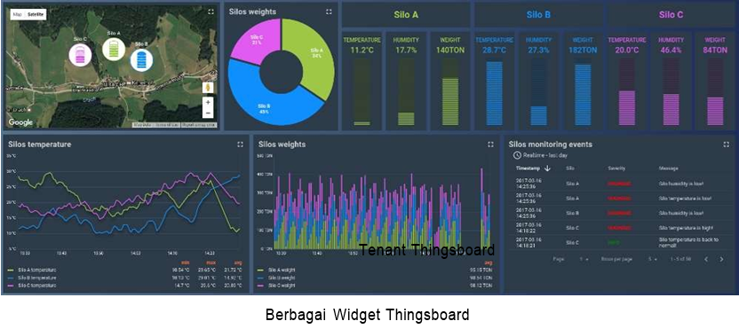

**4. Skalibilitas Horizontal**

Thingsboard Tidak ada downtime, restart server atau kesalahan aplikasi.

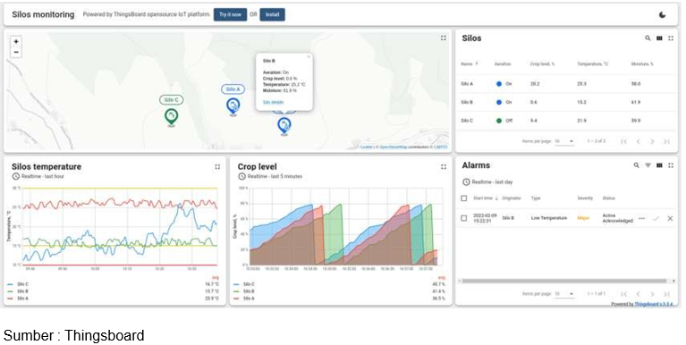

**5. IoT Rule Engine**

Thingsboard dapat memproses data perangkat yang masuk dengan rantai aturan fleksibel berdasarkan atribut entitas atau konten pesan. Meneruskan data ke sistem eksternal atau memicu alarm menggunakan logika khusus. Konfigurasikan rantai pemberitahuan kompleks pada alarm. Perkaya fungsionalitas sisi server atau manipulasi perangkat Anda dengan aturan yang sangat dapat disesuaikan. Tentukan logika aplikasi Anda dengan desainer rantai aturan drag-n-drop.


**6. Fault Tolerance**

Thingsboard meminimalisir Kegagalan node, kegagalan node akan secara otomatis terdeteksi. Kemudian Node yang gagal dapat diganti secara langsung tanpa waktu henti. Data yang ada akan direplikasi menggunakan database NoSQL yang andal.

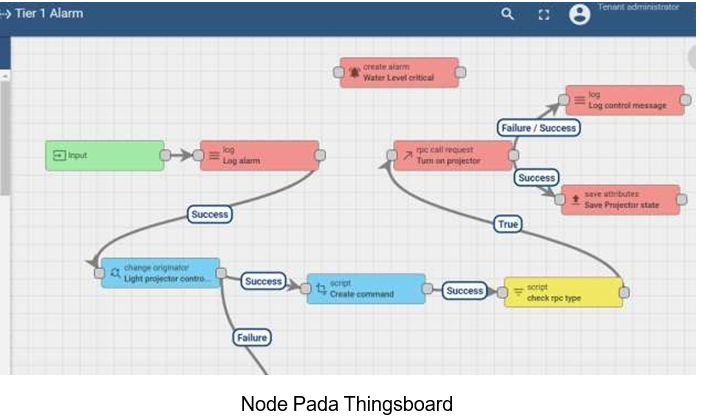

**7. Device Management**

Thingsboard memungkinkan untuk memantau sisi klien dan menyediakan atribut perangkat sisi server . Thingsboard juga menyediakan API untuk aplikasi sisi server yang berfungsi untuk mengirim perintah RPC ke perangkat dan sebaliknya.


**8. Security**

Mendukung enkripsi transport untuk protokol MQTT dan HTTP. Selain itu Thingsboard juga mendukung otentikasi perangkat dan manajemen kredensial perangkat.

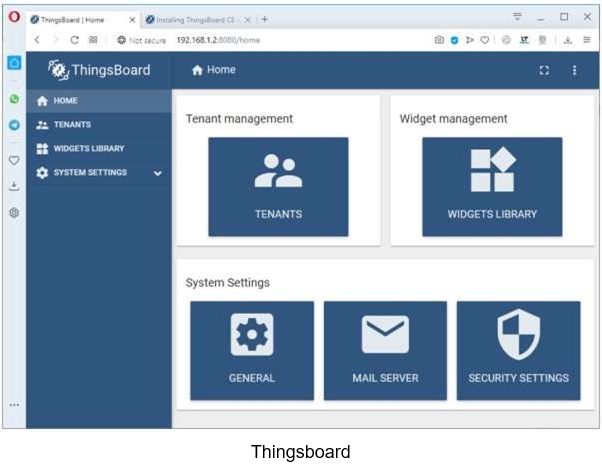

**9. Asset Management**

Thingsboard memberikan kemampuan untuk mendaftar dan mengelola aset. Thingsboard memungkinkan untuk dapat menyediakan atribut aset sisi server dan memantau alarm. Thingsboard memilki kemampuan untuk membangun hierarki entitas dengan menggunakan relasi.

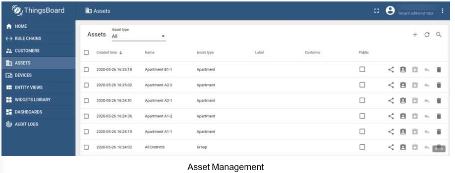

**10. Customization and Integration**

Perluas fungsionalitas platform default menggunakanrantai aturan, widget, dan implementasi transport yang dapat disesuaikan. Selain dukungan MQTT, CoAP, dan HTTP, pengguna ThingsBoard dapat menggunakan implementasi transport mereka sendiri atau menyesuaikan perilaku protokol yang ada.


**11. Alarms Management**

Memberikan kemampuan untuk membuat dan mengelola alarm yang terkait dengan entitas perangkat, aset, pelanggan, dll. Thingsboard dapat melakukan pemantauan alarm real time dan penyebaran alarm ke hierarki entitas terkait. Naikkan alarm saat perangkat terputus atau saat tidak ada aktivitas.

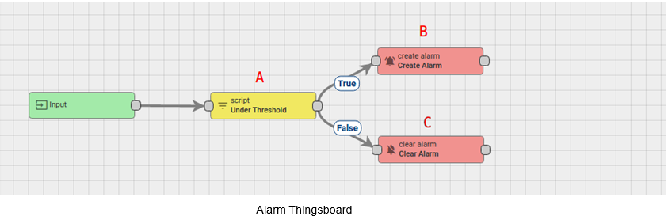

**12. 100% Open-source**

ThingsBoard mempunyai lisensi di bawah Lisensi Apache 2.0, sehingga dapat digunakan dalam produk komersial secara gratis. Bahkan Thingsboard dapat menyimpannya sebagai solusi SaaS (Software as a Services) atau PaaS (Platform as a Services).


**13. Microservices or Monolithic**

Memberikan kemampuan untuk meningkatkan ke layanan mikro untuk ketersediaan tinggi dan skalabilitas secara horizontal yang lebih luas.

**14. SQL, NoSQL and Hybrid database**

Mendukung berbagai opsi database dan kemampuan untuk memilih tempat menyimpan entitas utama dan tempat menyimpan data telemetri.

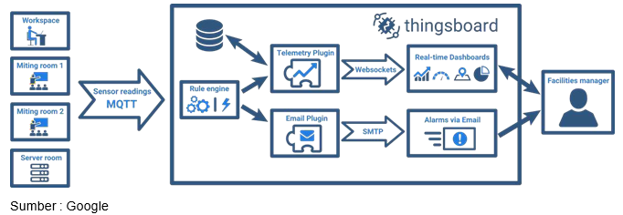

**15. Thingsboard Edge**

ThingsBoard Edge adalah produk perangkat lunak untuk Cloud Computing. Ini memungkinkan melakukan analisis dan manajemen data pada saat yang sama.
ThingsBoard Edge menyinkronkan dengan mulus dengan cloud ThingsBoard seperti ThingsBoard Cloud, Demo ThingsBoard, ThingsBoard PE atau ThingsBoard CE, semuanya dapat disesuaikan dengan kebutuhan.


### Produk Thingsboard
**1. Thingsboard IoT Gateway**

ThingsBoard IoT Gateway akan membantu untuk mengintegrasikan perangkat yang terhubung ke sistem lama dan sistem pihak ketiga dengan platform ThingsBoard IoT. Thingsboard adalah platform IoT yang sumbernya terbuka untuk pengumpulan data, pemrosesan, visualisasi, dan manajemen perangkat.

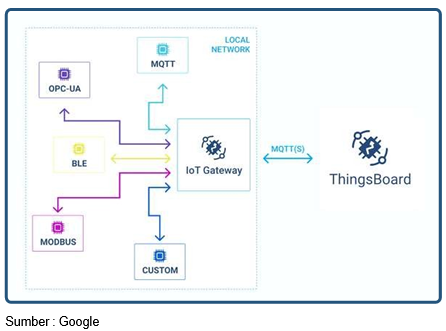


**3. License Server**

Server lisensi adalah perangkat lunak yang menyediakan akses ke token atau kunci akses ke komputer klien. Ini biasa disediakan di intranet organisasi atau melalui internet.
Server Lisensi ThingsBoard adalah solusi penagihan eksklusif yang memungkinkan pelanggan ThingsBoard Professional Edition (TB PE) untuk dengan mudah membeli kunci lisensi secara online. Pemrosesan pembayaran online dijamin oleh Stripe , yang memungkinkan kartu kredit dan transfer kawat.


### Implementasi ThingsBoard
**1. Smart Energy**

Sistem energi terbarukan yang mengoptimalkan pemanfaatan semua komponen dalam sistem produksi energi untuk memaksimalkan efisiensi, mengurangi biaya, dan tetap mengutamakan keamanan dalam pemanfaatannya.


**2. Smart Metering**

Adalah sebuah sistem Iot dalam bentuk software dan hardware yang memberikan kemudahan dalam pencatatan pemakaian air, listrik atau gas dengan memanfaatkan teknologi komunikasi yang beragam

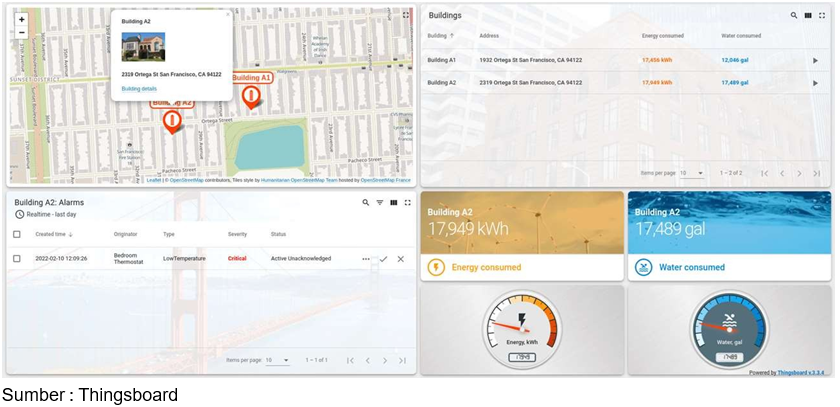

**3. Smart Farming**

Adalah sistem yang menggunakan teknologi informasi dalam proses pertanian yang telah dirancang dan ditetapkan. Proses penerapan smart farming memang tidak mudah sebab memerlukan data yang lebih kompleks dan akurat.


**4. Water Metering**

Adalah alat yang digunakan untuk mengukur jumlah volume air yang dialirkan melalui saluran pipa yang dilengkapi juga dengan alat penghitung. Alat penghitung ini terdiri dari unit penghitung, unit sensor, dan unit indikator pengukur untuk mendukung cara kerja dari water meter tersebut.


**5. Water Metering**

Smart office atau kantor pintar merupakan kolaborasi teknologi cerdas dan IoT (Internet of Things) yang diimplementasikan pada sebuah lingkungan kerja.


## Praktik Visualisai Data Menggunakan MQTT dan Thingsboard

**1. Membuat Publisher**

Buat project di wokwi dengan nama mqtt_publisher dengan rangkaian dan kode sebagai berikut

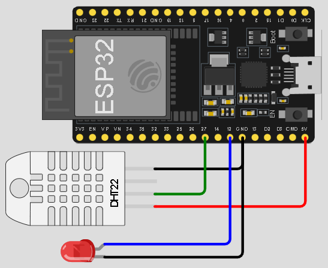

```cpp
#include <WiFi.h>
#include <PubSubClient.h>
#include <DHTesp.h>

#define dht22_pin 27
#define led_pin 12

unsigned long lastMsg = 0;
unsigned long now = 0;

//thingsboard
char mqttServer[] = "thingsboard.cloud";

char ssid[] = "Wokwi-GUEST";
char pass[] = "";
String tem="", hum="";

DHTesp dht;
TempAndHumidity dhtData;
WiFiClient espClient;
PubSubClient mqttClient(espClient); //object client mqtt

//koneksi ke wifi
void wifiSetup() {
  delay(10);

  Serial.println();
  Serial.print("Connect to ");
  Serial.println(ssid);

  WiFi.mode(WIFI_STA);
  WiFi.begin(ssid, pass);

  while (WiFi.status() != WL_CONNECTED) {
    delay(500);
    Serial.print(".");
  }

  Serial.println("WiFi connected");
  Serial.println("IP address: ");
  Serial.println(WiFi.localIP());
}

//koneksi ke broker
void mqttConnect(){
  digitalWrite(led_pin, LOW);
  while(!mqttClient.connected()){
    Serial.println("Mencoba menghubungi broker MQTT ...");
    
    //mencoba koneksi ke broker thingsboard (cliend-id,user,pass)
    if(!mqttClient.connect("tsa-vsga-123","tsa-vsga-123", "tsa-vsga-123")){
      Serial.print("Gagal terhubung, status = ");
      Serial.print(mqttClient.state());
      Serial.println("Coba lagi dalam 5 detik ...");
      delay(5000);
    }
  }
  digitalWrite(led_pin, HIGH);
  Serial.print("Terhubung ke server : ");
  Serial.println(mqttServer);

}

void setup() {
  Serial.begin(115200);
  pinMode(12, OUTPUT);
  dht.setup(dht22_pin, DHTesp::DHT22);
  wifiSetup();
  mqttClient.setServer(mqttServer,1883);
}

void loop() {
  if(!mqttClient.connected()){
    mqttConnect();
  }
  mqttClient.loop();
  now = millis();

  //mode publisher
  //mengatur agar pengiriman data terjadi tiap 2 detik
  if(now-lastMsg > 2000){
    lastMsg = now;
    dhtData = dht.getTempAndHumidity();

    //tem = String(dhtData.temperature,2);
    tem = String(random(0,100));
    //hum = String(dhtData.humidity,2);
    hum = String(random(0,100));

    //publish ke thingsboard
    mqttClient.publish("v1/devices/me/telemetry",
      ("{\"temperature\":"+tem+"}").c_str());
    mqttClient.publish("v1/devices/me/telemetry",
      ("{\"humidity\":"+hum+"}").c_str());
    
    Serial.println("Data : suhu = "+tem+", kelembapan = "+hum);
  }
}
```

**2. Menyiapkan dashboard Thingsboard**

1. Pastikan anda sudah memiliki account di Thingsbord dengan development board ESP32

    

2. Pastikan credentials di ESP32 dan di Thingsboard sama

    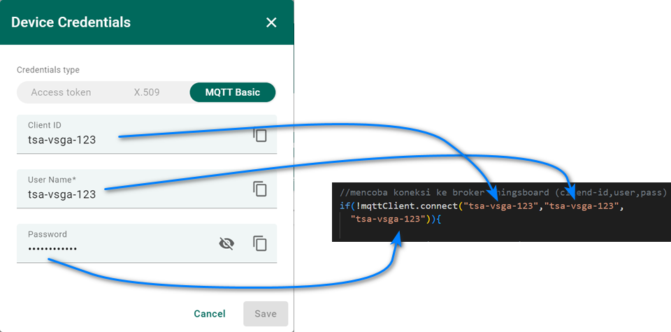

3. Di dashboard Thingsboard, tambahkan widget tabel dan time series seperti berikut ini

    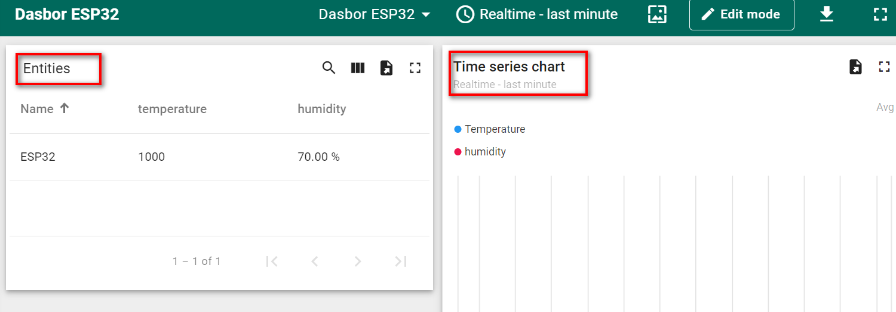

4. Untuk widget entitas tabel, tambahkan data keys seperti gambar berikut ini

    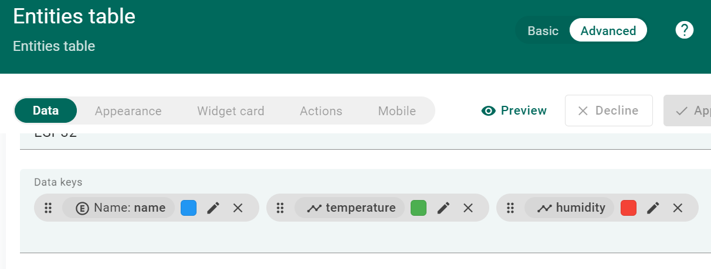

5. Untuk widget time series tambahkan series seperti gambar berikut ini

    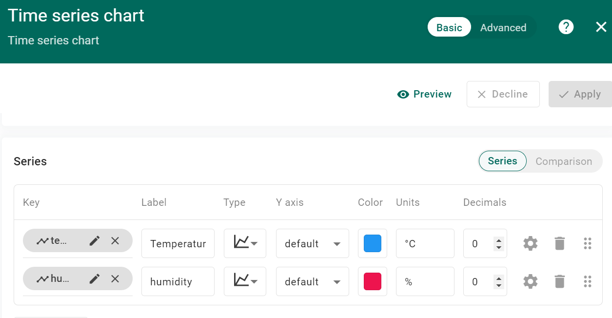

6. Jalankan aplikasi IoT anda, pastikan data yang ditampilkan sama dengan yang di dashboard Thingsboard

    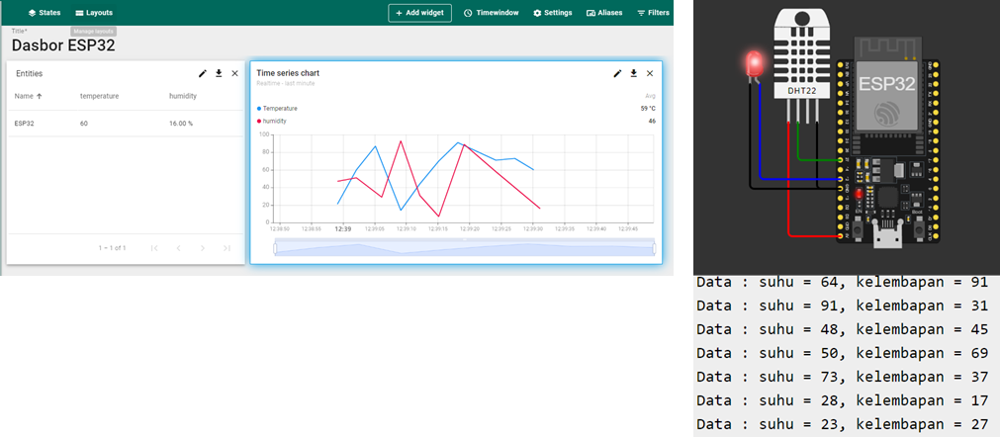

## Tugas Kelompok
Buatlah arsitektur IoT yang dapat mengirimkan data telemetry ke Thingsboard menggunakan protokol MQTT berdasarkan dari proyek MQTT yang sudah kelompok kalian kembangkan sebelumnya.
