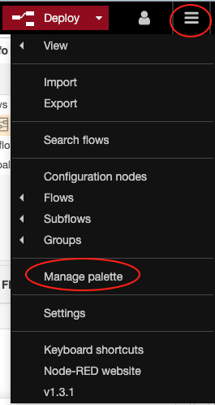
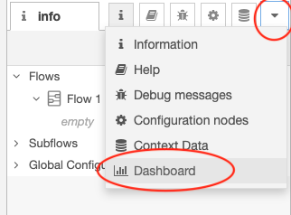
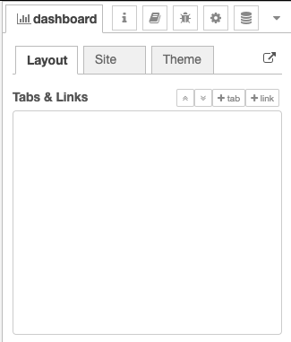
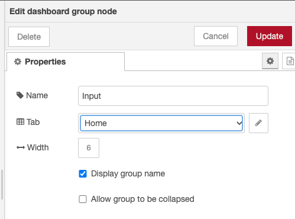
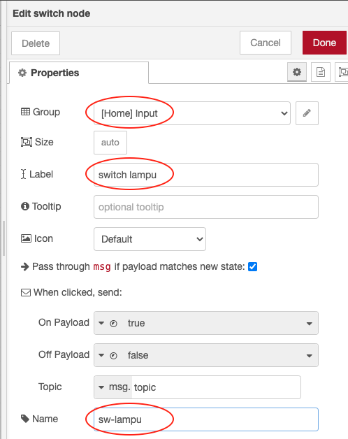
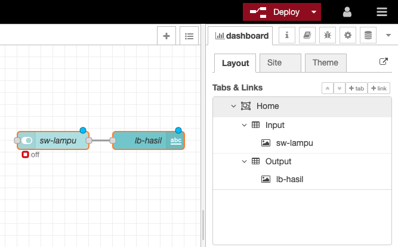
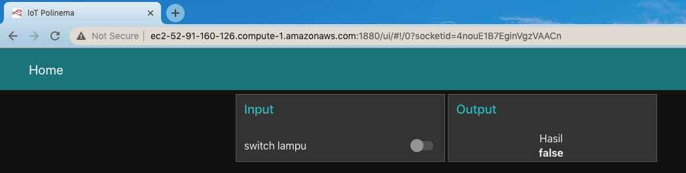
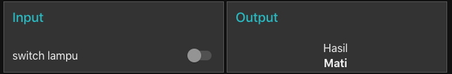
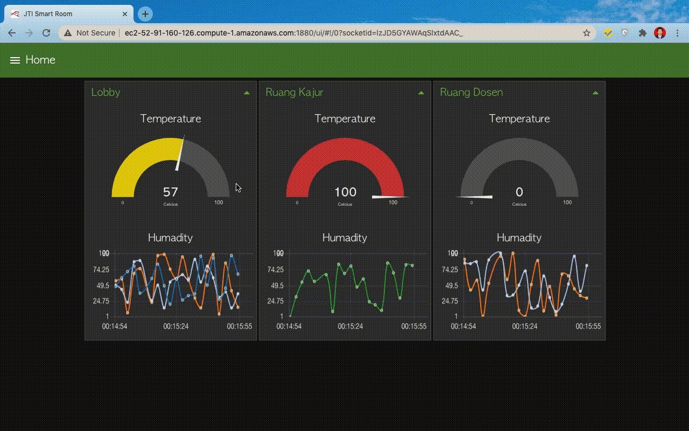

# Manajemen IoT Dashboard System

# Topik Bahasan

Manajemen IoT Dashboard System

## Kemampuan Akhir yang Direncanakan

- Mahasiswa mampu untuk membuat dashboard untuk project IoT
- Mahasiswa mampu untuk melakukan pengaturan smart device

## Teori Singkat
Layaknya sebuah IoT platform yang mempermudah pengguna dalam memvisualisaikan atau menyajikan data kepada pengguna, Node-RED
juga menyediakan sebuah dashboard agar kita dapat dengan mudah untuk menyajikan data secara live atau real time.

Untuk menggunakan atau membuat tampilan dashhboard menggunakan Node-RED juga sangat mudah, yaitu tinggal melakukan drag and 
drop pada worksheet untuk setiap komponen.

https://flows.nodered.org/node/node-red-dashboard

## Praktikum
### 1. Install Dashboard Node-RED
Untuk menggunakan dashboard Node-RED, kita harus install terlebih dahulu modulnya terlebih dahulu. Dapat dilakukan menggunakan
2 cara untuk installasinya, sebagai berikut
1. Menggunakan perintah `npm`.
   
    Langkah-langkah yang dapat dilakukan adalah sebagai berikut
   - Masuk ke direktori installasi Node-RED, ketika menggunakan EC2 terdapat di `/home/ubuntu/.node-red`. Jalankan perintah
    `cd /home/ubuntu/.node-red` di EC2 Anda.
   - Selanjutnya jalankan perintah `npm i node-red-dashboard`. 
2. Menggunakan menu `Manage pallete` pada Node-RED, mengakses Node-RED via browser.

    Langkah yang dapat dilakukan adalah sebagai berikut
    - Silakan akses Node-RED via browser, misalkan `http://ec2-52-91-160-126.compute-1.amazonaws.com:1880/`. 
    - Klik button yang terdapat di pojok kanan atas dan cari menu `Manage pallete`. Perhatikan gambar di bawah ini
    
        
    - Sehingga akan muncul jendela `User Settings`, pilih tab `install` dan ketik `dashboard` sehingga akan muncul modul-modul
    yang bisa kita install dan klik `tombol install`. Untuk lebih jelasnya perhatikan gambar di bawah ini
      
        
    - Akan muncul pop notifikasi proses install seperti gambar di bawah ini, silakan pilih atau klik `tombol install`.
        
        
    - Silakan cek dengan melihat pada Node-RED via browser, seharusnya sudah bertambah komponen-komponen dashboard pada
    pallete yang terdapat di sebelah kanan.
      
        

### 2. Membuat Dashboard Node-RED
Pada praktikum yang kedua akan dibuat sebuah tampilan seolah-olah menyalakan lampu dari internet, ikutilah langkah-langkah
sebagai berikut
1. Terlebih dahulu pilih menu `dashboard`, yang terdapat di pojok kanan bawah. dashbaord ini adalah untuk mengkonfigurasi 
   website yang akan kita buat misalkan dari sistem menu/hirarki menu ataupun title website. Perhatikan gambar di bawah ini
   
   
   Setelah ditambahkan
   
   
2. Pada bagian `Tabs & Links` klik tombol `tab` sehingga akan ditambahkan tab baru di bawahnya, pada tab baru yang terbentuk
   yaitu `Tab 1` klik tombol `edit` sehingga akan muncul jendela `Edit dashboard tab node` seperti berikut
   
    
   
    Pada bagian `Name` isikan `Home` dan `Icon` diganti dengan `fa-home` dan klik tombol `Update` untuk mengakhiri.
   > Untuk mengganti icon dengan yang lain bisa menggunakan `Material Design Icon, Font Awesome Icon, atau Weather Icon`. 
   > Contoh di atas menggunakan style dari icon `Font Awesome Icon`.
   > 
3. Selanjutnya tambahkan `Group` pada `Tab Home` tersebut dengan klik tombol `group`. Selanjutnya klik `edit` pada group 
   yang baru ditambahkan sehingga akan muncul jendela `Edit dashboard tab node` kembali. Sesuaikan nilai-nilai seperti pada
   gambar berikut
   
    
   
4. Ulangi langkah sebelumnya sehingga tampilannya menjadi seperti berikut
   
    
5. Drag ke worksheet/flow node `switch` kemudian double klik sehingga akan menampilkan jendela seperti di bawah, sesuaikan
bagian seperti `Group, Label, dan Name` seperti pada gambar di bawah ini.
    
   
6. Ulangi langkah sebelumnya, tetapi yang ditambahkan adalah node `text`, sesuaikan property seperti pada gambar berikut

    

7. Hubungkan `node switch` dan `node text`, hasil akhirnya adalah sebagai berikut. Kemudian silakan lakukan deploy dengan
klik tombol `Deploy`. Untuk melihat tampilannya silakan akses Node-RED, misalnya `http://ec2-52-91-160-126.compute-1.amazonaws.com:1880/ui`.
   
    

    Hasil akhirnya adalah sebagai berikut

    

#### Pertanyaan
Silakan modifikasi flow di atas sehingga ketika node switch digeser tidak menghasilkan nilai true atau false, tetapi ketika
digeser nilainya adalah nyala atau mati. Perhatikan gambar berikut ini

Dalam keadaan mati

Dalam keadaan hidup

## Video Pendukung

## Tugas

Hasilnya adalah sebagai berikut

