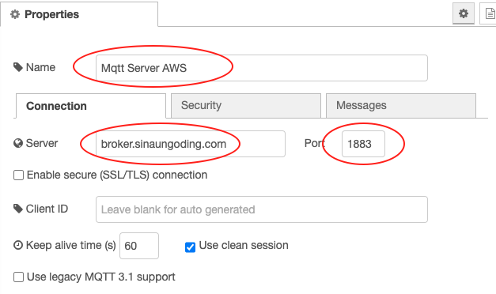
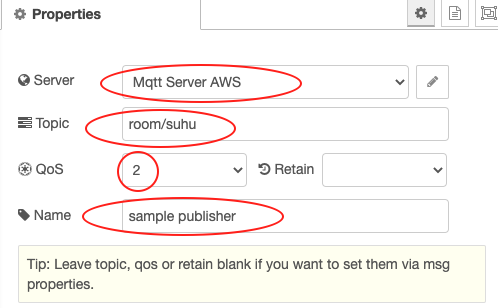
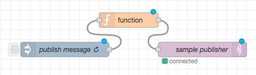
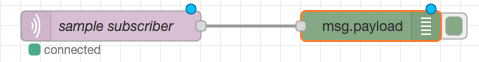
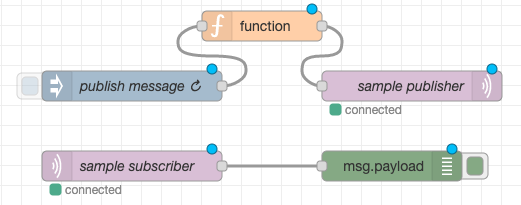
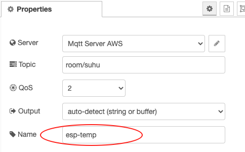
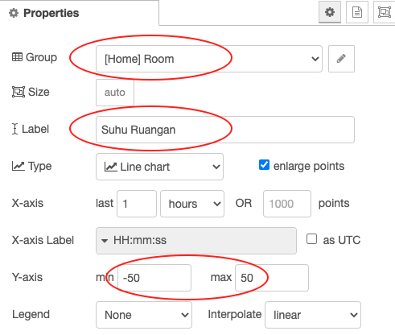
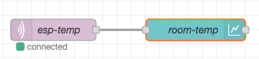

# Konfigurasi Smart Device

# Topik Bahasan

Konfigurasi Smart Device

## Kemampuan Akhir yang Direncanakan

- Mahasiswa mampu untuk mengkomunikasikan antara smart device dan IoT Server
- Mahasiswa mampu untuk menampilkan data sensor ke IoT Dashboard System sebagai monitoring
- Mahasiswa mampu untuk mengembangkan software di sisi smart device.

## Teori Singkat
Pada 2 pertemuan sebelumnya kita telah belajar cara menggunakan Node-RED dan membuat sebuah dashboard untuk memvisuaslisasikan
sebuah data dari berbagai inputan atau dummy data, tentunya sama sekali kita belum menyentuh smart device atau perangkat
IoT yang kita miliki. 

Untuk menghubungkan Node-RED ke perangkat IoT, langkahnya pun sangat sederhana yaitu benar-benar kita tidak dipusingkan 
dengan konfigurasi di perangkat IoT. Yang perlu dilakukan adalah membuat sebuah node di dashboard Node-RED yang fungsinya 
untuk menangkap data dari perangkat IoT, protokol yang bisa digunakan juga lumayan banyak mulai dari MQTT ataupun http. 

## Praktikum
### 1. MQTT Node-RED
Walaupun beberapa protokol yang dapat disupport oleh Node-RED, akan tetapi pada kesempatan kali ini protokol yang 
digunakan MQTT. Untuk menggunakan protokol MQTT, pada Node-RED dashboard ketika melakukan installasi sudah termasuk di dalamnya.
Ikut langkah-langkah di bawah ini untuk mulai praktikum
1. Silakan seret `node inject` ke worksheet, kemudian ubahlah nilai properties seperti pada gambar berikut
   
   
   
2. Seret juga `node function` ke worksheet, sesuaikan propertiesnya seperti pada gambar berikut
   
   
   
3. Jangan lupa seret juga `node mqtt out` pada kategori network, tambahkan server broker agar bisa publish data dengan 
   cara klik `icon pensil`. Konfigurasinya adalah sebagai berikut 
adalah sebagai berikut
   
   
   
   > Pada bagian `Name` isikan `Mqtt Server AWS`, `Server` diisikan `broker.sinaungoding.com` dan `port` isikan `1883`.
   > 
   Untuk `node mqtt out` kira-kira seperti berikut

    

    Perhatian gambar berikut untuk flow lengkapnya, setelah semua node dihubungkan.
   
    
   
4. Tambahkan `node mqtt in` ke worksheet, sesuaikan konfigurasi sebagai berikut

    
Pada bagian `Server, Topic dan Qos` disamakan dengan `node mqtt out` sedangkan `Name` silakan isikan dengan `sample subscriber`.
   
5. Tambahkan node terakhir yaitu `node debug`, sementara untuk kongifigurasinya tidak perlu disesuaikan. Hubungkan kedua
node tersebut sehingga menjadi sebagai berikut
   
   
   
   Sehingga flow lengkap dari langkah awal sampai akhir adalah sebagai berikut

   

### Verifikasi Hasil Percobaan
Setelah dilakukan deploy, kemudian klik `tab debug atau icon kutu` seharusnya adalah sebagai berikut. Adapun untuk nilainya
pasti berbeda


#### Pertanyaan
1. Pada `node inject`, pada properties `Repeat` dengan nilai `interval`. Apakah fungsinya?
2. Apakah yang dimaksud dengan baris kode `msg.payload=Math.floor(Math.random()*100);`?
3. Bagian `node mqtt out`, apakah fungsi `Qos` dengan nilai 2?

### 2. Menghubungkan Smart Device Node-RED
Pada praktikum kali ini akan dibuat sebuah dashboard untuk menampilkan suhu yang dikirimkan oleh ESP-8266 menggunakan
protokol MQTT. Langkah awal kita perlu menyiapkan Node-RED selanjutnya kita buat kode di sisi ESP-8266.
1. Silakan buat flow baru dengan cara `klik tombol plus(+)`, tambahkan terlebih dahulu `node mqtt in` ke worksheet dengan
konfigurasi sebagai berikut
   
    
   
   > Konfigurasi mirip dengan yang sebelumnya, tetapi yang membedakan adalah pada bagian `Name` yang diisikan dengan `esp-temp`
   > 
2. Buatlah dashboard dengan tab Site dengan title `Node-RED Dashboard` dengan layout adalah sebagai berikut

    
   
3. Tambahkan `node chart` dan sesuaikan konfigurasinya menjadi sebagai berikut

    

Jangan lupa pada bagian `Name` diisikan dengan `room-temp`.
   
4. Hubungkan kedua node tersebut dan Deploy, tampilan dashboard secara utuh menjadi demikian

    

Langkah terakhir yang perlu dilakukan yaitu membuat kode smart device, ESP8266. Tambahkan atau pasang sensor DHT11 yang rencananya
akan kita tampilkan pada dashboard yang sebelumnya telah kita buat. Kode lengkapnya adalah sebagai berkut
```c++
#include <Arduino.h>
#include <ESP8266WiFi.h>
#include <PubSubClient.h>
#include <SimpleDHT.h>

const char *ssid = "****";//silakan disesuaikan sendiri
const char *password = "****";//silakan disesuaikan sendiri

const char *mqtt_server = "broker.sinaungoding.com";

WiFiClient espClient;
PubSubClient client(espClient);

SimpleDHT11 dht11(D7);

long now = millis();
long lastMeasure = 0;

void setup_wifi()
{
  delay(10);
  Serial.println();
  Serial.print("Connecting to ");
  Serial.println(ssid);
  WiFi.begin(ssid, password);
  while (WiFi.status() != WL_CONNECTED)
  {
    delay(500);
    Serial.print(".");
  }
  Serial.println("");
  Serial.print("WiFi connected - ESP IP address: ");
  Serial.println(WiFi.localIP());
}

void reconnect()
{
  while (!client.connected())
  {
    Serial.print("Attempting MQTT connection...");
    if (client.connect("ESP8266Client"))
    {
      Serial.println("connected");
    }
    else
    {
      Serial.print("failed, rc=");
      Serial.print(client.state());
      Serial.println(" try again in 5 seconds");
      delay(5000);
    }
  }
}

void setup()
{
  Serial.begin(115200);
  Serial.println("Mqtt Node-RED");
  setup_wifi();
  client.setServer(mqtt_server, 1883);
}

void loop()
{
  if (!client.connected())
  {
    reconnect();
  }
  if (!client.loop())
  {
    client.connect("ESP8266Client");
  }
  now = millis();
  if (now - lastMeasure > 5000)
  {
    lastMeasure = now;
    int err = SimpleDHTErrSuccess;

    byte temperature = 0;
    byte humidity = 0;
    if ((err = dht11.read(&temperature, &humidity, NULL)) != SimpleDHTErrSuccess)
    {
      Serial.print("Pembacaan DHT11 gagal, err=");
      Serial.println(err);
      delay(1000);
      return;
    }
    static char temperatureTemp[7];
    dtostrf(temperature, 4, 2, temperatureTemp);
    Serial.println(temperatureTemp);

    client.publish("room/suhu", temperatureTemp);
  }
}
```

Upload kode di atas ke ESP8266 Anda dan amati hasilnya.
> Library yang digunakan pada project di atas adalah `winlinvip/SimpleDHT@^1.0.14` dan `knolleary/PubSubClient@^2.8`

### Verifikasi Hasil Percobaan
Hasil percobaan tersebut dapat dilihat pada serial monitor dan Node-RED melalui browser, kurang lebih seperti gambar di bawah


Tampilan serial monitor


Tampilan Node-RED pada browser

#### Pertanyaan
1. Modifikasi program di ESP8266 di atas agar bisa melakukan subscribe dengan topik `room/lamp`?
2. Tambahkan kode di atas agar bisa publish nilai kelembaban dengan topik `room/humadity`?
3. Tambah `node chart` agar dapat menampilkan nilai kelembaban, `node chart` masih dalam satu group yaitu Room  pada dashboard
Node-RED.

[comment]: <> (## Video Pendukung)

[comment]: <> (<p>)

[comment]: <> (<iframe width="768" height="480" src="https://www.youtube.com/embed/d3bqyYUlypU" title="YouTube video player" frameborder="0" allow="accelerometer; autoplay; clipboard-write; encrypted-media; gyroscope; picture-in-picture" allowfullscreen></iframe>)

[comment]: <> (</p>)

## Tugas
Masih lanjutan dengan tugas, tambahkan sensor LDR dan LED RGB pada ESP8266. Ketentuannya adalah sebagai berikut
1. Tab Home terdiri dari group Control, Monitoring, dan Cahaya.
   - `Group Control` memiliki 3 `node switch` dan 3 `text statis`, fungsi dari group ini adalah untuk menghidupkan dan mematikan
   led RGB.
   - `Group Monitoring` 2 `node chart` untuk menampilkan suhu dan kelembaban.
   - `Group Cahaya` terdiri dari `text` dan `gauge`, text untuk menampilkan kategori terang, redup, dan gelap. Sedangkan `node gauge`
   untuk menampilkan nilai sensor LDR.
2. Tab Contact
Pada tab ini digunakan untuk menampilkan data kelas, NIM, dan Nama. **Silakan diisi dengan nama Anda masing-masing**.
   
Hasil yang diharapkan adalah sebagai berikut


