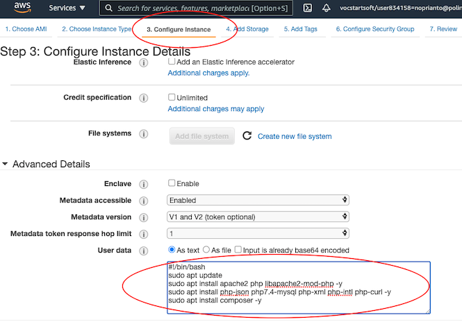
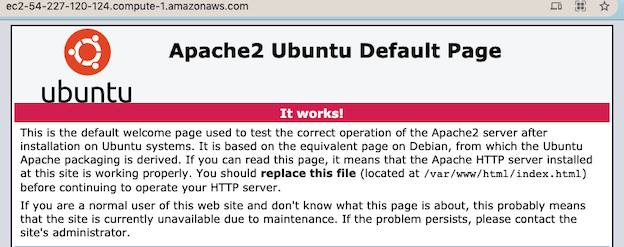
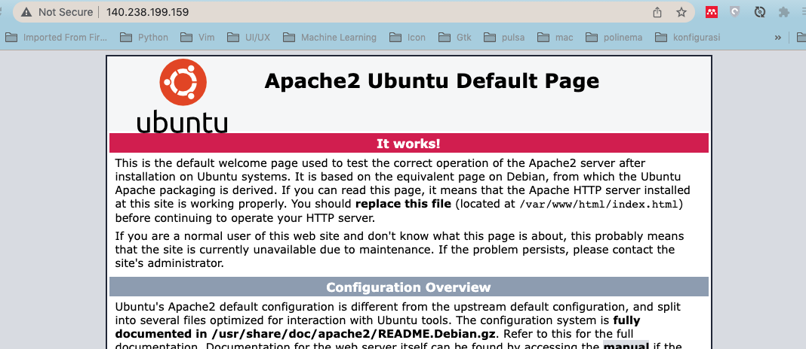
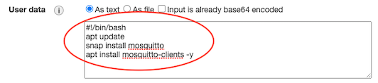
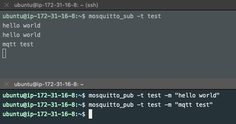
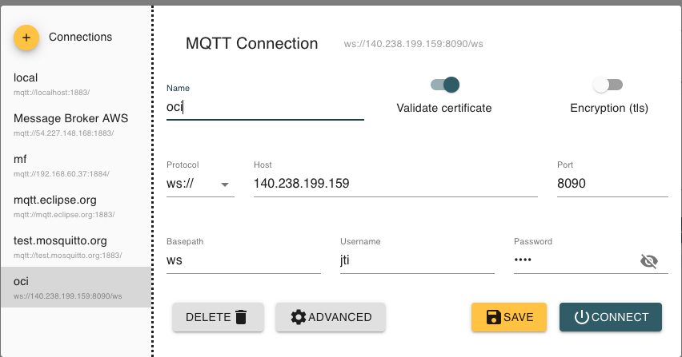

# IoT Gateway dan Web Dashboard

# Topik Bahasan

IoT Gateway dan Message Broker

## Kemampuan Akhir yang Direncanakan

- Mahasiswa mampu melakukan instalasi dan konfigurasi message broker.
- Mahasiswa mampu mengolah data sensor di dalam server local atau cloud.
- Mahasiswa bisa membuat dashboard sederhana data sensor

## Teori Singkat

IoT Gateway dan message broker kaitannya sangat erat yang tidak dapat dipisahkan pada sebuah infrasturktur IoT, untuk
lebih
jelaskan dapat dilihat pada gambar di bawah ini


sumber: _https://openautomationsoftware.com/open-automation-systems-blog/what-is-an-iot-gateway/_

Dari gambar di atas terlihat bahwa IoT gateway menjembatani sensor dan controller untuk melakukan komunikasi dengan
internet,
sehingga sebuah IoT gateway penyedia layanan diantara lokal koneksi parangkat IoT dan cloud/internet, perangkat IoT
mampu
berkomuniasi dengan perangkat IoT yang lain, dan jaringan yang lebih luas.

Biasanya IoT gateway adalah sebuah perangkat hardware dengan kemampuan konektivitas dan komputasi yang tinggi untuk
meneruskan data ke cloud untuk diolah menjadi informasi yang lebih bermanfaat. Beberapa perangkat yang bisa digunakan
IoT
gateway misalkan Raspberry atau model industrial komputer.

Sementara message broker sebuah penyedia pertukaran data antara iot device dengan cloud, message broker dipasang pada
sebuah
IoT gateway. Beberapa protokol yang digunakan oleh message broker ini misalkan AMQP, CoAP, dan MQTT. Konsep dari prokol
AMQP dan MQTT adalah dengan menerapkan teknik publish dan subscribe dan CoAP mirip dengan REST API dengan design
konsumsi low power,
publish berarti mengirimkan data ke message broker dengan topik tertentu sedangkan subscribe sendiri berarti
berlangganan
ke message broker pada sebuah topik.

## Praktikum

### 1. Konfigurasi Web Server

Data-data yang dihasilkan oleh sensor agar lebih menarik perlu divisualisasi atau ditampilkan, dalam hal ini pada sebuah
halaman website. Jika pada praktikum yang sebelumnya kita telah berhasil memanfaatkan IoT Platform, Node-RED untuk
menampilkan
data tersebut. Pada kesempatan kali ini akan dicoba untuk membuat visualisasi data dari awal, butuh sebuah web server.
Kemudian untuk memudahkan membuat kode program karena akan membutuhkan dashboard, misalkan chart, gauge, dan yang lain
digunakan halaman html,css serta menggunakan bootstramp.

#### 1. Konfigurasi PHP dan Codeiginter

Seperti biasanya kita akan menyiapkan instance, EC2 untuk kebutuhan di atas. Langkah-langkahnya adalah sebagai berikut

1. Buatlah sebuah instance EC2, kemudian pada langkah `3. Configure Instance` tambahkan baris perintah di bawah ini pada
   bagian `User Data`. Untuk lebih jelasnya perhatikan gambar di bawah ini
   

   ```shell
   #!/bin/bash
   apt update
   apt install apache2 php libapache2-mod-php -y
   apt install php-json php7.4-mysql php-xml php-intl php-curl -y
   apt install composer -y
   ```
   Dengan menggunakan script di atas, kita tidak perlu repot-repot menjalankan satu persatu ketika instance berhasil
   dibuat
   karena sudah dijalankan ketika proses pembuatan instance.
   > Di EC2 kita diizinkan untuk membuat script ketika membuat instance, biasanya yang disupport adalah bash scripting
   atau
   > perintah dasar pada sebuah terminal. Ketika bash script tersebut dijalankan, maka akan dijalankan sebagai user root
   > sehingga ketika kita ingin membuat direktori pada path tertentu harus full path, misalkan buat direktori di home
   > berarti `mkdir /home/ubuntu/[nama direktori]`

2. Silakan tambahkan port http yaitu 80 pada langkah `6. Configure Security Group`. Port tersebut digunakan untuk akses
   web server atau web yang akan kita buat.

3. Setelah instance berhasil dijalankan, kemudian silakan buka browser Anda kemudian ketik/paste domain(alamat) dari
   instance
   tersebut. Misalkan domain saya adalah `http://ec2-54-227-120-124.compute-1.amazonaws.com/` seharusnya akan muncul
   tampilan
   seperti pada gambar berikut

   

4. Untuk memudahkan proses pengembangan aplikasi web, kita akan mencoba menggunakan framework codeigniter4. Silakan
   masuk
   ke EC2 yang telah dibuat sebelumnya, bisa menggunakan putty atau perintah ssh. Jalankan beberapa baris perintah di
   bawah ini

   ```shell
   composer create-project codeigniter4/appstarter iot-jti --no-dev
   sudo chown -Rv www-data iot-jti/writable
   sudo mv iot-jti/ /var/www/html/
   ```
   Langkah installasi codeigniter menggunakan perintah `composer` agar lebih gampang karena akan download di repository,
   langkah yang lain bisa secara manual dengan mengunjungi website codeigniter dan download.

5. Ketika akses instance melalui browser yang ditampilkan masih halaman index dari apache, kita akan mencoba untuk
   mengubah
   halaman tersebut menjadi halaman codeigniter. Sebelumnya kita harus membuat konfigurasi untuk website kita, ketik
   beberapa
   perintah di bawah ini

   ```shell
   sudo cp /etc/apache2/sites-available/000-default.conf /etc/apache2/sites-available/iot-jti.conf
   sudo nano /etc/apache2/sites-available/iot-jti.conf
   sudo a2ensite iot-jti.conf
   sudo a2dissite 000-default.conf
   sudo systemctl restart apache2
   ```   
   > Ketika menjalankan perintah `sudo nano /etc/apache2/sites-available/iot-jti.conf` silakan
   dicari `DocumentRoot /var/www/html`
   > kemudian diganti menjadi `DocumentRoot /var/www/html/iot-jti/public`, hanya mengganti path-nya saja. CTRL+O
   kemudian
   > enter untuk menyimpan perubahan dan CTRL+x untuk keluar editor nano.

6. Buka browser atau kembali browser, kemudian ketik alamat ip atau dns instance.
   Misalkan `http://ec2-54-227-120-124.compute-1.amazonaws.com/`
   seharusnya akan menampilkan halaman seperti pada gambar berikut

   

7. Untuk mempermudah proses coding, aktifkan mode debug codeigniter menggunakan perintah di bawah ini

   ```shell
      cd /var/www/html/iot-jti
      mv env .env
      nano .env
   ```
   > Silakan dicari pada bagian `# CI_ENVIRONMENT = production` diubah menjadi  `CI_ENVIRONMENT = development`, tekan
   > CTRL+O kemudian enter untuk menyimpan perubahan dan CTRL+x untuk keluar editor nano.

8. Buka kembali browser, ketik alamat ip atau dns seharusnya akan menampilkan seperti pada gambar berikut pada bagian
   bawah
   halaman codeigniter.

   

> Codeignier sudah berhasil terpasang pada instance atau server, selanjutnya adalah membuat kode sesuai dengan
> kebutuhan.
> Skenario yang bisa dilakukan adalah untuk mengedit atau mengubah kode yang terdapat di codeigniter yaitu bisa
> menggunakan
> repository, misalkan git. Upload semua satu project codeigniter ke repository yang di server, kemudian bisa di-clone
> ke
> komputer lokal atau laptop untuk melaukan editing. Ketika selesai edit, push ke repository dan di server atau instance
> harus melakukan pull.
>
> Skenario yang lain, download project codeigniter di server pindah ke laptop/lokal komputer. Bisa menggunakan WinSCP
> atau tool
> yang lain. Ketika ada perubahan di lokal, maka harus upload perubahan tersebut yang ada di server.
>
> Jujur lebih menyarankan skenario yang pertama untuk menghindari terjadi konflik, terlebih lagi ketika pengembangannya
> sudah
> lebih dari satu orang.

#### 2. Konfigurasi Web Server OCI

Pada langkah yang kedua akan melakukan konfigurasi pada Oracle Cloud Infrastructure, silakan masuk terlebih dahulu ke
instance
yang akan Anda konfigurasi kemudian ikuti langkah-langkah di bawah ini

1. Silakan memasang web server terlebih dahulu, web server yang akan diguankan adalah apache. Berikut perintah untuk
   melakukan
   installasi
   ```shell
   sudo apt update
   sudo apt install apache2 -y
   ```
   Untuk melakukan pengecekan ketika selesai proses installasi adalah dengan menggunakan perintah `telnet`.
   ```shell
   ubuntu@praktikum-iot:~$ telnet localhost 80
   Trying 127.0.0.1...
   Connected to localhost.
   Escape character is '^]'.
   ^]
   ```
   > Selain mengunakan telnet, bisa juga menggunakan perintah `sudo systemctl status apache2` untuk mengetahui status
   > apakah apache berjalan atau tidak.

   Dari keluaran perintah `telnet` di atas web server sudah berjalan, akan tetapi ketika ingin mengakses instance kita
   dari luar
   masih belum bisa dilakukan. Silakan terlebih dahulu Virtual Cloud Network seperti pada materi yang sebelumnya agar
   port
   80 bisa diakses dari luar. Jangan lupa jalankan perintah di bawah ini ketika sudah menambahkan atau mendaftarkan port
    80.
   ```shell
   sudo iptables -I INPUT 6 -m state --state NEW -p tcp --dport 80 -j ACCEPT
   sudo netfilter-persistent save
   ```
   Tampilan ketika sudah berhasil adalah halaman home page, seperti pada gambar berikut
   
2. Normalnya web server harus dijalankan manual ketika instance tidak berjalan, agar dapat secara otomatis berjalan
   silakan
   ketik perintah di bawah ini
   ```shell
   sudo systemctl enable apache2
   ```
   Silakan restart instance Anda, untuk membuktikan apakah perintah di atas sesuai yang diharapkan yaitu web server
   sudah
   berjalan tanpa menjalankan secara manual kembali.

> Sebagai alternative Anda bisa menggunakan windows dengan melakukan installasi apache ataupun php secara manual satu
> persatu. Kemudian untuk lebih praktis dan mudah install XAMPP, dengan download terlebih dahulu
> di [tautan berikut](https://www.apachefriends.org/download.html).

### 2. Konfigurasi Message Broker

#### 1. Amazone Web Service (AWS)

Untuk praktikum sebelumnya kita memanfaatkan message broker yang sudah ada, dalam praktikum yang kedua mencoba bagaimana
caranya konfigurasi message broker untuk aplikasi yang akan kita bangun. Silakan mengikuti langkah-langkah di bawah ini

1. Buatlah sebuah instance baru, kemudian untuk langkah `3. Configure Instance` pada bagian `User Data` tambahkan baris
   perintah
   sebagai berikut
   ```shell
   #!/bin/bash
   apt-add-repository ppa:mosquitto-dev/mosquitto-ppa -y
   apt-get update
   apt-get install mosquitto mosquitto-clients -y
   ```
   Baris di atas digunakan untuk melakukan installasi mosquitto sebagai message broker sekaligus install mosquitto
   client
   untuk melaukan pengujian publish dan subscribe. Atau dapat melihat pada gambar berikut

   

2. Tambahkan 2 port yang perlu dibuka selain port 22 untuk ssh, misalkan port 1883 dan 8089 pada
   langkah `6. Configure Security
   Group`. Perhatikan gambar di bawah ini

   

3. Ketika instance sudah jalan, silakan remote menggunakan putty atau tool yang lain. Kemudian jalankan perintah di
   bawah ini
   untuk mengecek apakah installasi mosquitto sudah berhasil.
   ```shell
   ubuntu@ip-172-31-16-8:~$ telnet localhost 1883
   Trying 127.0.0.1...
   Connected to localhost.
   Escape character is '^]'.
   ^]
   
   telnet> Connection closed.
   ```
   Perintah di atas menandakan bahwa proses installasi mosquitto telah berhasil, kemudian silakan dicoba untuk melakukan
   publish dan subscribe message. Buka windows baru lagi atau duplicate session, selanjutkan lakukan perintah seperti
   pada
   gambar berikut

   

   Terlihat bahwa proses subscribe dan publish berhasil dilakukan pada localhost. Parameter `-t` menandakan nama
   topiknya,
   `-m` berarti messagenya yang akan dikirimkan. Kemudian misalkan untuk mencoba pada host atau
   server yang lain tambahkan parameter `-h` diikuti nama host atau ip.
   Misalkan `mosquitto_sub -h broker.sinaungoding.com -t test`,
   dan untuk melakukan subscribe `mosquitto_pub -h broker.hivemq.com -t test -m "mqtt test"`.

#### 2. Oracle Cloud Infrastructure (OCI)

Untuk konfigurasi message broker di OCI sebenarnya sama, hanya langkah-langkah pada menu atau istilah yang berbeda
ketika
menggunakan Oracle Cloud Infrastructure.

1. Silakan masuk terlebih dahulu ke instance Anda, kemudian jalankan perintah di bawah ini
   ```shell
   sudo apt-add-repository ppa:mosquitto-dev/mosquitto-ppa -y
   sudo apt-get update
   sudo apt-get install mosquitto mosquitto-clients -y
   ```
   Perintah di atas digunakan untuk melakukan installasi message broker yaitu
   menggunakan `mosquitto dan mosquitto-clients`
   untuk melakukan publish atau subscribe menggunakan terminal. Seperti biasa untuk melakukan pengecekan kita bisa
   menggunakan perintah
   `telnet` apakah sudah berhasil dan berjalan belum message broker.
   ```shell
   ubuntu@praktikum-iot:~$ telnet localhost 1883
   Trying 127.0.0.1...
   Connected to localhost.
   Escape character is '^]'.
   ^]
   ```
   Kita butuh lagi port yang akan digunakan sebagai client untuk terhubung ke message broker menggunakan protokol
   websocket,
   misalkan kita akan menggunakan port 8090. Jangan lupa untuk menyimpan perubahan firewall yang telah dikonfigurasi
   pada VCN
   menggunakan perintah firewall.
   ```shell
   sudo iptables -I INPUT 6 -m state --state NEW -p tcp --dport 1883 -j ACCEPT
   sudo iptables -I INPUT 6 -m state --state NEW -p tcp --dport 8090 -j ACCEPT
   sudo netfilter-persistent save
   ```
2. Setelah message broker berhasil dikonfigurasi, selanjutnya kita bisa memanfaatkan atau mencoba untuk publish message
   data
   sekaligus menerima pengiriman data. Perintah yang bisa dilakukan adalah sebagai berikut untuk menerima data atau
   subscribe
   ```shell
   ubuntu@praktikum-iot:~$ mosquitto_sub -t "iot/polinema"
   ```
   Perintah di atas untuk mernerima data dengan topik "iot/polinema", sehingga ketika ada yang mengirimkan data dengan
   topik
   tersebut data akan diterima. Kemudian untuk menerima data dapat menggunakan perintah berikut
   ```shell
   ubuntu@praktikum-iot:~$ mosquitto_pub -t "iot/polinema" -m "iot jaya"
   ```
   Dengan menggunakan perintah di atas digunakan untuk mengirimkan data "iot jaya" dengan topik "iot/polinema",
   seharusnya pada
   perintah subscribe di atas akan menerima data.

#### 3. Installasi di local (Windows)

Message broker juga dapat dilakukan installasi di local, pada kesempatan ini akan melakukan installasi message broker
Mosquitto pada sistem operasi Windows.

1. Download terlebih dahulu di [sini.](https://mosquitto.org/download/)
2. Lakukan installasi sampai selesai seperti ditunjukkan pada gambar di bawah ini

   

3. Agar perintah mosquitto bisa dikenali perlu didaftarkan (path) terlebih dahulu, gambar di bawah ini adalah perintah
   mosquitto yang belum dikenali.

   

4. Secara default folder installasi terdapat di `C:\Program Files\mosquitto`, sehingga kita perlu mendaftarkan folder
   tersebut pada path environment yang ditunjukkan pada gambar di bawah ini

   

5. Ketik kembali perintah `mosquitto` pada Windows PowerShell, seharusnya outputnya berbeda dari yang sebelumnya artinya
   message broker sudah berjalan.

> Untuk membuktikan message broker telah berjalan bisa menggunakan perintah telnet yang diketik pada Windows PowerSheel.
> Jika perintah telnet belum dikenali, silakan diaktifkan terlebih dahlulu
> pada `Control Panel - Turn Windows fatures on or off - Telnet Client`.
>
> Anda juga bisa dengan mengirimkan(publish) message atau data dengan perintah `mosquitto_pub -t "test" -m "hai"`.

#### Menambahkan Password MQTT

Agar lebih aman terhadap pihak-pihak yang tidak bertanggungjawab, perlu ditambahkan keamanan ketika akan menggunakan
message broker yang telah kita install, salah satunya yaitu menambahkan authentifikasi berupa user dan password ketika
ingin melakukan subscribe ataupun publish message.

Ikuti langkah-langkah di bawah ini untuk melakukan konfigurasinya

1. Buatlah sebuah user `jti` dengan perintah di bawah ini. User `jti` hanya contoh, silakan diganti dengan yang lain
   jika
   diperlukan
   ```shell
   ubuntu@ip-172-31-16-8:~$ sudo mosquitto_passwd -c /etc/mosquitto/passwd jti
   Password:
   Reenter password:
   ```
   > Jika menggunakan sistem operasi windows bisa menggunakan perintah yang sama pada Windows
   PowerShell, `mosquitto_passwd -c 'C:\Program Files\mosquitto\pwfile' jti.` Jangan lupa membuka Windows PowerShell
   sebagai Administrator. Anda juga bisa menggunakan parameter `-b` untuk menambahkan user, serta parameter `-D` untuk menghapus user pada file konfigurasi tersebut.

2. Buatlah file konfigurasi yang menginfokan bahwa untuk publish tidak dizinkan tanpa password. Ketik perintah di bawah
   ini
   ```shell
   sudo nano /etc/mosquitto/conf.d/jti.conf
   ```
   Akan muncul editor nano, selanjutnya tambahkan dua baris perintah berikut
   ```shell
   listener 8090
   protocol websockets
   
   listener 1883
   #protocol websockets
   
   per_listener_settings true
   allow_anonymous false
   password_file /etc/mosquitto/passwd
   ```
   Tekan CTRL+O untuk menyimpan konfigurasi file dan CTRL+X untuk keluar dari editor nano.

   > Untuk sistem operasi Windows, file konfigurasi terdapat di `C:\Program Files\mosquitto\mosquitto.conf`. Bisa dibuka
   menggunakan notepad atau sejenisnya

3. Silakan restart mosquitto untuk memberikan perubahan dan coba lakukan publish atau subscribe sebuah message,
   kira-kira
   perintahnya adalah sebagai berikut
   ```shell
   sudo systemctl restart mosquitto
   ```

   > Untuk sistem operasi windows, silakan sesuaian konfigurasi seperti berikut ini, jika jalankan menggunakan
   perintah `mosquitto -c .\mosquitto.conf`. File konfigurasi bisa diletakkan di folder manapun.

   ```shell
   listener 8090
   protocol websockets
      
   listener 1883
   protocol mqtt
      
   per_listener_settings true
   allow_anonymous false
   password_file pwfile
   ```

### Verifikasi Hasil Percobaan

Silakan dicoba untuk publish message menggunakan perintah berikut

```shell
buntu@ip-172-31-16-8:~$ mosquitto_pub -h localhost -t "test" -m "hello world"
Connection error: Connection Refused: not authorised.
Error: The connection was refused.
```

Dari keluaran di atas terlihat bahwa terjadi error karena ketika publish message tidak menggunakan user dan password.
Kemudian ketika ditambahkan username dan password seperti perintah berikut

```shell
ubuntu@ip-172-31-16-8:~$ mosquitto_pub -h localhost -t "test" -m "hello world" -u jti -P 1234
```

Ketika tidak menampilkan pesan berarti berhasil publish message.
> Untuk memudahkan melakukan pengecekan bisa menggunakan mqtt client menggunakan http://mqtt-explorer.com, silakan
> download dan installasi. Tampilannya adalah sebagai berikut
> 

#### Pertanyaan

1. Apakah fungsi dari baris perintah `protocol websockets` pada file konfig mosquitto?
2. Silakan ganti menjadi `false` pada `per_listener_settings true`, restart mosquitto. Apakah yang akan terjadi atau
   pengaruhnya apa?
3. Buatlah user yang lain, kemudian lakukan subscribe dan publish message!

### 3. Menghubungkan Smart Device Aplikasi Web

Setelah menyiapkan webserver untuk aplikasi web dan message broker untuk mengirimkan data sensor ataupun aktuator,
selanjutnya
perlu disiapkan Node-MCU dengan kode program jobsheet sebelumnya dan tentunya akan kita tambahkan halaman dashboad untuk
menampilkan data sensor dari Node-MCU. Adapun langkah-langkahnya adalah sebagai berikut

1. Tambahkan kode program pada Node-MCU, dibutuhkan DHT11. Kode programnya adalah sebagai berikut
   ```cpp
   #include <Arduino.h>
   #include <ESP8266WiFi.h>
   #include <PubSubClient.h>
   #include <SimpleDHT.h>
   
   // hp
   // const char *ssid = "od3ng";
   // const char *password = "0d3n9bro";
   
   // kampus
   const char *ssid = "Smart Parking";            // sesuaikan dengan username wifi
   const char *password = "5m4rT_P4rk!Ng";        // sesuaikan dengan password wifi
   const char *mqtt_server = "broker.hivemq.com"; // isikan server broker
   
   WiFiClient espClient;
   PubSubClient client(espClient);
   
   SimpleDHT11 dht11(D7);
   
   long now = millis();
   long lastMeasure = 0;
   String macAddr = "";
   
   void setup_wifi()
   {
   delay(10);
   Serial.println();
   Serial.print("Connecting to ");
   Serial.println(ssid);
   WiFi.begin(ssid, password);
   while (WiFi.status() != WL_CONNECTED)
   {
   delay(500);
   Serial.print(".");
   }
   Serial.println("");
   Serial.print("WiFi connected - ESP IP address: ");
   Serial.println(WiFi.localIP());
   macAddr = WiFi.macAddress();
   Serial.println(macAddr);
   }
   
   void reconnect()
   {
   while (!client.connected())
   {
   Serial.print("Attempting MQTT connection...");
   if (client.connect(macAddr.c_str()))
   {
   Serial.println("connected");
   }
   else
   {
   Serial.print("failed, rc=");
   Serial.print(client.state());
   Serial.println(" try again in 5 seconds");
   delay(5000);
   }
   }
   }
   
   void setup()
   {
   Serial.begin(115200);
   Serial.println("Mqtt Node-RED");
   setup_wifi();
   client.setServer(mqtt_server, 1883);
   }
   
   void loop()
   {
   if (!client.connected())
   {
   reconnect();
   }
   if (!client.loop())
   {
   client.connect(macAddr.c_str());
   }
   now = millis();
   if (now - lastMeasure > 5000)
   {
   lastMeasure = now;
   int err = SimpleDHTErrSuccess;
   
       byte temperature = 0;
       byte humidity = 0;
       if ((err = dht11.read(&temperature, &humidity, NULL)) != SimpleDHTErrSuccess)
       {
         Serial.print("Pembacaan DHT11 gagal, err=");
         Serial.println(err);
         delay(1000);
         return;
       }
       static char temperatureTemp[7];
       dtostrf(temperature, 4, 2, temperatureTemp);
       Serial.println(temperatureTemp);
   
       client.publish("room/suhu", temperatureTemp); // agar lebih unix silakan tambahkan NIM ex: 0001/room/suhu
   }
   }
   ```
   Beberapa yang perlu disesuaikan adalah terkait dengan `ssid` dan `password`, kemudian `port` dan `server` untuk
   message broker,
   silakan menggunakan message broker yang telah dikonfigurasi sebelumnya. Untuk port, yang perlu disesuaikan adalah
   `client.setServer(mqtt_server, 1883);`

2. Edit file atau buat file index.html yang terdapat di `/var/www/html/index.html` menggunakan file seperti di bawah ini

   Isi dari file php tersebut adalah sebagai berikut
   ```html
   <!DOCTYPE html>
   <html lang="en">
   
   <head>
       <meta charset="UTF-8">
       <meta http-equiv="X-UA-Compatible" content="IE=edge">
       <meta name="viewport" content="width=device-width, initial-scale=1.0">
       <title>JTI IoT</title>
       <script type="text/javascript" src="http://ajax.googleapis.com/ajax/libs/jquery/1.8.2/jquery.min.js"></script>
       <script src="https://cdnjs.cloudflare.com/ajax/libs/paho-mqtt/1.0.1/mqttws31.min.js" type="text/javascript"></script>
       <script type="text/javascript">
           var MQTTbroker = '****';//servernya disesuaikan
           var MQTTport = ****; //sesuaikan port websockets messsage broker,
           var MQTTsubTopic = '****'; //topiknya perlu disesuaikan
           var chart; // global variuable for chart
           var dataTopics = new Array();
           //mqtt broker
           var client = new Paho.MQTT.Client(MQTTbroker, MQTTport, "jti_" + parseInt(Math.random() * 100, 10));
           client.onMessageArrived = onMessageArrived;
           client.onConnectionLost = onConnectionLost;
   
           //mqtt connecton options including the mqtt broker subscriptions
           var options = {
               userName: "****",//silakan disikan username dan password yang didaftarkan mqtt
               password: "****",
               timeout: 3,
               useSSL: false,
               onSuccess: function() {
                   console.log("mqtt connected");
                   // Connection succeeded; subscribe to our topics
                   client.subscribe(MQTTsubTopic, {
                       qos: 1
                   });
               },
               onFailure: function(message) {
                   console.log("Connection failed, ERROR: " + message.errorMessage);
                   //window.setTimeout(location.reload(),20000); //wait 20seconds before trying to connect again.
               }
           };
           //can be used to reconnect on connection lost
           function onConnectionLost(responseObject) {
               console.log("connection lost: " + responseObject.errorMessage);
               //window.setTimeout(location.reload(),20000); //wait 20seconds before trying to connect again.
           };
           //what is done when a message arrives from the broker
           function onMessageArrived(message) {
               console.log(message.destinationName, '', message.payloadString);
               //check if it is a new topic, if not add it to the array
               if (dataTopics.indexOf(message.destinationName) < 0) {
   
                   dataTopics.push(message.destinationName); //add new topic to array
                   var y = dataTopics.indexOf(message.destinationName); //get the index no
   
                   //create new data series for the chart
                   var newseries = {
                       id: y,
                       name: message.destinationName,
                       data: []
                   };
                   chart.addSeries(newseries); //add the series
               };
   
               var y = dataTopics.indexOf(message.destinationName); //get the index no of the topic from the array
               var myEpoch = new Date().getTime(); //get current epoch time
               var thenum = message.payloadString.replace(/^\D+/g, ''); //remove any text spaces from the message
               var plotMqtt = [myEpoch, Number(thenum)]; //create the array
               if (isNumber(thenum)) { //check if it is a real number and not text
                   console.log('is a propper number, will send to chart.')
                   plot(plotMqtt, y); //send it to the plot function
               };
           };
           //check if a real number
           function isNumber(n) {
               return !isNaN(parseFloat(n)) && isFinite(n);
           };
           //function that is called once the document has loaded
           function init() {
               //i find i have to set this to false if i have trouble with timezones.
               Highcharts.setOptions({
                   global: {
                       useUTC: false
                   }
               });
               // Connect to MQTT broker
               client.connect(options);
           };
           //this adds the plots to the chart
           function plot(point, chartno) {
               console.log(point);
   
               var series = chart.series[0],
                   shift = series.data.length > 20; // shift if the series is
               // longer than 20
               // add the point
               chart.series[chartno].addPoint(point, true, shift);
           };
           //settings for the chart
           $(document).ready(function() {
               chart = new Highcharts.Chart({
                   chart: {
                       renderTo: 'container',
                       defaultSeriesType: 'spline'
                   },
                   title: {
                       text: 'Dashboard IoT JTI - Suhu Live Websockets'
                   },
                   subtitle: {
                       text: 'broker: ' + MQTTbroker + ' | port: ' + MQTTport + ' | topic : ' + MQTTsubTopic
                   },
                   xAxis: {
                       type: 'datetime',
                       tickPixelInterval: 150,
                       maxZoom: 20 * 1000
                   },
                   yAxis: {
                       minPadding: 0.2,
                       maxPadding: 0.2,
                       title: {
                           text: 'Value',
                           margin: 80
                       }
                   },
                   series: []
               });
           });
       </script>
       <script src="http://code.highcharts.com/stock/highstock.js"></script>
       <script src="http://code.highcharts.com/stock/modules/exporting.js"></script>
   </head>
   
   <body onload="init();">
       <!--Start the javascript ball rolling and connect to the mqtt broker-->
       <div id="container" style="height: 500px; min-width: 500px"></div><!-- this the placeholder for the chart-->
   </body>
   
   </html>
   ```
   Code di atas digunakan untuk menampilkan suhu yang dikirimkan oleh Node-MCU, karena aplikasi web berjalan di atas
   browser
   sehingga protokol yang digunakan tidak menggunakan http biasanya untuk komunikasi antara aplikasi dengan server
   broker.
   Yang diguankan adalah protokol websocket, komunikasi tersebut di-hanlde oleh javascript dengan bantuan
   library `pahomqtt`.

   Perlu disesuikan port, server, dan topik dari kode di atas agar bisa menampilkan data, silakan disesuaikan dengan
   konfigurasi yang telah Anda lakukan sebelumnya. Untuk melakukan pengecekan silakan buka browser Anda kemudian ketika
   alamat
   server Anda dana amati log dengan cara inspect element. Berikut ini adalah tampilan ketika web socket sudah terhubung
   ke
   message broker.
   
   Tampilan di atas ketika tidak ada data
   
   Sedangkan tampilan di atas adalah dengan cara inspect element untuk mengetahui logging pada kode program untuk
   mengetahui
   web socket terhubung ke message broker.

> Ketika tidak terhubung dipastikan kembali konfigurasi pada NodeMCU dan halaman html terkait dengan host message
> broker, port,
> user, dan password. Ketika tidak terhubung menggunakan user password coba pada bagian `per_listener_settings true`,
> silakan
> ubah menjadi false.

4. Upload kode tersebut ke server, bisa menggunakan WinSCP atau ketika sudah menggunakan repository berarti perlu `push`
   ke
   repo selanjutnya yang di server perlu dilakukan `pull`. Selanjutnya buka browser Anda dan ketik alamat aplikasi web
   yang
   ada di instance EC2, seharusnya menampilkan halaman seperti berikut

   

#### Pertanyaan

1. Berapa lama sekali pengiriman data sensor DHT dari Node-MCU ke server broker? Silakan diubah menjadi lebih cepat!
2. Fungsi baris perintah `dtostrf(temperature, 4, 2, temperatureTemp);` digunakan untuk apa? Jelaskan!
3. Modifikasi bentuk chart pada halaman `index.html` dalam bentuk yang lain, misalkan chart bar ataupun gauge!

## Video Pendukung

<p>
<iframe width="790" height="494" src="https://www.youtube.com/embed/fKsZBicqzQ8" title="YouTube video player" frameborder="0" allow="accelerometer; autoplay; clipboard-write; encrypted-media; gyroscope; picture-in-picture" allowfullscreen></iframe>
</p>

## Tugas

Buatlah sebuah tampilan website yang fungsi utama adalah untuk menampilkan sensor cahaya, suhu, dan kelembaban. Kemudian
Dapat juga menghidupkan masing-masing LED RGB, website tersebut harus telah teruplod di OCI(lampirkan alamatnya pada
laporan praktikum) dan videokan hasilnya.
> Untuk tampilan grafik bisa menggunakan referensi dari _highcharts.com_
>
Sebagai contoh bisa melihat tampilan seperti berikut ini


