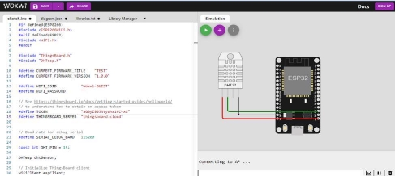

**Modul Praktikum : Konsep dan Penerapan Wireless Sensor Network **

Selesaikan  langkah  praktikum  berikut  untuk  mempraktekkan  materi  yang  telah dipelajari pada modul.

**Tujuan Praktikum** 

Setelah  menyelesaikan  praktikum  Anda,  akan  memiliki  kemampuan  untuk memahami konsep dan penerapan Wireless Sensor Network.

**Tujuan Visual** 

\- 

**Sumber Daya**  

Berikut merupakan sumber daya yang diperlukan untuk menyelesaikan praktikum: 

- PC atau Laptop dengan spesifikasi minimum RAM 4GB Processor Core i3 
- Koneksi internet
- Chrome *browser*

**Daftar Perintah**  

Pada praktikum ini, Anda akan menggunakan beberapa perintah (*command*) pada tabel berikut. 

|***Command*** |**Deskripsi** |
| - | - |
|
#include "ThingsBoard.h" 

#define TOKEN               " "    

#define THINGSBOARD\_SERVER  " " 
|Digunakan untuk mengakses library thingsboard, 2 parameter yang menghubungkan ke Thingsboard adalah TOKEN dan THINGSBOARD\_SERVER, parameter tersebut dapat diisi dengan Token yang dimiliki |

**Bantuan** 

\-

**Persiapan - ![ref1]**

**Praktikum 1: Program pendeteksi suhu dan kelembapan pada budidaya jamur**

Selesaikan langkah-langkah praktikum berikut ini menggunakan Wokwi di browser Anda. 

**Prosedur Praktikum** 

**Langkah 1**  Buatlah program sepertigambardisamping 

Praktikum ini menggunakan ESP 32, DHT 22 pada wokwi dan server monitoringnya menggunakan Thingsboard 

**Langkah 2**  Klik Device Group Monitoring Suhu dan Kelembaban Budidaya Jamur 

Klik tanda + pada kanan atas untuk menambahkan device 

Masukkan nama Lahan 1  

Klik Add 

Buatlah device baru untuk Lahan 2 sehingga akanmuncul 2 device seperti gambar di samping ![ref1]

**Langkah 3**  Buatlah program dan rangkaian pada wokwi seperti gambard isamping 

Buatlah 2 simulasi pada wokwi 

Masukkan token lahan 1 di wokwi pertama dan token lahan 2 untuk wokwi kedua. 

Setelah program berhasil di upload, cek pada serial monitor apakah terdapat kesalahan atau tidak 

Jika sudah sesuai bisa beralih ke ThingsBoard 

**Verifikasi Praktikum ![ref1]**

Anda telah menyelesaikan praktikum jika hasil berikut telah tercapai:  

- Tidak ada pesan error pada code 
- Data Real Time pada Lahan 1 dan Lahan 2 ![ref1]

Panduan Praktikum Internet of Things  Copyright © 2022, JTI Polinema 

[ref1]: Aspose.Words.56d72b02-e688-4143-bf4d-054550f6bc7c.002.png
